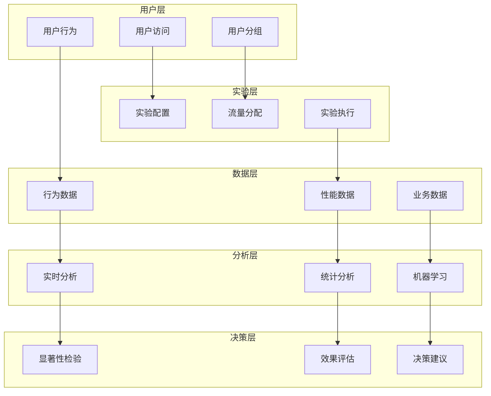

# 数据合规123导航网站A/B测试与评估框架

## 1. 测试框架概述

### 1.1 框架目标

#### 1.1.1 核心目标
```typescript
interface ABTestingGoals {
  // 用户体验优化
  userExperience: {
    reduceBounceRate: '目标: 跳出率降低30%';
    increaseSessionDuration: '目标: 会话时长增加50%';
    improveNavigationEfficiency: '目标: 导航效率提升40%';
  };
  // 业务指标提升
  businessMetrics: {
    increaseClickThroughRate: '目标: 点击率提升25%';
    improveUserRetention: '目标: 用户留存率提升35%';
    enhanceConversionRate: '目标: 转化率提升20%';
  };
  // 技术性能优化
  technicalPerformance: {
    reduceLoadTime: '目标: 页面加载时间减少40%';
    improveInteractionSpeed: '目标: 交互响应时间减少50%';
    optimizeResourceUsage: '目标: 资源使用优化30%';
  };
}
```

#### 1.1.2 测试原则
```typescript
interface TestingPrinciples {
  // 科学性原则
  scientific: {
    randomization: '完全随机分组';
    control: '设置对照组';
    replication: '可重复验证';
    statistical: '统计显著性检验';
  };
  // 用户中心原则
  userCentric: {
    minimalDisruption: '最小化用户体验干扰';
    transparency: '测试透明度';
    privacy: '用户隐私保护';
    consent: '用户知情同意';
  };
  // 业务导向原则
  businessDriven: {
    relevance: '与业务目标相关';
    measurability: '可量化评估';
    actionability: '结果可执行';
    roi: '投资回报率考量';
  };
}
```

### 1.2 框架架构

#### 1.2.1 系统架构


#### 1.2.2 技术架构
```typescript
interface TestingArchitecture {
  // 前端实验引擎
  frontend: {
    experimentManager: '实验管理器';
    userSegmentation: '用户分群器';
    variantRenderer: '变体渲染器';
    eventTracker: '事件追踪器';
  };
  // 后端实验服务
  backend: {
    experimentService: '实验服务';
    userService: '用户服务';
    analyticsService: '分析服务';
    mlService: '机器学习服务';
  };
  // 数据基础设施
  data: {
    eventCollection: '事件收集';
    dataPipeline: '数据处理管道';
    dataWarehouse: '数据仓库';
    analyticsEngine: '分析引擎';
  };
}
```

## 2. 实验设计框架

### 2.1 实验类型定义

#### 2.1.1 UI/UX实验
```typescript
interface UIUXExperiments {
  // 布局实验
  layout: {
    homepageLayout: {
      control: '网格布局';
      variantA: '列表布局';
      variantB: '卡片布局';
      variantC: '混合布局';
    };
    navigationStructure: {
      control: '顶部导航';
      variantA: '侧边导航';
      variantB: '底部导航';
      variantC: '组合导航';
    };
  };
  // 交互实验
  interaction: {
    searchInterface: {
      control: '简单搜索框';
      variantA: '智能搜索建议';
      variantB: '高级搜索选项';
      variantC: '语音搜索';
    };
    websiteCard: {
      control: '基础卡片';
      variantA: '悬停效果增强';
      variantB: '快速预览';
      variantC: '交互式卡片';
    };
  };
  // 视觉实验
  visual: {
    colorScheme: {
      control: '当前配色';
      variantA: '高对比度';
      variantB: '柔和配色';
      variantC: '动态主题';
    };
    typography: {
      control: '当前字体';
      variantA: '现代字体';
      variantB: '传统字体';
      variantC: '自定义字体';
    };
  };
}
```

#### 2.1.2 功能实验
```typescript
interface FeatureExperiments {
  // 推荐系统实验
  recommendation: {
    algorithm: {
      control: '基于点击量的推荐';
      variantA: '协同过滤推荐';
      variantB: '内容相似推荐';
      variantC: '混合推荐算法';
    };
    personalization: {
      control: '无个性化';
      variantA: '基于历史行为';
      variantB: '基于用户偏好';
      variantC: '基于社交网络';
    };
  };
  // 搜索功能实验
  search: {
    ranking: {
      control: '相关性排序';
      variantA: '热度排序';
      variantB: '时间排序';
      variantC: '综合排序';
    };
    features: {
      control: '基础搜索';
      variantA: '搜索建议';
      variantB: '搜索历史';
      variantC: '智能纠错';
    };
  };
  // 社交功能实验
  social: {
    sharing: {
      control: '无分享功能';
      variantA: '基础分享';
      variantB: '社交分享';
      variantC: '协作分享';
    };
    feedback: {
      control: '无反馈功能';
      variantA: '评分系统';
      variantB: '评论系统';
      variantC: '社区讨论';
    };
  };
}
```

#### 2.1.3 性能实验
```typescript
interface PerformanceExperiments {
  // 加载策略实验
  loading: {
    strategy: {
      control: '一次性加载';
      variantA: '分页加载';
      variantB: '无限滚动';
      variantC: '智能预加载';
    };
    priority: {
      control: '平等加载';
      variantA: '首屏优先';
      variantB: '用户兴趣优先';
      variantC: '网络感知加载';
    };
  };
  // 缓存策略实验
  caching: {
    browser: {
      control: '标准缓存';
      variantA: '积极缓存';
      variantB: '智能缓存';
      variantC: '动态缓存';
    };
    cdn: {
      control: '基础CDN';
      variantA: '边缘缓存';
      variantB: '区域缓存';
      variantC: '全球缓存';
    };
  };
}
```

### 2.2 实验设计原则

#### 2.2.1 假设驱动设计
```typescript
interface HypothesisDrivenDesign {
  // 假设结构
  hypothesis: {
    // 问题陈述
    problem: {
      observation: '观察到用户跳出率较高';
      impact: '影响用户参与度和转化率';
      evidence: '数据分析显示跳出率为45%';
    };
    // 解决方案假设
    solution: {
      proposed: '优化首页布局设计';
      mechanism: '通过更清晰的视觉层次和导航结构';
      expected: '预计跳出率降低20%';
    };
    // 成功指标
    success: {
      primary: '跳出率降低15%以上';
      secondary: ['会话时长增加', '页面浏览量增加'];
      guardrail: '用户满意度不下降';
    };
  };
  // 实验设计
  experiment: {
    variables: {
      independent: '布局设计变体';
      dependent: '跳出率、会话时长、页面浏览量';
      controlled: ['用户来源', '时间段', '设备类型'];
    };
    methodology: {
      type: 'A/B测试';
      duration: '2周';
      sampleSize: '10000用户';
      significance: '95%';
    };
  };
}
```

#### 2.2.2 多变量测试设计
```typescript
interface MultivariateTesting {
  // 因子设计
  factorialDesign: {
    factors: {
      layout: ['网格', '列表', '卡片'];
      color: ['蓝色', '绿色', '紫色'];
      typography: ['现代', '传统', '中性'];
    };
    combinations: 27; // 3×3×3
    sampleSize: '每组至少1000用户';
    duration: '3周';
  };
  // 部分因子设计
  fractionalDesign: {
    factors: {
      primary: ['布局', '颜色'];
      secondary: ['字体', '间距'];
      tertiary: ['动画', '图标'];
    };
    resolution: 'V';
    combinations: 16;
    efficiency: '节省40%样本量';
  };
}
```

### 2.3 样本量计算

#### 2.3.1 统计功效分析
```typescript
interface SampleSizeCalculation {
  // 基础参数
  parameters: {
    baselineRate: number; // 基线转化率
    minimumDetectableEffect: number; // 最小可检测效应
    significanceLevel: number; // 显著性水平α
    statisticalPower: number; // 统计功效1-β
  };
  // 计算方法
  methods: {
    analytical: {
      formula: 'n = 2 × (Zα/2 + Zβ)² × p(1-p) / (pA - pB)²';
      assumptions: ['正态分布', '独立样本', '等方差'];
      accuracy: '高';
    };
    simulation: {
      approach: '蒙特卡洛模拟';
      iterations: 10000;
      flexibility: '高';
      complexity: '中等';
    };
    bayesian: {
      prior: '贝叶斯先验';
      posterior: '后验分布';
      uncertainty: '量化';
      updating: '实时更新';
    };
  };
}
```

#### 2.3.2 实际样本量计算示例
```typescript
// 样本量计算器
class SampleSizeCalculator {
  // 基础参数
  private baselineRate = 0.05; // 5%基线转化率
  private minimumDetectableEffect = 0.01; // 1%最小效应
  private significanceLevel = 0.05; // 95%置信度
  private statisticalPower = 0.8; // 80%统计功效

  // 计算每组所需样本量
  calculateSampleSize(): number {
    const p1 = this.baselineRate;
    const p2 = this.baselineRate + this.minimumDetectableEffect;
    const zAlpha = this.getZScore(1 - this.significanceLevel / 2);
    const zBeta = this.getZScore(this.statisticalPower);
    
    const pooledP = (p1 + p2) / 2;
    const numerator = 2 * Math.pow(zAlpha + zBeta, 2) * pooledP * (1 - pooledP);
    const denominator = Math.pow(p2 - p1, 2);
    
    return Math.ceil(numerator / denominator);
  }

  // 考虑多测试校正
  calculateWithMultipleComparisons(comparisons: number): number {
    const adjustedAlpha = this.significanceLevel / comparisons;
    const zAlpha = this.getZScore(1 - adjustedAlpha / 2);
    const zBeta = this.getZScore(this.statisticalPower);
    
    const p1 = this.baselineRate;
    const p2 = this.baselineRate + this.minimumDetectableEffect;
    const pooledP = (p1 + p2) / 2;
    
    const numerator = 2 * Math.pow(zAlpha + zBeta, 2) * pooledP * (1 - pooledP);
    const denominator = Math.pow(p2 - p1, 2);
    
    return Math.ceil(numerator / denominator);
  }

  // 获取Z分数
  private getZScore(probability: number): number {
    // 使用近似公式计算Z分数
    const a0 = 2.5066282;
    const a1 = -18.6150006;
    const a2 = 41.3911977;
    const a3 = -25.4410605;
    const b1 = -8.4735109;
    const b2 = 23.0833677;
    const b3 = -21.0622410;
    const b4 = 3.1308291;
    const c0 = -2.7871893;
    const c1 = -2.2979648;
    const c2 = 4.8501413;
    const c3 = 2.3212128;
    const d1 = 3.5438892;
    const d2 = 1.6370678;

    let y = probability - 0.5;
    let z: number;

    if (Math.abs(y) < 0.42) {
      const r = y * y;
      z = y * (((a3 * r + a2) * r + a1) * r + a0) / ((((b4 * r + b3) * r + b2) * r + b1) * r + 1);
    } else {
      let r = probability;
      if (y > 0) r = 1 - probability;
      r = Math.log(-Math.log(r));
      z = c0 + r * (c1 + r * (c2 + r * c3));
      if (y < 0) z = -z;
    }

    return z;
  }
}
```

## 3. 用户分群和定向

### 3.1 用户分群策略

#### 3.1.1 行为分群
```typescript
interface BehavioralSegmentation {
  // 使用行为分群
  usageBehavior: {
    // 活跃用户
    activeUsers: {
      criteria: '过去7天访问>3次';
      characteristics: ['高参与度', '功能探索', '反馈积极'];
      percentage: '25%';
    };
    // 普通用户
    regularUsers: {
      criteria: '过去30天访问2-10次';
      characteristics: ['稳定使用', '核心功能', '偶尔反馈'];
      percentage: '50%';
    };
    // 流失用户
    churnedUsers: {
      criteria: '过去30天无访问';
      characteristics: ['低参与度', '功能单一', '缺乏反馈'];
      percentage: '15%';
    };
    // 新用户
    newUsers: {
      criteria: '注册<7天';
      characteristics: ['探索阶段', '学习成本', '引导需求'];
      percentage: '10%';
    };
  };
  // 功能使用分群
  featureUsage: {
    searchHeavy: {
      criteria: '搜索功能使用>70%';
      behavior: '搜索导向';
      preference: '精准结果';
    };
    browseHeavy: {
      criteria: '浏览功能使用>70%';
      behavior: '浏览导向';
      preference: '发现体验';
    };
    socialHeavy: {
      criteria: '社交功能使用>50%';
      behavior: '社交导向';
      preference: '互动体验';
    };
  };
}
```

#### 3.1.2 技术分群
```typescript
interface TechnicalSegmentation {
  // 设备类型分群
  deviceType: {
    mobile: {
      percentage: '45%';
      characteristics: ['触摸交互', '小屏幕', '移动场景'];
      considerations: ['响应式设计', '触摸优化', '流量限制'];
    };
    desktop: {
      percentage: '40%';
      characteristics: ['鼠标交互', '大屏幕', '固定场景'];
      considerations: ['丰富展示', '复杂交互', '性能充足'];
    };
    tablet: {
      percentage: '15%';
      characteristics: ['混合交互', '中等屏幕', '便携场景'];
      considerations: ['平衡设计', '横竖屏适配', '性能适中'];
    };
  };
  // 浏览器分群
  browserType: {
    chrome: {
      percentage: '65%';
      features: ['完整支持', '最新特性', '性能优化'];
    };
    safari: {
      percentage: '20%';
      features: ['iOS优化', '隐私保护', '性能平衡'];
    };
    firefox: {
      percentage: '10%';
      features: ['隐私导向', '开源特性', '性能稳定'];
    };
    others: {
      percentage: '5%';
      features: ['兼容性', '基础功能', '性能保守'];
    };
  };
  // 网络条件分群
  networkCondition: {
    highSpeed: {
      criteria: '带宽>10Mbps';
      percentage: '70%';
      strategy: '高质量资源';
    };
    mediumSpeed: {
      criteria: '带宽1-10Mbps';
      percentage: '25%';
      strategy: '平衡资源';
    };
    lowSpeed: {
      criteria: '带宽<1Mbps';
      percentage: '5%';
      strategy: '轻量资源';
    };
  };
}
```

### 3.2 定向策略

#### 3.2.1 分层定向
```typescript
interface LayeredTargeting {
  // 全局层（100%用户）
  global: {
    experiments: ['基础性能优化', '核心功能改进'];
    criteria: '所有用户';
    percentage: '100%';
    duration: '持续进行';
  };
  // 分群层（特定用户群）
  segmented: {
    experiments: ['个性化功能', '特定体验优化'];
    criteria: '基于用户属性';
    percentage: '30-50%';
    duration: '2-4周';
  };
  // 个性化层（小群体）
  personalized: {
    experiments: ['高级个性化', '实验性功能'];
    criteria: '高度特定条件';
    percentage: '5-10%';
    duration: '1-2周';
  };
}
```

#### 3.2.2 动态定向
```typescript
interface DynamicTargeting {
  // 实时行为定向
  realTimeBehavior: {
    // 基于当前会话行为
    sessionBased: {
      trigger: '页面停留时间>30秒';
      action: '展示深度功能实验';
      timeout: '会话结束';
    };
    // 基于实时交互
    interactionBased: {
      trigger: '点击搜索按钮';
      action: '展示搜索优化实验';
      cooldown: '5分钟';
    };
  };
  // 上下文定向
  contextual: {
    timeBased: {
      morning: '6:00-12:00';
      afternoon: '12:00-18:00';
      evening: '18:00-24:00';
      night: '0:00-6:00';
    };
    locationBased: {
      domestic: '国内用户';
      international: '国际用户';
    };
    referrerBased: {
      searchEngine: '搜索引擎';
      socialMedia: '社交媒体';
      direct: '直接访问';
    };
  };
}
```

## 4. 数据收集和分析

### 4.1 数据收集框架

#### 4.1.1 事件追踪设计
```typescript
interface EventTrackingFramework {
  // 用户行为事件
  userBehavior: {
    // 页面访问事件
    pageView: {
      name: 'page_view';
      properties: {
        page: string;
        title: string;
        referrer: string;
        timestamp: number;
        duration: number;
      };
      triggers: ['页面加载', '单页应用路由变化'];
    };
    // 点击事件
    click: {
      name: 'element_click';
      properties: {
        element: string;
        text: string;
        position: { x: number; y: number };
        context: string;
        timestamp: number;
      };
      triggers: ['用户点击行为'];
    };
    // 搜索事件
    search: {
      name: 'search_performed';
      properties: {
        query: string;
        results_count: number;
        result_clicked: boolean;
        result_position: number;
        timestamp: number;
      };
      triggers: ['搜索执行', '搜索结果点击'];
    };
  };
  // 实验相关事件
  experiment: {
    // 实验曝光
    exposure: {
      name: 'experiment_exposed';
      properties: {
        experiment_id: string;
        variant: string;
        user_id: string;
        timestamp: number;
        context: object;
      };
    };
    // 实验转化
    conversion: {
      name: 'experiment_converted';
      properties: {
        experiment_id: string;
        variant: string;
        user_id: string;
        conversion_type: string;
        value: number;
        timestamp: number;
      };
    };
  };
  // 性能事件
  performance: {
    // 核心Web指标
    webVitals: {
      name: 'web_vital_measured';
      properties: {
        metric_name: string;
        value: number;
        rating: 'good' | 'needs-improvement' | 'poor';
        timestamp: number;
      };
    };
    // 自定义性能指标
    custom: {
      name: 'performance_measured';
      properties: {
        metric_name: string;
        value: number;
        unit: string;
        context: object;
        timestamp: number;
      };
    };
  };
}
```

#### 4.1.2 数据质量保证
```typescript
interface DataQualityAssurance {
  // 数据验证
  validation: {
    // 格式验证
    format: {
      requiredFields: ['user_id', 'timestamp', 'event_name'];
      dataTypes: {
        user_id: 'string',
        timestamp: 'number',
        event_name: 'string',
      };
      valueRanges: {
        timestamp: '过去1年到未来1分钟',
        duration: '正数',
      };
    };
    // 业务逻辑验证
    businessLogic: {
      sequential: '事件时间顺序合理';
      consistent: '用户状态一致性';
      complete: '实验数据完整性';
    };
  };
  // 数据清洗
  cleaning: {
    // 异常值处理
    outliers: {
      method: 'IQR法则';
      threshold: '1.5倍四分位距';
      action: '标记但保留';
    };
    // 重复数据处理
    duplicates: {
      identification: '基于时间窗口和用户ID';
      removal: '保留第一条记录';
      logging: '记录删除操作';
    };
    // 缺失值处理
    missingValues: {
      strategy: '基于业务规则填充';
      critical: '删除记录';
      nonCritical: '使用默认值';
    };
  };
  // 数据完整性监控
  monitoring: {
    // 实时质量指标
    realTime: {
      eventRate: '事件接收率';
      errorRate: '数据错误率';
      latency: '数据传输延迟';
    };
    // 批处理质量检查
    batch: {
      daily: '每日数据完整性检查';
      weekly: '每周数据质量报告';
      monthly: '每月数据审计';
    };
  };
}
```

### 4.2 实时分析系统

#### 4.2.1 实时指标计算
```typescript
interface RealTimeAnalytics {
  // 实验指标实时计算
  experimentMetrics: {
    // 基础指标
    basic: {
      exposure: {
        calculation: '累计实验曝光用户数';
        updateFrequency: '每分钟';
        window: '滑动24小时';
      };
      conversion: {
        calculation: '累计转化用户数';
        updateFrequency: '每分钟';
        window: '滑动24小时';
      };
      conversionRate: {
        calculation: '转化率 = 转化用户数 / 曝光用户数';
        updateFrequency: '每分钟';
        window: '滑动24小时';
      };
    };
    // 统计显著性
    statistical: {
      pValue: {
        method: '卡方检验';
        updateFrequency: '每小时';
        threshold: 0.05;
      };
      confidenceInterval: {
        method: 'Bootstrap方法';
        level: 95;
        iterations: 1000;
      };
      power: {
        method: '功效分析';
        target: 0.8;
        updateFrequency: '每日';
      };
    };
  };
  // 异常检测
  anomalyDetection: {
    // 统计异常检测
    statistical: {
      method: '控制图';
      threshold: '3σ';
      sensitivity: '中等';
      action: '自动告警';
    };
    // 机器学习异常检测
    ml: {
      algorithm: 'Isolation Forest';
      trainingWindow: '7天';
      updateFrequency: '每日';
      features: ['转化率', '曝光率', '用户行为'];
    };
  };
}
```

#### 4.2.2 实时仪表板
```typescript
interface RealTimeDashboard {
  // 实验概览
  experimentOverview: {
    activeExperiments: number;
    totalUsers: number;
    totalExposures: number;
    significantResults: number;
    lastUpdated: string;
  };
  // 实验详情
  experimentDetails: {
    experimentId: string;
    name: string;
    status: 'running' | 'stopped' | 'completed';
    startDate: string;
    endDate: string;
    variants: Array<{
      name: string;
      users: number;
      exposures: number;
      conversions: number;
      conversionRate: number;
      confidenceInterval: [number, number];
    }>;
    primaryMetric: {
      name: string;
      value: number;
      pValue: number;
      significant: boolean;
    };
  };
  // 性能指标
  performanceMetrics: {
    eventProcessing: {
      rate: number; // 事件处理速率
      latency: number; // 处理延迟
      backlog: number; // 积压事件数
    };
    systemHealth: {
      cpu: number;
      memory: number;
      disk: number;
      network: number;
    };
  };
}
```

### 4.3 统计分析方法

#### 4.3.1 假设检验
```typescript
interface HypothesisTesting {
  // A/B测试统计检验
  abTesting: {
    // 频率学派方法
    frequentist: {
      // 卡方检验（分类变量）
      chiSquare: {
        useCase: '转化率比较';
        assumptions: ['独立样本', '期望频数>5', '随机抽样'];
        testStatistic: 'χ² = Σ((O-E)²/E)';
        pValue: 'P(χ² > 观测值)';
        interpretation: 'p < α 拒绝原假设';
      };
      // t检验（连续变量）
      tTest: {
        useCase: '均值比较';
        variants: ['独立样本t检验', '配对样本t检验'];
        assumptions: ['正态性', '方差齐性', '独立性'];
        testStatistic: 't = (x̄₁ - x̄₂) / SE';
        degreesOfFreedom: 'n₁ + n₂ - 2';
      };
      // Mann-Whitney U检验（非参数）
      mannWhitney: {
        useCase: '非正态分布数据';
        advantages: ['无需正态假设', '对异常值稳健'];
        testStatistic: 'U = 秩和统计量';
        effectSize: 'η²或r';
      };
    };
    // 贝叶斯方法
    bayesian: {
      // 贝叶斯A/B测试
      bayesianAB: {
        prior: 'Beta先验分布';
        likelihood: '二项分布';
        posterior: 'Beta后验分布';
        probability: 'P(变体 > 对照 | 数据)';
        decisionRule: 'P > 95% 宣布胜出';
      };
      // 层次模型
      hierarchical: {
        structure: '多层次数据建模';
        shrinkage: '向均值收缩';
        partialPooling: '部分池化';
        advantages: ['小样本稳健', '自然处理层次结构'];
      };
    };
  };
}
```

#### 4.3.2 效应量计算
```typescript
interface EffectSizeCalculation {
  // 标准化效应量
  standardized: {
    // Cohen's d
    cohensD: {
      formula: 'd = (M₁ - M₂) / SD_pooled';
      interpretation: {
        small: 0.2;
        medium: 0.5;
        large: 0.8;
      };
      confidenceInterval: '基于非中心t分布';
    };
    // 相关系数
    correlation: {
      pearson: 'r = Σ((X-X̄)(Y-Ȳ)) / √(Σ(X-X̄)²Σ(Y-Ȳ)²)';
      spearman: '基于秩次的相关系数';
      interpretation: {
        weak: 0.1;
        moderate: 0.3;
        strong: 0.5;
      };
    };
  };
  // 实际意义效应量
  practical: {
    // 相对提升
    relativeImprovement: {
      formula: 'RI = (p_B - p_A) / p_A × 100%';
      interpretation: '百分比提升';
      businessRelevance: '结合业务价值评估';
    };
    // 数值差异
    absoluteDifference: {
      formula: 'AD = M_B - M_A';
      interpretation: '绝对数值差异';
      confidenceInterval: '基于抽样分布';
    };
    // 成功概率
    probabilityOfSuperiority: {
      formula: 'PS = P(X_B > X_A)';
      estimation: '基于Bootstrap或贝叶斯方法';
      interpretation: '变体优于对照的概率';
    };
  };
}
```

## 5. 实验执行和管理

### 5.1 实验生命周期管理

#### 5.1.1 实验流程
```typescript
interface ExperimentLifecycle {
  // 实验设计阶段
  design: {
    // 问题定义
    problemDefinition: {
      activities: ['业务问题识别', '用户痛点分析', '机会点识别'];
      deliverables: ['问题陈述文档', '用户调研报告', '竞品分析报告'];
      duration: '1-2周';
    };
    // 假设形成
    hypothesisFormation: {
      activities: ['解决方案brainstorming', '假设构建', '成功指标定义'];
      deliverables: ['假设陈述', '变体设计方案', '评估指标体系'];
      duration: '1周';
    };
    // 实验设计
    experimentDesign: {
      activities: ['实验类型选择', '样本量计算', '分组策略制定'];
      deliverables: ['实验设计方案', '统计分析计划', '实施时间表'];
      duration: '1周';
    };
  };
  // 实验开发阶段
  development: {
    // 技术实现
    implementation: {
      activities: ['变体开发', '追踪代码实现', '测试验证'];
      deliverables: ['功能代码', '追踪代码', '测试报告'];
      duration: '2-3周';
    };
    // 质量保证
    qualityAssurance: {
      activities: ['功能测试', '性能测试', '兼容性测试'];
      deliverables: ['测试报告', '性能报告', '上线检查清单'];
      duration: '3-5天';
    };
  };
  // 实验执行阶段
  execution: {
    // 实验启动
    launch: {
      activities: ['流量分配', '监控系统配置', '预警设置'];
      deliverables: ['实验启动报告', '监控仪表板', '预警配置'];
      duration: '1天';
    };
    // 实验监控
    monitoring: {
      activities: ['实时数据监控', '异常检测', '中期分析'];
      deliverables: ['监控报告', '异常报告', '中期分析报告'];
      duration: '整个实验期间';
    };
    // 实验结束
    conclusion: {
      activities: ['数据收集完成', '统计分析', '结果解读'];
      deliverables: ['实验结果报告', '业务建议', '后续计划'];
      duration: '3-5天';
    };
  };
}
```

#### 5.1.2 实验状态管理
```typescript
interface ExperimentStatusManagement {
  // 实验状态定义
  statuses: {
    draft: {
      description: '实验设计阶段';
      allowedActions: ['编辑', '审核', '删除'];
      nextStates: ['ready', 'cancelled'];
    };
    ready: {
      description: '实验准备就绪';
      allowedActions: ['启动', '编辑', '取消'];
      nextStates: ['running', 'draft', 'cancelled'];
    };
    running: {
      description: '实验进行中';
      allowedActions: ['监控', '调整', '停止'];
      nextStates: ['paused', 'completed', 'stopped'];
    };
    paused: {
      description: '实验暂停';
      allowedActions: ['恢复', '停止', '调整'];
      nextStates: ['running', 'stopped', 'completed'];
    };
    completed: {
      description: '实验正常完成';
      allowedActions: ['分析', '报告', '归档'];
      nextStates: ['archived'];
    };
    stopped: {
      description: '实验提前终止';
      allowedActions: ['分析', '报告'];
      nextStates: ['archived'];
    };
    cancelled: {
      description: '实验取消';
      allowedActions: ['删除', '重新设计'];
      nextStates: ['deleted'];
    };
    archived: {
      description: '实验已归档';
      allowedActions: ['查看', '复制'];
      nextStates: [];
    };
  };
}
```

### 5.2 流量分配策略

#### 5.2.1 分层实验设计
```typescript
interface LayeredExperimentDesign {
  // 实验层定义
  layers: {
    // UI层
    uiLayer: {
      experiments: ['颜色方案', '字体选择', '布局设计'];
      traffic: '100%';
      mutualExclusion: true; // 互斥实验
      priority: 'high';
    };
    // 功能层
    featureLayer: {
      experiments: ['搜索算法', '推荐系统', '排序策略'];
      traffic: '80%';
      mutualExclusion: false; // 可并行
      priority: 'medium';
    };
    // 性能层
    performanceLayer: {
      experiments: ['加载策略', '缓存机制', '资源优化'];
      traffic: '60%';
      mutualExclusion: false;
      priority: 'low';
    };
    // 个性化层
    personalizationLayer: {
      experiments: ['个性化推荐', '定制化界面', '智能提醒'];
      traffic: '40%';
      mutualExclusion: false;
      priority: 'medium';
    };
  };
  // 流量分配算法
  trafficAllocation: {
    algorithm: '一致性哈希';
    collisionHandling: '优先级覆盖';
    overflowHandling: '降级到默认组';
    stickiness: '基于用户ID';
  };
}
```

#### 5.2.2 动态流量调整
```typescript
interface DynamicTrafficAdjustment {
  // 基于性能的流量调整
  performanceBased: {
    // 错误率监控
    errorRate: {
      threshold: 0.05; // 5%错误率阈值
      action: '减少50%流量';
      recovery: '错误率<2%时恢复';
    };
    // 响应时间监控
    responseTime: {
      threshold: 2000; // 2秒响应时间
      action: '减少30%流量';
      recovery: '响应时间<1秒时恢复';
    };
    // 资源使用率监控
    resourceUsage: {
      cpu: { threshold: 80; action: '减少20%流量' };
      memory: { threshold: 85; action: '减少25%流量' };
      disk: { threshold: 90; action: '减少40%流量' };
    };
  };
  // 基于效果的流量调整
  effectivenessBased: {
    // 早期效果检测
    earlyDetection: {
      window: '24小时';
      significance: 'p < 0.1';
      action: '增加变体流量到50%';
    };
    // 显著效果检测
    significantEffect: {
      window: '72小时';
      significance: 'p < 0.05';
      effectSize: '> 5%相对提升';
      action: '增加变体流量到80%';
    };
    // 负面效果检测
    negativeEffect: {
      window: '48小时';
      significance: 'p < 0.05';
      effectSize: '< -3%相对下降';
      action: '停止实验并回滚';
    };
  };
}
```

### 5.3 多变量测试管理

#### 5.3.1 实验组合管理
```typescript
interface MultivariateExperimentManagement {
  // 因子实验设计
  factorialDesign: {
    // 2×2×2因子设计
    factors: {
      layout: ['网格', '列表'];
      color: ['蓝色', '绿色'];
      size: ['小', '大'];
    };
    combinations: 8;
    sampleSize: '每组至少500用户';
    duration: '2周';
    analysis: '主效应 + 交互效应';
  };
  // 部分因子设计
  fractionalFactorial: {
    resolution: 'IV';
    generators: ['D = ABC'];
    combinations: 4; // 半因子设计
    alias: '主效应与三阶交互混杂';
    efficiency: '节省50%样本量';
  };
  // 响应面方法
  responseSurface: {
    design: '中心复合设计';
    factors: 3;
    levels: 5;
    centerPoints: 5;
    axialPoints: 6;
    totalRuns: 19;
    objective: '寻找最优组合';
  };
}
```

#### 5.3.2 实验冲突检测
```typescript
interface ExperimentConflictDetection {
  // 冲突类型定义
  conflictTypes: {
    // 功能冲突
    functional: {
      description: '实验功能相互干扰';
      examples: ['两个实验修改同一按钮', '实验A依赖实验B的变体'];
      severity: 'high';
      resolution: '互斥或分层设计';
    };
    // 统计冲突
    statistical: {
      description: '实验结果相互影响';
      examples: ['实验间交互效应', '用户行为改变影响其他实验'];
      severity: 'medium';
      resolution: '交互分析或隔离设计';
    };
    // 技术冲突
    technical: {
      description: '实验实现技术冲突';
      examples: ['CSS样式冲突', 'JavaScript变量冲突', 'API调用冲突'];
      severity: 'high';
      resolution: '命名空间隔离或技术重构';
    };
  };
  // 冲突检测算法
  detectionAlgorithm: {
    // 静态分析
    static: {
      methods: ['代码依赖分析', '资源使用分析', 'API调用分析'];
      coverage: '100%代码覆盖';
      falsePositive: '< 5%';
      executionTime: '< 30秒';
    };
    // 动态监控
    dynamic: {
      methods: ['运行时行为监控', '性能指标监控', '错误率监控'];
      sampling: '10%用户流量';
      detectionTime: '< 5分钟';
      accuracy: '> 95%';
    };
  };
}
```

## 6. 结果分析和决策

### 6.1 统计分析框架

#### 6.1.1 综合评估体系
```typescript
interface ComprehensiveEvaluationFramework {
  // 主要指标评估
  primaryMetrics: {
    // 转化率分析
    conversionRate: {
      method: '频率学派 + 贝叶斯方法';
      significance: 'p < 0.05';
      effectSize: 'Cohen\'s h ≥ 0.2';
      practicalSignificance: '相对提升 ≥ 5%';
      confidence: '95%置信区间';
    };
    // 用户参与度
    engagement: {
      metrics: ['会话时长', '页面浏览量', '功能使用频率'];
      method: '多变量检验';
      compositeScore: '加权综合评分';
      interpretation: '标准化效应量';
    };
  };
  // 次要指标评估
  secondaryMetrics: {
    // 用户体验指标
    userExperience: {
      satisfaction: {
        method: 't检验';
        measure: '用户满意度评分';
        improvement: '≥ 0.3分（5分制）';
      };
      usability: {
        method: '任务完成率比较';
        tasks: ['搜索任务', '导航任务', '收藏任务'];
        successRate: '提升 ≥ 10%';
      };
    };
    // 技术性能指标
    technicalPerformance: {
      loadTime: {
        method: '中位数检验';
        threshold: '改善 ≥ 200ms';
        percentile: '75th percentile';
      };
      errorRate: {
        method: '比例检验';
        threshold: '降低 ≥ 20%';
        confidence: '95%';
      };
    };
  };
  // 护栏指标监控
  guardrailMetrics: {
    // 用户满意度
    satisfaction: {
      metric: '用户满意度评分';
      threshold: '下降不超过0.2分';
      action: '触发调查或停止实验';
    };
    // 系统稳定性
    stability: {
      metric: '系统错误率';
      threshold: '增加不超过50%';
      action: '技术调查和修复';
    };
    // 业务指标
    businessHealth: {
      metric: '核心业务指标';
      threshold: '下降不超过5%';
      action: '业务影响评估';
    };
  };
}
```

#### 6.1.2 高级分析方法
```typescript
interface AdvancedAnalysisMethods {
  // 因果推断
  causalInference: {
    // 工具变量法
    instrumentalVariables: {
      useCase: '处理内生性问题';
      assumptions: ['相关性', '外生性', '排他性'];
      validation: ['第一阶段F检验', '过度识别检验'];
      implementation: '两阶段最小二乘法';
    };
    // 断点回归
    regressionDiscontinuity: {
      useCase: '基于阈值的因果推断';
      types: ['sharp', 'fuzzy'];
      validation: ['连续性检验', '带宽选择', '稳健性检验'];
      bandwidth: '最优带宽选择';
    };
    // 双重差分法
    differenceInDifferences: {
      useCase: '政策或功能变更影响评估';
      assumptions: ['平行趋势', '无预期效应'];
      validation: ['平行趋势检验', '安慰剂检验'];
      estimation: '双向固定效应模型';
    };
  };
  // 机器学习增强分析
  mlEnhanced: {
    //  uplift建模
    upliftModeling: {
      objective: '估计个体处理效应';
      methods: ['Two-model', 'Class-variable', 'Causal forests'];
      evaluation: ['QINI曲线', 'uplift曲线', 'AUUC'];
      personalization: '个性化实验推荐';
    };
    // 因果森林
    causalForests: {
      method: '基于随机森林的因果推断';
      advantages: ['非参数', '处理异质性', '变量重要性'];
      inference: 'honest估计';
      uncertainty: '置信区间估计';
    };
    // 双重机器学习
    doubleMachineLearning: {
      approach: '正交机器学习';
      steps: [' nuisance参数估计', '正交得分函数', '交叉拟合'];
      properties: ['正交性', 'N^(-1/2)收敛', '置信区间有效性'];
    };
  };
}
```

### 6.2 决策框架

#### 6.2.1 决策标准
```typescript
interface DecisionCriteria {
  // 统计显著性标准
  statistical: {
    // 频率学派标准
    frequentist: {
      significanceLevel: 0.05;
      power: 0.8;
      effectSize: 'practically significant';
      confidenceInterval: '不包含0';
      multipleTesting: 'FDR或Bonferroni校正';
    };
    // 贝叶斯标准
    bayesian: {
      probabilityThreshold: 0.95;
      regionOfPracticalEquivalence: 'ROPE';
      bayesFactor: 'BF > 3';
      posteriorOdds: '支持备择假设';
      decisionTheoretic: '期望效用最大化';
    };
  };
  // 业务决策标准
  business: {
    // 成本效益分析
    costBenefit: {
      implementationCost: '开发+部署成本';
      maintenanceCost: '长期维护成本';
      expectedBenefit: '预期收益量化';
      roiThreshold: 'ROI > 200%';
      paybackPeriod: '< 6个月';
    };
    // 风险评估
    riskAssessment: {
      technicalRisk: '实现复杂度评估';
      userRisk: '用户体验负面影响';
      businessRisk: '业务指标下降风险';
      mitigation: '风险缓解措施';
      contingency: '应急预案';
    };
    // 战略一致性
    strategicAlignment: {
      productVision: '与产品愿景一致';
      userValue: '用户价值创造';
      competitiveAdvantage: '竞争优势建立';
      longTermBenefit: '长期收益评估';
    };
  };
}
```

#### 6.2.2 决策流程
```typescript
interface DecisionProcess {
  // 自动化决策
  automated: {
    // 规则引擎
    ruleEngine: {
      // 显著正效应
      positiveSignificant: {
        conditions: ['p < 0.05', 'effect > 5%', 'CI > 0', 'guardrail OK'];
        action: '自动推荐实施';
        confidence: 'high';
        notification: '邮件+仪表板';
      };
      // 显著负效应
      negativeSignificant: {
        conditions: ['p < 0.05', 'effect < -3%', 'CI < 0'];
        action: '自动停止实验';
        confidence: 'high';
        notification: '立即告警';
      };
      // 无显著效应
      noSignificantEffect: {
        conditions: ['p >= 0.05', '|effect| < 2%', 'power > 0.8'];
        action: '维持现状';
        confidence: 'medium';
        notification: '定期报告';
      };
    };
    // 置信度评估
    confidenceAssessment: {
      high: {
        criteria: ['大样本', '低p值', '一致效应', '多重验证'];
        action: '高置信度决策';
        automation: '完全自动化';
      };
      medium: {
        criteria: ['中等样本', '边际显著', '混合证据'];
        action: '人工审核';
        automation: '半自动化';
      };
      low: {
        criteria: ['小样本', '高p值', '不一致效应'];
        action: '专家决策';
        automation: '手动处理';
      };
    };
  };
  // 人工决策
  manual: {
    // 专家委员会
    expertCommittee: {
      composition: ['产品经理', '数据科学家', '用户研究员', '技术负责人'];
      responsibilities: ['复杂案例决策', '争议案例仲裁', '策略制定'];
      meetingFrequency: '每周';
      decisionProcess: ['案例呈现', '讨论分析', '投票决策', '记录归档'];
    };
    // 利益相关者协商
    stakeholderConsultation: {
      participants: ['业务部门', '技术团队', '法务合规', '高级管理层'];
      consultationProcess: ['影响评估', '风险讨论', '资源评估', '时间表制定'];
      decisionCriteria: ['综合评估', '多数同意', '风险可控'];
      documentation: ['决策记录', '理由说明', '后续计划'];
    };
  };
}
```

### 6.3 结果报告和知识管理

#### 6.3.1 实验报告模板
```typescript
interface ExperimentReportTemplate {
  // 执行摘要
  executiveSummary: {
    objective: '实验目标和背景';
    methodology: '实验设计和方法';
    keyFindings: '主要发现（3-5点）';
    recommendations: '行动建议';
    businessImpact: '预期业务影响';
  };
  // 详细分析
  detailedAnalysis: {
    // 实验设计
    experimentDesign: {
      hypothesis: '假设陈述';
      variants: '变体描述';
      metrics: '评估指标';
      sampleSize: '样本量计算';
      duration: '实验时长';
    };
    // 结果分析
    results: {
      primaryMetrics: '主要指标结果';
      secondaryMetrics: '次要指标结果';
      statisticalTests: '统计检验结果';
      effectSizes: '效应量估计';
      confidenceIntervals: '置信区间';
    };
    // 用户洞察
    userInsights: {
      qualitative: '定性研究发现';
      behavioral: '行为模式分析';
      segmentation: '分群分析结果';
      feedback: '用户反馈总结';
    };
    // 技术洞察
    technicalInsights: {
      implementation: '实现复杂度';
      performance: '性能影响';
      scalability: '可扩展性评估';
      maintainability: '可维护性分析';
    };
  };
  // 附录
  appendices: {
    rawData: '原始数据链接';
    statisticalOutput: '详细统计输出';
    visualizations: '图表和可视化';
    code: '分析代码';
    documentation: '相关文档链接';
  };
}
```

#### 6.3.2 知识管理系统
```typescript
interface KnowledgeManagementSystem {
  // 实验知识库
  experimentKnowledgeBase: {
    // 成功案例
    successCases: {
      category: '成功案例';
      structure: ['背景', '解决方案', '结果', '关键成功因素'];
      searchability: '全文搜索+标签';
      updateFrequency: '实时更新';
    };
    // 失败案例
    failureCases: {
      category: '失败案例';
      structure: ['背景', '失败原因', '教训', '改进建议'];
      importance: '高（避免重复错误）';
      sharing: '团队内部分享';
    };
    // 最佳实践
    bestPractices: {
      category: '最佳实践';
      content: ['实验设计', '分析方法', '实施流程', '工具使用'];
      validation: '基于数据验证';
      maintenance: '定期更新';
    };
    // 工具和技术
    toolsAndTechniques: {
      category: '工具技术';
      content: ['分析工具', '统计方法', '可视化技术', '自动化脚本'];
      documentation: '详细使用说明';
      training: '定期培训';
    };
  };
  // 学习机制
  learningMechanisms: {
    // 定期回顾
    retrospectives: {
      frequency: '每月';
      participants: ['数据科学团队', '产品团队'];
      format: ['案例分享', '方法讨论', '工具演示'];
      output: ['改进建议', '培训需求', '工具开发'];
    };
    // 跨团队分享
    crossTeamSharing: {
      frequency: '每季度';
      audience: '全公司';
      content: ['重大发现', '方法论创新', '工具更新'];
      format: ['技术分享会', '内部博客', '文档库'];
    };
    // 外部学习
    externalLearning: {
      conferences: '行业会议参与';
      publications: '学术论文发表';
      collaborations: '外部合作研究';
      benchmarking: '行业标杆学习';
    };
  };
}
```

## 7. 技术实现

### 7.1 前端实验框架

#### 7.1.1 实验管理器
```typescript
// 实验管理器实现
class ExperimentManager {
  private experiments: Map<string, Experiment> = new Map();
  private userVariants: Map<string, Map<string, string>> = new Map();
  private eventTracker: EventTracker;
  private config: ExperimentConfig;

  constructor(config: ExperimentConfig) {
    this.config = config;
    this.eventTracker = new EventTracker(config.tracking);
    this.initializeExperiments();
  }

  // 初始化实验
  private async initializeExperiments(): Promise<void> {
    try {
      const experiments = await this.fetchExperiments();
      experiments.forEach(exp => {
        this.experiments.set(exp.id, exp);
      });
      this.validateExperiments();
    } catch (error) {
      console.error('Failed to initialize experiments:', error);
    }
  }

  // 获取用户变体
  public getUserVariant(experimentId: string, userId: string): string | null {
    const experiment = this.experiments.get(experimentId);
    if (!experiment || !experiment.active) {
      return null;
    }

    // 检查用户是否已有分配的变体
    const userExperimentVariants = this.userVariants.get(userId);
    if (userExperimentVariants) {
      const existingVariant = userExperimentVariants.get(experimentId);
      if (existingVariant) {
        return existingVariant;
      }
    }

    // 分配新变体
    const variant = this.assignVariant(experiment, userId);
    if (variant) {
      this.storeUserVariant(userId, experimentId, variant);
      this.trackExposure(userId, experimentId, variant);
    }

    return variant;
  }

  // 变体分配算法
  private assignVariant(experiment: Experiment, userId: string): string | null {
    // 检查用户是否符合实验条件
    if (!this.isUserEligible(experiment, userId)) {
      return null;
    }

    // 使用一致性哈希确保分配一致性
    const hash = this.hashUserId(userId + experiment.id);
    const bucket = hash % 100;

    // 根据流量分配确定变体
    let cumulativePercentage = 0;
    for (const variant of experiment.variants) {
      cumulativePercentage += variant.percentage;
      if (bucket < cumulativePercentage) {
        return variant.name;
      }
    }

    return null; // 对照组
  }

  // 检查用户资格
  private isUserEligible(experiment: Experiment, userId: string): boolean {
    // 检查用户属性
    if (experiment.targeting) {
      const userAttributes = this.getUserAttributes(userId);
      return this.evaluateTargeting(experiment.targeting, userAttributes);
    }

    return true;
  }

  // 用户ID哈希
  private hashUserId(userId: string): number {
    let hash = 0;
    for (let i = 0; i < userId.length; i++) {
      const char = userId.charCodeAt(i);
      hash = ((hash << 5) - hash) + char;
      hash = hash & hash; // 转换为32位整数
    }
    return Math.abs(hash);
  }

  // 追踪实验曝光
  private trackExposure(userId: string, experimentId: string, variant: string): void {
    this.eventTracker.track('experiment_exposed', {
      user_id: userId,
      experiment_id: experimentId,
      variant: variant,
      timestamp: Date.now(),
    });
  }

  // 获取实验配置
  public getExperimentConfig(experimentId: string): Experiment | undefined {
    return this.experiments.get(experimentId);
  }

  // 获取所有活跃实验
  public getActiveExperiments(): Experiment[] {
    return Array.from(this.experiments.values()).filter(exp => exp.active);
  }

  // 其他辅助方法...
  private async fetchExperiments(): Promise<Experiment[]> {
    // 从后端API获取实验配置
    const response = await fetch(`${this.config.apiUrl}/experiments`);
    return response.json();
  }

  private validateExperiments(): void {
    // 验证实验配置的有效性
    for (const experiment of this.experiments.values()) {
      this.validateExperiment(experiment);
    }
  }

  private validateExperiment(experiment: Experiment): void {
    // 验证实验配置
    if (!experiment.id || !experiment.name) {
      throw new Error(`Invalid experiment: missing id or name`);
    }

    // 验证变体配置
    let totalPercentage = 0;
    for (const variant of experiment.variants) {
      totalPercentage += variant.percentage;
    }

    if (totalPercentage > 100) {
      throw new Error(`Invalid experiment ${experiment.id}: total percentage > 100`);
    }
  }

  private storeUserVariant(userId: string, experimentId: string, variant: string): void {
    if (!this.userVariants.has(userId)) {
      this.userVariants.set(userId, new Map());
    }
    this.userVariants.get(userId)!.set(experimentId, variant);
  }

  private getUserAttributes(userId: string): UserAttributes {
    // 从用户服务获取用户属性
    // 这里应该是实际的实现
    return {
      userId,
      // 其他用户属性...
    };
  }

  private evaluateTargeting(targeting: TargetingConfig, attributes: UserAttributes): boolean {
    // 评估用户是否符合目标条件
    // 这里应该是实际的实现
    return true;
  }
}
```

#### 7.1.2 变体渲染器
```typescript
// 变体渲染器实现
class VariantRenderer {
  private experimentManager: ExperimentManager;
  private componentVariants: Map<string, ComponentVariants> = new Map();

  constructor(experimentManager: ExperimentManager) {
    this.experimentManager = experimentManager;
    this.registerComponentVariants();
  }

  // 注册组件变体
  private registerComponentVariants(): void {
    // 首页布局变体
    this.componentVariants.set('HomePageLayout', {
      control: () => import('./components/HomePageLayoutControl'),
      variantA: () => import('./components/HomePageLayoutVariantA'),
      variantB: () => import('./components/HomePageLayoutVariantB'),
    });

    // 搜索栏变体
    this.componentVariants.set('SearchBar', {
      control: () => import('./components/SearchBarControl'),
      variantA: () => import('./components/SearchBarVariantA'),
      variantB: () => import('./components/SearchBarVariantB'),
    });

    // 网站卡片变体
    this.componentVariants.set('WebsiteCard', {
      control: () => import('./components/WebsiteCardControl'),
      variantA: () => import('./components/WebsiteCardVariantA'),
      variantB: () => import('./components/WebsiteCardVariantB'),
    });
  }

  // 渲染实验组件
  public async renderExperimentComponent(
    experimentId: string,
    componentName: string,
    userId: string,
    props: any = {}
  ): Promise<JSX.Element> {
    const variant = this.experimentManager.getUserVariant(experimentId, userId);
    const componentVariants = this.componentVariants.get(componentName);

    if (!componentVariants) {
      console.warn(`No variants registered for component: ${componentName}`);
      return this.renderDefaultComponent(componentName, props);
    }

    const componentLoader = componentVariants[variant || 'control'];
    if (!componentLoader) {
      console.warn(`No component loader for variant: ${variant}`);
      return this.renderDefaultComponent(componentName, props);
    }

    try {
      const Component = await componentLoader();
      return <Component.default {...props} />;
    } catch (error) {
      console.error(`Failed to load component variant: ${variant}`, error);
      return this.renderDefaultComponent(componentName, props);
    }
  }

  // 渲染默认组件
  private renderDefaultComponent(componentName: string, props: any): JSX.Element {
    // 这里应该返回一个默认的组件或错误组件
    return <div>Default component for {componentName}</div>;
  }

  // 创建实验组件包装器
  public createExperimentWrapper(
    experimentId: string,
    componentName: string
  ): React.FC<any> {
    return (props: any) => {
      const [component, setComponent] = useState<JSX.Element | null>(null);
      const userId = useUserId(); // 假设有这个hook

      useEffect(() => {
        this.renderExperimentComponent(experimentId, componentName, userId, props)
          .then(setComponent)
          .catch(error => {
            console.error('Failed to render experiment component:', error);
          });
      }, [userId, props]);

      return component || <div>Loading...</div>;
    };
  }
}

// 使用示例
const ExperimentHomePage: React.FC = () => {
  const experimentManager = useExperimentManager();
  const variantRenderer = useVariantRenderer(experimentManager);
  const userId = useUserId();

  return (
    <div className="home-page">
      <Suspense fallback={<div>Loading...</div>}>
        {variantRenderer.renderExperimentComponent(
          'homepage_layout_exp',
          'HomePageLayout',
          userId,
          { websites: [], categories: [] }
        )}
      </Suspense>
    </div>
  );
};
```

### 7.2 后端实验服务

#### 7.2.1 实验配置管理
```typescript
// 实验配置服务
class ExperimentConfigService {
  private experiments: Map<string, ExperimentConfig> = new Map();
  private targetingRules: Map<string, TargetingRule[]> = new Map();

  // 获取实验配置
  async getExperimentConfig(experimentId: string): Promise<ExperimentConfig | null> {
    // 从数据库获取实验配置
    const config = await this.fetchFromDatabase(experimentId);
    if (!config) {
      return null;
    }

    // 验证配置有效性
    this.validateConfig(config);

    return config;
  }

  // 获取