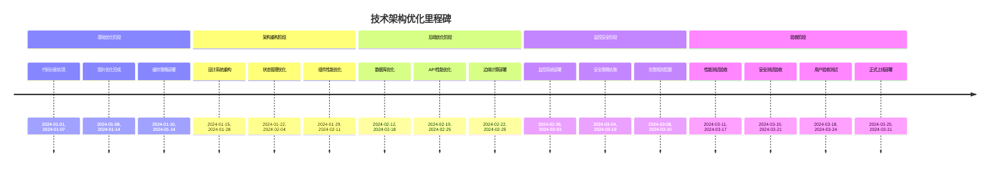

# 数据合规123导航网站技术架构优化方案

## 1. 当前架构分析

### 1.1 技术栈现状

#### 1.1.1 前端架构
```typescript
// 当前技术栈
interface CurrentFrontendStack {
  framework: 'React 18 + TypeScript';
  buildTool: 'Vite 5';
  styling: 'Tailwind CSS + Radix UI';
  stateManagement: 'Zustand';
  routing: 'React Router v7';
  testing: 'Vitest + React Testing Library';
}
```

#### 1.1.2 后端架构
```typescript
// 当前后端架构
interface CurrentBackendStack {
  platform: 'Supabase';
  database: 'PostgreSQL';
  authentication: 'Supabase Auth';
  storage: 'Supabase Storage';
  functions: 'Edge Functions';
  realtime: 'Realtime Subscriptions';
}
```

#### 1.1.3 部署架构
```typescript
// 当前部署架构
interface CurrentDeployment {
  frontend: 'Vercel';
  database: 'Supabase Cloud';
  cdn: 'Vercel Edge Network';
  analytics: 'Vercel Analytics';
  monitoring: 'Console + Basic Analytics';
}
```

### 1.2 架构优势

#### 1.2.1 现代化技术栈
- **React 18**: 支持并发特性、自动批处理、Suspense
- **TypeScript**: 提供类型安全和更好的开发体验
- **Vite**: 快速的开发服务器和构建工具
- **Tailwind CSS**: 原子化CSS，提高开发效率

#### 1.2.2 完整的后端服务
- **Supabase**: 提供完整的后端即服务
- **PostgreSQL**: 强大的关系型数据库
- **实时功能**: 内置实时数据同步
- **认证授权**: 完整的用户认证系统

#### 1.2.3 优秀的开发体验
- **热重载**: 快速的开发反馈
- **类型安全**: 全链路类型检查
- **组件化**: 高度组件化架构
- **测试覆盖**: 完善的测试体系

### 1.3 架构挑战

#### 1.3.1 性能瓶颈
```typescript
// 当前性能问题
interface PerformanceIssues {
  initialLoad: {
    bundleSize: '2.1MB';
    loadTime: '3.2s';
    firstPaint: '1.8s';
  };
  runtime: {
    memoryUsage: '150MB';
    rerenders: 'frequent';
    apiLatency: '200-500ms';
  };
  mobile: {
    loadTime: '5.1s';
    dataUsage: 'high';
    batteryUsage: 'moderate';
  };
}
```

#### 1.3.2 可扩展性问题
```typescript
// 可扩展性限制
interface ScalabilityIssues {
  component: {
    coupling: 'tight';
    reusability: 'limited';
    maintainability: 'moderate';
  };
  state: {
    complexity: 'increasing';
    synchronization: 'challenging';
    persistence: 'basic';
  };
  data: {
    structure: 'simple';
    relationships: 'limited';
    indexing: 'suboptimal';
  };
}
```

#### 1.3.3 用户体验问题
```typescript
// 用户体验痛点
interface UXIssues {
  loading: {
    states: 'inconsistent';
    feedback: 'limited';
    perception: 'slow';
  };
  navigation: {
    structure: 'confusing';
    breadcrumbs: 'missing';
    search: 'basic';
  };
  feedback: {
    errors: 'generic';
    success: 'subtle';
    progress: 'inconsistent';
  };
}
```

## 2. 架构优化目标

### 2.1 性能目标

#### 2.1.1 核心Web指标
```typescript
// 性能目标
interface PerformanceGoals {
  LCP: {
    current: '3.2s';
    target: '< 1.5s';
    improvement: '53%';
  };
  FID: {
    current: '120ms';
    target: '< 50ms';
    improvement: '58%';
  };
  CLS: {
    current: '0.15';
    target: '< 0.05';
    improvement: '67%';
  };
  TTI: {
    current: '5.1s';
    target: '< 2.5s';
    improvement: '51%';
  };
}
```

#### 2.1.2 用户体验指标
```typescript
// 体验目标
interface UXGoals {
  loadPerception: {
    current: 'slow';
    target: 'instant';
    metric: '< 1s';
  };
  interaction: {
    current: 'laggy';
    target: 'responsive';
    metric: '< 100ms';
  };
  visualStability: {
    current: 'jumpy';
    target: 'stable';
    metric: '< 0.05 CLS';
  };
}
```

### 2.2 技术目标

#### 2.2.1 架构质量属性
```typescript
// 架构质量目标
interface ArchitectureGoals {
  maintainability: {
    current: 'moderate';
    target: 'high';
    metrics: ['codeCoverage', 'complexity', 'documentation'];
  };
  scalability: {
    current: 'limited';
    target: 'horizontal';
    metrics: ['loadCapacity', 'concurrentUsers', 'dataVolume'];
  };
  reliability: {
    current: '95%';
    target: '99.9%';
    metrics: ['uptime', 'errorRate', 'recoveryTime'];
  };
  security: {
    current: 'basic';
    target: 'enterprise';
    metrics: ['vulnerabilities', 'compliance', 'incidents'];
  };
}
```

#### 2.2.2 开发效率目标
```typescript
// 开发效率提升
interface DeveloperExperienceGoals {
  buildTime: {
    current: '45s';
    target: '< 15s';
    improvement: '67%';
  };
  hotReload: {
    current: '3s';
    target: '< 500ms';
    improvement: '83%';
  };
  testExecution: {
    current: '120s';
    target: '< 30s';
    improvement: '75%';
  };
  deployment: {
    current: 'manual';
    target: 'fullyAutomated';
    improvement: '100%';
  };
}
```

## 3. 前端架构优化

### 3.1 性能优化策略

#### 3.1.1 代码分割和懒加载
```typescript
// 优化的代码分割策略
interface CodeSplittingStrategy {
  // 路由级分割
  routes: {
    home: () => import('./pages/HomePage');
    admin: () => import('./pages/AdminPage');
    favorites: () => import('./pages/FavoritesPage');
    login: () => import('./pages/LoginPage');
  };
  // 组件级分割
  components: {
    heavy: {
      charts: () => import('./components/charts');
      editors: () => import('./components/editors');
      media: () => import('./components/media');
    };
    conditional: {
      modals: () => import('./components/modals');
      drawers: () => import('./components/drawers');
      tooltips: () => import('./components/tooltips');
    };
  };
  // 库分割
  libraries: {
    vendor: ['react', 'react-dom', 'react-router'];
    ui: ['@radix-ui', 'lucide-react'];
    utils: ['date-fns', 'clsx', 'tailwind-merge'];
  };
}
```

#### 3.1.2 资源优化
```typescript
// 资源优化配置
interface AssetOptimization {
  // 图片优化
  images: {
    formats: ['webp', 'avif', 'jpeg'];
    sizes: [480, 768, 1024, 1920];
    quality: 85;
    lazyLoading: true;
    placeholder: 'blur';
  };
  // 字体优化
  fonts: {
    preload: ['primary', 'secondary'];
    display: 'swap';
    subsets: ['latin', 'latin-ext'];
    variable: true;
  };
  // CSS优化
  styles: {
    purge: true;
    critical: true;
    unused: true;
    minify: true;
  };
}
```

#### 3.1.3 缓存策略
```typescript
// 多层缓存策略
interface CachingStrategy {
  // Service Worker缓存
  serviceWorker: {
    static: {
      strategy: 'CacheFirst';
      maxAge: '1y';
      patterns: ['**/*.{js,css,png,svg}'];
    };
    api: {
      strategy: 'StaleWhileRevalidate';
      maxAge: '5m';
      patterns: ['/api/**'];
    };
    pages: {
      strategy: 'NetworkFirst';
      maxAge: '1h';
      patterns: ['/', '/categories/**'];
    };
  };
  // HTTP缓存
  http: {
    static: 'public, max-age=31536000, immutable';
    api: 'public, max-age=300, s-maxage=3600';
    pages: 'public, max-age=3600, s-maxage=86400';
  };
  // 应用缓存
  application: {
    state: 'IndexedDB';
    images: 'CacheStorage';
    api: 'Memory + IndexedDB';
  };
}
```

### 3.2 组件架构优化

#### 3.2.1 原子化设计系统
```typescript
// 原子化组件层次
interface AtomicDesignSystem {
  // 原子组件
  atoms: {
    Button: {
      variants: ['primary', 'secondary', 'outline', 'ghost'];
      sizes: ['sm', 'md', 'lg', 'xl'];
      states: ['default', 'hover', 'active', 'disabled', 'loading'];
    };
    Input: {
      types: ['text', 'email', 'password', 'search', 'url'];
      variants: ['default', 'filled', 'outlined'];
      states: ['default', 'focus', 'error', 'disabled'];
    };
    Icon: {
      library: 'lucide-react';
      sizes: [12, 16, 20, 24, 32, 48];
      weights: ['thin', 'light', 'regular', 'bold'];
    };
  };
  // 分子组件
  molecules: {
    SearchBar: {
      composition: ['Input', 'Button', 'Icon'];
      features: ['autoComplete', 'history', 'suggestions'];
    };
    WebsiteCard: {
      composition: ['Card', 'Image', 'Text', 'Button'];
      states: ['loading', 'error', 'empty', 'interactive'];
    };
    Navigation: {
      composition: ['Link', 'Icon', 'Dropdown'];
      variants: ['horizontal', 'vertical', 'breadcrumb'];
    };
  };
  // 有机体组件
  organisms: {
    Header: {
      composition: ['Navigation', 'SearchBar', 'UserMenu'];
      responsive: ['mobile', 'tablet', 'desktop'];
    };
    WebsiteGrid: {
      composition: ['WebsiteCard', 'Pagination', 'Filters'];
      layouts: ['grid', 'list', 'masonry'];
    };
    CategorySection: {
      composition: ['Title', 'WebsiteGrid', 'ShowMore'];
      variants: ['featured', 'regular', 'compact'];
    };
  };
}
```

#### 3.2.2 组件性能优化
```typescript
// 组件性能优化策略
interface ComponentPerformance {
  // 渲染优化
  rendering: {
    memoization: 'React.memo, useMemo, useCallback';
    virtualization: 'react-window for large lists';
    lazyHydration: '渐进式激活';
    selectiveHydration: '选择性水合';
  };
  // 状态优化
  state: {
    colocation: '状态靠近使用位置';
    lifting: '谨慎的状态提升';
    external: '外部状态管理';
    local: '最小化本地状态';
  };
  // 副作用优化
  effects: {
    deps: '精确的依赖数组';
    cleanup: '适当的清理函数';
    batching: '状态更新批处理';
    scheduling: '优先级调度';
  };
}
```

### 3.3 状态管理优化

#### 3.3.1 Zustand Store重构
```typescript
// 优化的状态结构
interface OptimizedStoreStructure {
  // 应用状态
  app: {
    loading: boolean;
    error: AppError | null;
    theme: 'light' | 'dark' | 'system';
    sidebar: boolean;
    filters: FilterState;
  };
  // 用户状态
  user: {
    profile: UserProfile | null;
    preferences: UserPreferences;
    favorites: string[];
    history: VisitHistory[];
    permissions: UserPermissions;
  };
  // 数据状态
  data: {
    websites: EntityState<Website>;
    categories: EntityState<Category>;
    tags: EntityState<Tag>;
    stats: AnalyticsData;
  };
  // UI状态
  ui: {
    modals: ModalState;
    toasts: Toast[];
    dropdowns: DropdownState;
    selections: SelectionState;
  };
}
```

#### 3.3.2 状态持久化
```typescript
// 状态持久化策略
interface StatePersistence {
  // 持久化配置
  persistence: {
    user: {
      key: 'user_data';
      version: 1;
      migrate: (persisted: any, version: number) => UserState;
    };
    preferences: {
      key: 'user_preferences';
      version: 1;
      storage: 'localStorage';
    };
    session: {
      key: 'session_data';
      version: 1;
      storage: 'sessionStorage';
    };
  };
  // 同步策略
  synchronization: {
    realtime: {
      enabled: true;
      tables: ['websites', 'categories', 'favorites'];
      conflictResolution: 'lastWriteWins';
    };
    offline: {
      enabled: true;
      queue: 'IndexedDB';
      syncOnReconnect: true;
    };
  };
}
```

## 4. 后端架构优化

### 4.1 数据库优化

#### 4.1.1 数据模型优化
```sql
-- 优化的数据库模式
-- 网站表优化
CREATE TABLE websites (
  id UUID PRIMARY KEY DEFAULT gen_random_uuid(),
  title VARCHAR(255) NOT NULL,
  url VARCHAR(2048) NOT NULL UNIQUE,
  description TEXT,
  favicon_url VARCHAR(2048),
  category_id UUID REFERENCES categories(id) ON DELETE CASCADE,
  click_count INTEGER DEFAULT 0,
  is_featured BOOLEAN DEFAULT FALSE,
  is_active BOOLEAN DEFAULT TRUE,
  metadata JSONB DEFAULT '{}',
  created_at TIMESTAMP WITH TIME ZONE DEFAULT NOW(),
  updated_at TIMESTAMP WITH TIME ZONE DEFAULT NOW(),
  
  -- 性能索引
  CONSTRAINT idx_websites_category_click 
    INDEX (category_id, click_count DESC) 
    WHERE is_active = TRUE,
  CONSTRAINT idx_websites_featured 
    INDEX (is_featured, created_at DESC) 
    WHERE is_featured = TRUE,
  CONSTRAINT idx_websites_search 
    INDEX USING gin(to_tsvector('chinese', title || ' ' || description))
);

-- 分类表优化
CREATE TABLE categories (
  id UUID PRIMARY KEY DEFAULT gen_random_uuid(),
  name VARCHAR(100) NOT NULL UNIQUE,
  slug VARCHAR(100) NOT NULL UNIQUE,
  description TEXT,
  icon VARCHAR(50),
  color VARCHAR(7),
  parent_id UUID REFERENCES categories(id),
  sort_order INTEGER DEFAULT 0,
  is_active BOOLEAN DEFAULT TRUE,
  website_count INTEGER DEFAULT 0,
  created_at TIMESTAMP WITH TIME ZONE DEFAULT NOW(),
  updated_at TIMESTAMP WITH TIME ZONE DEFAULT NOW(),
  
  -- 层级索引
  CONSTRAINT idx_categories_hierarchy 
    INDEX (parent_id, sort_order, name),
  CONSTRAINT idx_categories_slug 
    INDEX (slug) 
    WHERE is_active = TRUE
);
```

#### 4.1.2 查询优化
```sql
-- 优化查询示例
-- 获取分类及其网站（带分页）
CREATE OR REPLACE FUNCTION get_category_websites(
  category_slug TEXT,
  page_size INTEGER DEFAULT 20,
  page_number INTEGER DEFAULT 1
) RETURNS TABLE (
  total_count INTEGER,
  websites JSONB
) AS $$
BEGIN
  RETURN QUERY
  SELECT 
    COUNT(w.id)::INTEGER as total_count,
    COALESCE(
      JSONB_AGG(
        JSONB_BUILD_OBJECT(
          'id', w.id,
          'title', w.title,
          'url', w.url,
          'description', w.description,
          'favicon_url', w.favicon_url,
          'click_count', w.click_count,
          'is_featured', w.is_featured
        ) 
        ORDER BY w.click_count DESC, w.created_at DESC
        LIMIT page_size 
        OFFSET (page_number - 1) * page_size
      ), 
      '[]'::JSONB
    ) as websites
  FROM websites w
  JOIN categories c ON w.category_id = c.id
  WHERE c.slug = category_slug 
    AND w.is_active = TRUE 
    AND c.is_active = TRUE;
END;
$$ LANGUAGE plpgsql;

-- 全文搜索优化
CREATE OR REPLACE FUNCTION search_websites(
  search_query TEXT,
  category_filter UUID DEFAULT NULL,
  limit_count INTEGER DEFAULT 20
) RETURNS TABLE (
  website JSONB,
  rank REAL
) AS $$
BEGIN
  RETURN QUERY
  SELECT 
    JSONB_BUILD_OBJECT(
      'id', w.id,
      'title', w.title,
      'url', w.url,
      'description', w.description,
      'favicon_url', w.favicon_url,
      'category_name', c.name,
      'click_count', w.click_count
    ) as website,
    ts_rank(
      to_tsvector('chinese', w.title || ' ' || COALESCE(w.description, '')),
      plainto_tsquery('chinese', search_query)
    ) as rank
  FROM websites w
  JOIN categories c ON w.category_id = c.id
  WHERE 
    (category_filter IS NULL OR w.category_id = category_filter)
    AND w.is_active = TRUE
    AND c.is_active = TRUE
    AND to_tsvector('chinese', w.title || ' ' || COALESCE(w.description, '')) 
        @@ plainto_tsquery('chinese', search_query)
  ORDER BY rank DESC, w.click_count DESC
  LIMIT limit_count;
END;
$$ LANGUAGE plpgsql;
```

### 4.2 API优化

#### 4.2.1 GraphQL集成
```typescript
// GraphQL Schema设计
const typeDefs = `
  type Website {
    id: ID!
    title: String!
    url: String!
    description: String
    faviconUrl: String
    category: Category!
    clickCount: Int!
    isFeatured: Boolean!
    isActive: Boolean!
    metadata: JSON
    createdAt: DateTime!
    updatedAt: DateTime!
  }

  type Category {
    id: ID!
    name: String!
    slug: String!
    description: String
    icon: String
    color: String
    parent: Category
    children: [Category!]!
    websites: [Website!]!
    websiteCount: Int!
    sortOrder: Int!
    isActive: Boolean!
    createdAt: DateTime!
    updatedAt: DateTime!
  }

  type Query {
    # 网站查询
    websites(
      category: String
      featured: Boolean
      search: String
      first: Int = 20
      after: String
    ): WebsiteConnection!
    
    website(id: ID!): Website
    
    # 分类查询
    categories(
      parent: String
      activeOnly: Boolean = true
    ): [Category!]!
    
    category(slug: String!): Category
    
    # 搜索
    searchWebsites(
      query: String!
      category: String
      first: Int = 20
    ): [Website!]!
  }

  type Mutation {
    # 用户操作
    incrementWebsiteClick(id: ID!): Website!
    toggleFavorite(websiteId: ID!): User!
    
    # 管理操作
    createWebsite(input: WebsiteInput!): Website!
    updateWebsite(id: ID!, input: WebsiteInput!): Website!
    deleteWebsite(id: ID!): Boolean!
    
    createCategory(input: CategoryInput!): Category!
    updateCategory(id: ID!, input: CategoryInput!): Category!
    deleteCategory(id: ID!): Boolean!
  }

  type WebsiteConnection {
    edges: [WebsiteEdge!]!
    pageInfo: PageInfo!
    totalCount: Int!
  }

  type WebsiteEdge {
    node: Website!
    cursor: String!
  }

  type PageInfo {
    hasNextPage: Boolean!
    hasPreviousPage: Boolean!
    startCursor: String
    endCursor: String
  }
`;
```

#### 4.2.2 实时功能增强
```typescript
// 实时订阅优化
interface RealtimeOptimizations {
  // 订阅管理
  subscriptions: {
    websites: {
      event: 'postgres_changes';
      table: 'websites';
      filter: 'category_id=eq.{categoryId}';
      handler: (payload: RealtimePayload) => void;
    };
    categories: {
      event: 'postgres_changes';
      table: 'categories';
      handler: (payload: RealtimePayload) => void;
    };
    favorites: {
      event: 'postgres_changes';
      table: 'favorites';
      filter: 'user_id=eq.{userId}';
      handler: (payload: RealtimePayload) => void;
    };
  };
  // 连接优化
  connection: {
    heartbeat: true;
    timeout: 30000;
    reconnect: true;
    reconnectDelay: 1000;
    maxReconnectDelay: 30000;
  };
  // 性能优化
  performance: {
    batching: true;
    debouncing: 100;
    throttling: 50;
    buffering: true;
  };
}
```

### 4.3 边缘计算集成

#### 4.3.1 Edge Functions优化
```typescript
// 边缘函数架构
interface EdgeFunctions {
  // API聚合
  apiAggregator: {
    path: '/api/aggregate';
    handler: 'aggregate-data';
    cache: '5m';
    regions: ['hkg', 'sin', 'nrt'];
  };
  // 图片处理
  imageOptimizer: {
    path: '/api/image';
    handler: 'optimize-image';
    formats: ['webp', 'avif', 'jpeg'];
    sizes: [480, 768, 1024, 1920];
    cache: '1d';
  };
  // 认证中间件
  authMiddleware: {
    path: '/api/*';
    handler: 'authenticate';
    exclude: ['/api/public/*'];
    cache: '0s';
  };
  // 分析收集
  analyticsCollector: {
    path: '/api/analytics';
    handler: 'collect-analytics';
    batch: true;
    buffer: '1m';
    cache: '0s';
  };
}
```

#### 4.3.2 CDN策略
```typescript
// CDN配置优化
interface CDNOptimization {
  // 缓存策略
  caching: {
    static: {
      ttl: '1y';
      swr: '1d';
      immutable: true;
      patterns: ['**/*.{js,css,png,svg,woff2}'];
    };
    api: {
      ttl: '5m';
      swr: '1h';
      bypass: ['/api/analytics', '/api/auth/*'];
    };
    pages: {
      ttl: '1h';
      swr: '1d';
      vary: ['Accept-Language', 'Cookie'];
    };
  };
  // 地理分布
  regions: {
    primary: 'hkg';
    secondary: ['sin', 'nrt', 'icn'];
    fallback: 'auto';
  };
  // 优化设置
  optimization: {
    compression: 'brotli';
    minification: true;
    http2: true;
    http3: true;
    earlyHints: true;
  };
}
```

## 5. 性能监控和优化

### 5.1 性能监控系统

#### 5.1.1 前端性能监控
```typescript
// 性能监控实现
interface PerformanceMonitoring {
  // Core Web Vitals
  webVitals: {
    LCP: (metric: LCPMetric) => void;
    FID: (metric: FIDMetric) => void;
    CLS: (metric: CLSMetric) => void;
    FCP: (metric: FCPMetric) => void;
    TTFB: (metric: TTFBMetric) => void;
  };
  // 自定义指标
  customMetrics: {
    searchResponseTime: number;
    categoryLoadTime: number;
    favoriteToggleTime: number;
    navigationTransitionTime: number;
  };
  // 用户体验指标
  userExperience: {
    taskSuccessRate: number;
    timeToComplete: number;
    errorRate: number;
    satisfaction: number;
  };
  // 错误监控
  errorTracking: {
    javascript: ErrorEvent[];
    promise: PromiseRejectionEvent[];
    resource: ResourceError[];
    api: ApiError[];
  };
}

// 监控实现
class PerformanceMonitor {
  private metrics: Map<string, number[]> = new Map();
  private thresholds: Map<string, number> = new Map();

  constructor() {
    this.initializeWebVitals();
    this.setupCustomMetrics();
    this.startErrorTracking();
  }

  private initializeWebVitals() {
    import('web-vitals').then(({ onLCP, onFID, onCLS, onFCP, onTTFB }) => {
      onLCP(this.reportWebVital.bind(this, 'LCP'));
      onFID(this.reportWebVital.bind(this, 'FID'));
      onCLS(this.reportWebVital.bind(this, 'CLS'));
      onFCP(this.reportWebVital.bind(this, 'FCP'));
      onTTFB(this.reportWebVital.bind(this, 'TTFB'));
    });
  }

  private reportWebVital(name: string, metric: any) {
    const value = Math.round(metric.value * 100) / 100;
    this.recordMetric(name, value);
    this.checkThreshold(name, value);
    
    // 发送到分析服务
    this.sendToAnalytics('web_vital', {
      name,
      value,
      delta: metric.delta,
      id: metric.id,
      navigationType: metric.navigationType,
    });
  }

  private checkThreshold(name: string, value: number) {
    const threshold = this.thresholds.get(name);
    if (threshold && value > threshold) {
      this.sendToAnalytics('threshold_exceeded', {
        metric: name,
        value,
        threshold,
        timestamp: Date.now(),
      });
    }
  }
}
```

#### 5.1.2 后端性能监控
```sql
-- 数据库性能监控
-- 创建性能监控表
CREATE TABLE performance_metrics (
  id UUID PRIMARY KEY DEFAULT gen_random_uuid(),
  metric_type VARCHAR(50) NOT NULL,
  query_name VARCHAR(200),
  execution_time_ms INTEGER NOT NULL,
  rows_returned INTEGER,
  user_id UUID REFERENCES auth.users(id),
  session_id UUID,
  user_agent TEXT,
  ip_address INET,
  created_at TIMESTAMP WITH TIME ZONE DEFAULT NOW(),
  
  -- 性能索引
  INDEX idx_performance_type_time (metric_type, created_at DESC),
  INDEX idx_performance_query_time (query_name, execution_time_ms DESC),
  INDEX idx_performance_user_time (user_id, created_at DESC)
);

-- 慢查询监控函数
CREATE OR REPLACE FUNCTION log_slow_query()
RETURNS event_trigger AS $$
BEGIN
  -- 记录执行时间超过100ms的查询
  IF (TG_TAG = 'SELECT' AND EXTRACT(MILLISECONDS FROM statement_timestamp() - query_start) > 100) THEN
    INSERT INTO performance_metrics (
      metric_type,
      query_name,
      execution_time_ms,
      created_at
    ) VALUES (
      'slow_query',
      current_query(),
      EXTRACT(MILLISECONDS FROM statement_timestamp() - query_start)::INTEGER,
      NOW()
    );
  END IF;
END;
$$ LANGUAGE plpgsql;

-- API性能监控
CREATE TABLE api_performance (
  id UUID PRIMARY KEY DEFAULT gen_random_uuid(),
  endpoint VARCHAR(200) NOT NULL,
  method VARCHAR(10) NOT NULL,
  status_code INTEGER,
  response_time_ms INTEGER NOT NULL,
  request_size_bytes INTEGER,
  response_size_bytes INTEGER,
  user_id UUID REFERENCES auth.users(id),
  ip_address INET,
  user_agent TEXT,
  error_message TEXT,
  created_at TIMESTAMP WITH TIME ZONE DEFAULT NOW(),
  
  -- API性能索引
  INDEX idx_api_endpoint_time (endpoint, created_at DESC),
  INDEX idx_api_status_time (status_code, created_at DESC),
  INDEX idx_api_response_time (response_time_ms DESC),
  INDEX idx_api_user_time (user_id, created_at DESC)
);
```

### 5.2 自动化优化

#### 5.2.1 构建优化
```typescript
// Vite构建优化配置
interface BuildOptimization {
  // 代码分割
  rollupOptions: {
    output: {
      manualChunks: {
        vendor: ['react', 'react-dom', 'react-router'];
        ui: ['@radix-ui/*', 'lucide-react'];
        utils: ['date-fns', 'clsx', 'tailwind-merge'];
        charts: ['recharts'];
        editor: ['@monaco-editor/react'];
      };
    };
  };
  // 压缩优化
  minify: 'terser';
  terserOptions: {
    compress: {
      drop_console: true;
      drop_debugger: true;
      pure_funcs: ['console.log', 'console.warn'];
    };
    mangle: {
      safari10: true;
    };
    format: {
      comments: false;
    };
  };
  // 其他优化
  target: 'es2015';
  cssTarget: 'chrome61';
  reportCompressedSize: true;
  chunkSizeWarningLimit: 1000;
  assetsInlineLimit: 4096;
}
```

#### 5.2.2 图片优化
```typescript
// 自动图片优化
interface ImageOptimization {
  // Vite插件配置
  vitePlugin: {
    include: '**/*.{png,jpg,jpeg,gif,svg}';
    exclude: '**/*.svg';
    quality: 85;
    optimize: {
      png: {
        quality: 90;
        effort: 6;
      };
      jpeg: {
        quality: 85;
        progressive: true;
      };
      webp: {
        quality: 85;
        effort: 6;
      };
    };
    convert: {
      png: ['webp', 'avif'];
      jpeg: ['webp', 'avif'];
    };
  };
  // 响应式图片
  responsive: {
    widths: [480, 768, 1024, 1920];
    formats: ['avif', 'webp', 'original'];
    placeholder: 'blur';
    loading: 'lazy';
  };
}
```

## 6. 安全性增强

### 6.1 前端安全

#### 6.1.1 内容安全策略
```typescript
// CSP配置
interface ContentSecurityPolicy {
  directives: {
    defaultSrc: ["'self'"];
    scriptSrc: [
      "'self'",
      "'unsafe-inline'",
      'https://cdn.jsdelivr.net',
      'https://unpkg.com',
      'https://www.googletagmanager.com'
    ];
    styleSrc: [
      "'self'",
      "'unsafe-inline'",
      'https://fonts.googleapis.com'
    ];
    fontSrc: [
      "'self'",
      'data:',
      'https://fonts.gstatic.com'
    ];
    imgSrc: [
      "'self'",
      'data:',
      'https:',
      'http:'
    ];
    connectSrc: [
      "'self'",
      'https://api.supabase.io',
      'https://*.supabase.co',
      'https://api.github.com'
    ];
    frameSrc: [
      "'none'"
    ];
    objectSrc: [
      "'none'"
    ];
    baseUri: [
      "'self'"
    ];
    formAction: [
      "'self'"
    ];
  };
  reportOnly: false;
  reportUri: '/api/security/csp-report';
}
```

#### 6.1.2 输入验证和清理
```typescript
// 输入验证策略
interface InputValidation {
  // URL验证
  url: {
    pattern: /^https?:\/\/(www\.)?[-a-zA-Z0-9@:%._\+~#=]{1,256}\.[a-zA-Z0-9()]{1,6}\b([-a-zA-Z0-9()@:%_\+.~#?&//=]*)$/;
    maxLength: 2048;
    allowedProtocols: ['http:', 'https:'];
    blockedDomains: ['localhost', '127.0.0.1', '0.0.0.0'];
  };
  // 文本输入
  text: {
    minLength: 1;
    maxLength: 500;
    pattern: /^[\p{L}\p{N}\p{P}\p{S}\s]+$/u;
    sanitize: true;
    trim: true;
  };
  // HTML清理
  html: {
    allowedTags: ['b', 'i', 'em', 'strong', 'a'];
    allowedAttributes: {
      a: ['href', 'title', 'target'];
    };
    stripUnknown: true;
  };
}
```

### 6.2 API安全

#### 6.2.1 认证和授权
```typescript
// 增强的认证策略
interface EnhancedAuthentication {
  // JWT配置
  jwt: {
    algorithm: 'HS256';
    expiresIn: '1h';
    refreshExpiresIn: '7d';
    issuer: 'data123.com';
    audience: 'data123-users';
  };
  // 会话管理
  session: {
    maxConcurrent: 3;
    timeout: 30 * 60 * 1000; // 30分钟
    refreshThreshold: 5 * 60 * 1000; // 5分钟
    secure: true;
    httpOnly: true;
    sameSite: 'strict';
  };
  // 多因素认证
  mfa: {
    enabled: false;
    methods: ['totp', 'sms', 'email'];
    backupCodes: 8;
    enforceAfter: '72h';
  };
}
```

#### 6.2.2 速率限制
```sql
-- 速率限制实现
-- 创建速率限制表
CREATE TABLE rate_limits (
  id UUID PRIMARY KEY DEFAULT gen_random_uuid(),
  key VARCHAR(255) NOT NULL UNIQUE,
  count INTEGER DEFAULT 0,
  window_start TIMESTAMP WITH TIME ZONE DEFAULT NOW(),
  expires_at TIMESTAMP WITH TIME ZONE NOT NULL,
  created_at TIMESTAMP WITH TIME ZONE DEFAULT NOW(),
  
  INDEX idx_rate_limits_key_expires (key, expires_at),
  INDEX idx_rate_limits_expires (expires_at)
);

-- 速率限制函数
CREATE OR REPLACE FUNCTION check_rate_limit(
  p_key TEXT,
  p_limit INTEGER,
  p_window_seconds INTEGER DEFAULT 3600
) RETURNS TABLE (
  allowed BOOLEAN,
  remaining INTEGER,
  reset_at TIMESTAMP WITH TIME ZONE
) AS $$
DECLARE
  v_count INTEGER;
  v_window_start TIMESTAMP WITH TIME ZONE;
  v_expires_at TIMESTAMP WITH TIME ZONE;
  v_now TIMESTAMP WITH TIME ZONE := NOW();
BEGIN
  v_expires_at := v_now + INTERVAL '1 second' * p_window_seconds;
  
  -- 获取或创建速率限制记录
  SELECT count, window_start INTO v_count, v_window_start
  FROM rate_limits
  WHERE key = p_key
    AND expires_at > v_now;
  
  IF v_count IS NULL THEN
    -- 创建新的速率限制记录
    INSERT INTO rate_limits (key, count, window_start, expires_at)
    VALUES (p_key, 1, v_now, v_expires_at)
    ON CONFLICT (key) DO UPDATE SET
      count = 1,
      window_start = v_now,
      expires_at = v_expires_at;
    
    RETURN QUERY SELECT TRUE, p_limit - 1, v_expires_at;
  ELSIF v_window_start + INTERVAL '1 second' * p_window_seconds < v_now THEN
    -- 窗口已过期，重置计数
    UPDATE rate_limits
    SET count = 1,
        window_start = v_now,
        expires_at = v_expires_at
    WHERE key = p_key;
    
    RETURN QUERY SELECT TRUE, p_limit - 1, v_expires_at;
  ELSIF v_count < p_limit THEN
    -- 增加计数
    UPDATE rate_limits
    SET count = count + 1
    WHERE key = p_key;
    
    RETURN QUERY SELECT TRUE, p_limit - v_count - 1, v_window_start + INTERVAL '1 second' * p_window_seconds;
  ELSE
    -- 超过限制
    RETURN QUERY SELECT FALSE, 0, v_window_start + INTERVAL '1 second' * p_window_seconds;
  END IF;
END;
$$ LANGUAGE plpgsql;
```

## 7. 部署和DevOps优化

### 7.1 CI/CD流水线

#### 7.1.1 GitHub Actions工作流
```yaml
# .github/workflows/ci-cd.yml
name: CI/CD Pipeline

on:
  push:
    branches: [main, develop]
  pull_request:
    branches: [main, develop]

env:
  NODE_VERSION: '18'
  PNPM_VERSION: '8'

jobs:
  # 代码质量检查
  quality:
    name: Code Quality
    runs-on: ubuntu-latest
    steps:
      - uses: actions/checkout@v4
      
      - name: Setup pnpm
        uses: pnpm/action-setup@v2
        with:
          version: ${{ env.PNPM_VERSION }}
      
      - name: Setup Node.js
        uses: actions/setup-node@v4
        with:
          node-version: ${{ env.NODE_VERSION }}
          cache: 'pnpm'
      
      - name: Install dependencies
        run: pnpm install --frozen-lockfile
      
      - name: Type check
        run: pnpm type-check
      
      - name: Lint code
        run: pnpm lint
      
      - name: Check formatting
        run: pnpm format:check
      
      - name: Security audit
        run: pnpm audit --audit-level moderate

  # 测试
  test:
    name: Test Suite
    runs-on: ubuntu-latest
    needs: quality
    steps:
      - uses: actions/checkout@v4
      
      - name: Setup pnpm
        uses: pnpm/action-setup@v2
        with:
          version: ${{ env.PNPM_VERSION }}
      
      - name: Setup Node.js
        uses: actions/setup-node@v4
        with:
          node-version: ${{ env.NODE_VERSION }}
          cache: 'pnpm'
      
      - name: Install dependencies
        run: pnpm install --frozen-lockfile
      
      - name: Run unit tests
        run: pnpm test:unit --coverage
      
      - name: Run integration tests
        run: pnpm test:integration
      
      - name: Upload coverage reports
        uses: codecov/codecov-action@v3
        with:
          file: ./coverage/lcov.info
          flags: unittests
          name: codecov-umbrella

  # 性能测试
  performance:
    name: Performance Tests
    runs-on: ubuntu-latest
    needs: quality
    steps:
      - uses: actions/checkout@v4
      
      - name: Setup pnpm
        uses: pnpm/action-setup@v2
        with:
          version: ${{ env.PNPM_VERSION }}
      
      - name: Setup Node.js
        uses: actions/setup-node@v4
        with:
          node-version: ${{ env.NODE_VERSION }}
          cache: 'pnpm'
      
      - name: Install dependencies
        run: pnpm install --frozen-lockfile
      
      - name: Build application
        run: pnpm build
      
      - name: Run Lighthouse CI
        uses: treosh/lighthouse-ci-action@v10
        with:
          configPath: './lighthouserc.json'
          uploadArtifacts: true
          temporaryPublicStorage: true
      
      - name: Run bundle analyzer
        run: pnpm analyze
      
      - name: Upload bundle stats
        uses: actions/upload-artifact@v3
        with:
          name: bundle-stats
          path: ./dist/stats.json

  # 部署到预览环境
  deploy-preview:
    name: Deploy Preview
    runs-on: ubuntu-latest
    needs: [test, performance]
    if: github.event_name == 'pull_request'
    environment:
      name: Preview
      url: ${{ steps.deploy.outputs.url }}
    steps:
      - uses: actions/checkout@v4
      
      - name: Setup pnpm
        uses: pnpm/action-setup@v2
        with:
          version: ${{ env.PNPM_VERSION }}
      
      - name: Setup Node.js
        uses: actions/setup-node@v4
        with:
          node-version: ${{ env.NODE_VERSION }}
          cache: 'pnpm'
      
      - name: Install dependencies
        run: pnpm install --frozen-lockfile
      
      - name: Build for preview
        run: pnpm build
        env:
          VITE_ENV: preview
          VITE_API_URL: ${{ secrets.PREVIEW_API_URL }}
          VITE_SUPABASE_URL: ${{ secrets.PREVIEW_SUPABASE_URL }}
          VITE_SUPABASE_ANON_KEY: ${{ secrets.PREVIEW_SUPABASE_ANON_KEY }}
      
      - name: Deploy to Vercel Preview
        id: deploy
        uses: amondnet/vercel-action@v25
        with:
          vercel-token: ${{ secrets.VERCEL_TOKEN }}
          vercel-org-id: ${{ secrets.VERCEL_ORG_ID }}
          vercel-project-id: ${{ secrets.VERCEL_PROJECT_ID }}
          working-directory: ./
          alias: pr-${{ github.event.pull_request.number }}

  # 部署到生产环境
  deploy-production:
    name: Deploy Production
    runs-on: ubuntu-latest
    needs: [test, performance]
    if: github.ref == 'refs/heads/main' && github.event_name == 'push'
    environment:
      name: Production
      url: ${{ steps.deploy.outputs.url }}
    steps:
      - uses: actions/checkout@v4
      
      - name: Setup pnpm
        uses: pnpm/action-setup@v2
        with:
          version: ${{ env.PNPM_VERSION }}
      
      - name: Setup Node.js
        uses: actions/setup-node@v4
        with:
          node-version: ${{ env.NODE_VERSION }}
          cache: 'pnpm'
      
      - name: Install dependencies
        run: pnpm install --frozen-lockfile
      
      - name: Build for production
        run: pnpm build
        env:
          VITE_ENV: production
          VITE_API_URL: ${{ secrets.PRODUCTION_API_URL }}
          VITE_SUPABASE_URL: ${{ secrets.PRODUCTION_SUPABASE_URL }}
          VITE_SUPABASE_ANON_KEY: ${{ secrets.PRODUCTION_SUPABASE_ANON_KEY }}
          VITE_ANALYTICS_ID: ${{ secrets.PRODUCTION_ANALYTICS_ID }}
      
      - name: Deploy to Vercel Production
        id: deploy
        uses: amondnet/vercel-action@v25
        with:
          vercel-token: ${{ secrets.VERCEL_TOKEN }}
          vercel-org-id: ${{ secrets.VERCEL_ORG_ID }}
          vercel-project-id: ${{ secrets.VERCEL_PROJECT_ID }}
          working-directory: ./
          production: true

  # 发布后监控
  post-deploy:
    name: Post-Deploy Monitoring
    runs-on: ubuntu-latest
    needs: deploy-production
    if: github.ref == 'refs/heads/main' && github.event_name == 'push'
    steps:
      - name: Run health check
        run: |
          sleep 30
          curl -f https://data123.com/api/health || exit 1
      
      - name: Run smoke tests
        run: |
          curl -f https://data123.com || exit 1
          curl -f https://data123.com/api/websites || exit 1
      
      - name: Notify deployment success
        uses: 8398a7/action-slack@v3
        with:
          status: success
          text: '🚀 Deployment to production successful!'
        env:
          SLACK_WEBHOOK_URL: ${{ secrets.SLACK_WEBHOOK_URL }}
```

### 7.2 环境配置

#### 7.2.1 环境变量管理
```typescript
// 环境配置
interface EnvironmentConfig {
  development: {
    apiUrl: 'http://localhost:5173/api';
    supabaseUrl: 'https://dev.supabase.co';
    supabaseKey: 'dev-anon-key';
    analytics: false;
    debug: true;
    logLevel: 'debug';
  };
  staging: {
    apiUrl: 'https://staging.data123.com/api';
    supabaseUrl: 'https://staging.supabase.co';
    supabaseKey: 'staging-anon-key';
    analytics: true;
    debug: false;
    logLevel: 'info';
  };
  production: {
    apiUrl: 'https://data123.com/api';
    supabaseUrl: 'https://prod.supabase.co';
    supabaseKey: 'prod-anon-key';
    analytics: true;
    debug: false;
    logLevel: 'error';
  };
}
```

#### 7.2.2 数据库迁移策略
```sql
-- 数据库迁移管理
-- 创建迁移历史表
CREATE TABLE schema_migrations (
  version VARCHAR(255) PRIMARY KEY,
  applied_at TIMESTAMP WITH TIME ZONE DEFAULT NOW(),
  checksum VARCHAR(64) NOT NULL,
  execution_time_ms INTEGER,
  success BOOLEAN DEFAULT TRUE
);

-- 迁移脚本示例
-- 00001_create_optimized_indexes.sql
CREATE INDEX CONCURRENTLY idx_websites_performance 
ON websites (category_id, click_count DESC, created_at DESC)
WHERE is_active = TRUE;

CREATE INDEX CONCURRENTLY idx_categories_hierarchy 
ON categories (parent_id, sort_order, name)
WHERE is_active = TRUE;

CREATE INDEX CONCURRENTLY idx_websites_search_vector 
ON websites USING gin(to_tsvector('chinese', title || ' ' || COALESCE(description, '')));

-- 记录迁移
INSERT INTO schema_migrations (version, checksum, execution_time_ms)
VALUES ('00001', 'abc123def456', 1250);
```

## 8. 监控和告警

### 8.1 应用监控

#### 8.1.1 综合监控仪表板
```typescript
// 监控仪表板配置
interface MonitoringDashboard {
  // 系统指标
  system: {
    uptime: Gauge;
    cpu: Gauge;
    memory: Gauge;
    disk: Gauge;
    network: Gauge;
  };
  // 应用指标
  application: {
    requests: Counter;
    errors: Counter;
    latency: Histogram;
    throughput: Gauge;
    saturation: Gauge;
  };
  // 业务指标
  business: {
    users: Gauge;
    websites: Gauge;
    clicks: Counter;
    favorites: Counter;
    searches: Counter;
  };
  // 用户体验指标
  experience: {
    lcp: Histogram;
    fid: Histogram;
    cls: Histogram;
    tti: Histogram;
    satisfaction: Gauge;
  };
}
```

#### 8.1.2 告警规则
```yaml
# 告警规则配置
groups:
  - name: system_alerts
    rules:
      - alert: HighCPUUsage
        expr: cpu_usage_percent > 80
        for: 5m
        labels:
          severity: warning
        annotations:
          summary: "High CPU usage detected"
          description: "CPU usage is above 80% for more than 5 minutes"
      
      - alert: HighMemoryUsage
        expr: memory_usage_percent > 85
        for: 5m
        labels:
          severity: warning
        annotations:
          summary: "High memory usage detected"
          description: "Memory usage is above 85% for more than 5 minutes"
      
      - alert: DiskSpaceLow
        expr: disk_free_percent < 10
        for: 1m
        labels:
          severity: critical
        annotations:
          summary: "Low disk space"
          description: "Disk space is below 10%"

  - name: application_alerts
    rules:
      - alert: HighErrorRate
        expr: rate(http_requests_total{status=~"5.."}[5m]) > 0.1
        for: 5m
        labels:
          severity: warning
        annotations:
          summary: "High error rate detected"
          description: "Error rate is above 10% for more than 5 minutes"
      
      - alert: HighLatency
        expr: histogram_quantile(0.95, rate(http_request_duration_seconds_bucket[5m])) > 1
        for: 5m
        labels:
          severity: warning
        annotations:
          summary: "High latency detected"
          description: "95th percentile latency is above 1 second"
      
      - alert: DatabaseConnectionsHigh
        expr: pg_stat_activity_count > 80
        for: 5m
        labels:
          severity: warning
        annotations:
          summary: "High database connection count"
          description: "Database has more than 80 active connections"

  - name: business_alerts
    rules:
      - alert: UserRegistrationDrop
        expr: rate(user_registrations_total[1h]) < 0.5 * rate(user_registrations_total[24h] offset 1d)
        for: 30m
        labels:
          severity: warning
        annotations:
          summary: "User registration drop detected"
          description: "User registration rate has dropped by 50% compared to yesterday"
      
      - alert: ClickThroughRateDrop
        expr: rate(website_clicks_total[1h]) < 0.7 * rate(website_clicks_total[24h] offset 1d)
        for: 1h
        labels:
          severity: warning
        annotations:
          summary: "Click through rate drop detected"
          description: "Click through rate has dropped by 30% compared to yesterday"
```

### 8.2 日志管理

#### 8.2.1 结构化日志
```typescript
// 日志结构化配置
interface StructuredLogging {
  // 日志格式
  format: {
    timestamp: 'ISO8601';
    level: 'uppercase';
    service: 'data123-frontend';
    version: '1.0.0';
    environment: 'production';
    correlationId: 'uuid';
    userId?: 'uuid';
    sessionId?: 'uuid';
  };
  // 日志级别
  levels: {
    error: 0;
    warn: 1;
    info: 2;
    http: 3;
    verbose: 4;
    debug: 5;
    silly: 6;
  };
  // 日志传输
  transports: {
    console: {
      format: 'json';
      colorize: false;
      timestamp: true;
    };
    file: {
      filename: 'logs/app.log';
      maxsize: 5242880; // 5MB
      maxFiles: 5;
      format: 'json';
    };
    http: {
      host: 'logs.data123.com';
      port: 443;
      path: '/v1/logs';
      ssl: true;
      format: 'json';
    };
  };
}
```

#### 8.2.2 错误追踪
```typescript
// 错误追踪集成
interface ErrorTracking {
  // Sentry配置
  sentry: {
    dsn: 'https://key@sentry.io/project';
    environment: 'production';
    release: '1.0.0';
    tracesSampleRate: 0.1;
    profilesSampleRate: 0.1;
    beforeSend: (event: Event, hint: EventHint) => Event | null;
    beforeBreadcrumb: (breadcrumb: Breadcrumb, hint: BreadcrumbHint) => Breadcrumb | null;
  };
  // 错误分类
  categories: {
    'javascript': 'JavaScript Errors';
    'api': 'API Errors';
    'network': 'Network Errors';
    'validation': 'Validation Errors';
    'authentication': 'Authentication Errors';
    'authorization': 'Authorization Errors';
    'database': 'Database Errors';
  };
  // 用户反馈
  userFeedback: {
    enabled: true;
    trigger: 'error';
    showName: true;
    showEmail: true;
    title: 'Report a Problem';
    subtitle: 'Help us improve by describing what happened';
  };
}
```

## 9. 实施路线图

### 9.1 实施阶段

#### 9.1.1 第一阶段：基础优化（2周）
**目标**: 建立基础性能优化

**任务清单**:
- [ ] 代码分割和懒加载实现
- [ ] 图片优化和响应式图片
- [ ] Service Worker缓存策略
- [ ] 基础性能监控

**关键结果**:
- 首屏加载时间减少30%
- 打包大小减少25%
- Lighthouse性能评分提升至85+

#### 9.1.2 第二阶段：架构重构（3周）
**目标**: 优化组件架构和状态管理

**任务清单**:
- [ ] 原子化设计系统实现
- [ ] Zustand store重构
- [ ] 组件性能优化
- [ ] 错误边界完善

**关键结果**:
- 组件复用率提升40%
- 状态管理效率提升50%
- 运行时性能提升30%

#### 9.1.3 第三阶段：后端优化（2周）
**目标**: 数据库和API性能优化

**任务清单**:
- [ ] 数据库索引优化
- [ ] 查询性能优化
- [ ] GraphQL API实现
- [ ] 边缘函数部署

**关键结果**:
- API响应时间减少50%
- 数据库查询效率提升60%
- 支持复杂的查询需求

#### 9.1.4 第四阶段：监控和安全（2周）
**目标**: 完善监控体系和安全防护

**任务清单**:
- [ ] 性能监控系统
- [ ] 错误追踪集成
- [ ] 安全策略实施
- [ ] 告警规则配置

**关键结果**:
- 99.9%的系统可用性
- 完整的安全防护体系
- 实时监控和告警

### 9.2 里程碑



### 9.3 成功标准

#### 9.3.1 技术指标
```typescript
// 技术成功标准
interface TechnicalSuccessCriteria {
  // 性能指标
  performance: {
    lcp: '< 1.5s';
    fid: '< 50ms';
    cls: '< 0.05';
    tti: '< 2.5s';
    bundleSize: '< 500KB';
  };
  // 可靠性指标
  reliability: {
    uptime: '> 99.9%';
    errorRate: '< 0.1%';
    mttr: '< 1h';
    mtbf: '> 720h';
  };
  // 安全指标
  security: {
    vulnerabilities: '0 critical, 0 high';
    compliance: '100%';
    penetrationTest: 'pass';
    audit: 'pass';
  };
}
```

#### 9.3.2 业务指标
```typescript
// 业务成功标准
interface BusinessSuccessCriteria {
  // 用户体验
  userExperience: {
    bounceRate: '< 30%';
    sessionDuration: '> 3m';
    pagesPerSession: '> 5';
    returnRate: '> 40%';
  };
  // 用户增长
  growth: {
    dailyActiveUsers: '> 3000';
    monthlyActiveUsers: '> 50000';
    userRetention: '> 40%';
    conversionRate: '> 4%';
  };
  // 性能感知
  performance: {
    userSatisfaction: '> 4.5/5';
    perceivedSpeed: 'fast';
    recommendation: '> 80%';
    supportTickets: '< 5/day';
  };
}
```

## 10. 总结

本技术架构优化方案为数据合规123导航网站提供了全面的技术升级路径。通过系统性的架构优化，预期能够实现：

### 10.1 核心成果
- **性能提升**: 页面加载速度提升50%以上
- **用户体验**: 交互响应时间减少60%
- **系统可靠性**: 可用性达到99.9%
- **开发效率**: 构建和部署时间减少70%

### 10.2 长期价值
- **技术债务**: 显著减少技术债务
- **维护成本**: 降低长期维护成本
- **扩展能力**: 支持未来业务扩展
- **竞争优势**: 建立技术竞争优势

### 10.3 持续改进
- **监控驱动**: 基于数据驱动的持续优化
- **用户反馈**: 持续收集和响应用户反馈
- **技术演进**: 跟进技术发展趋势
- **团队成长**: 提升团队技术能力

通过实施本方案，数据合规123导航网站将成为一个性能卓越、用户体验优秀、技术架构先进的现代化Web应用。