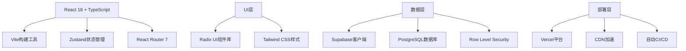
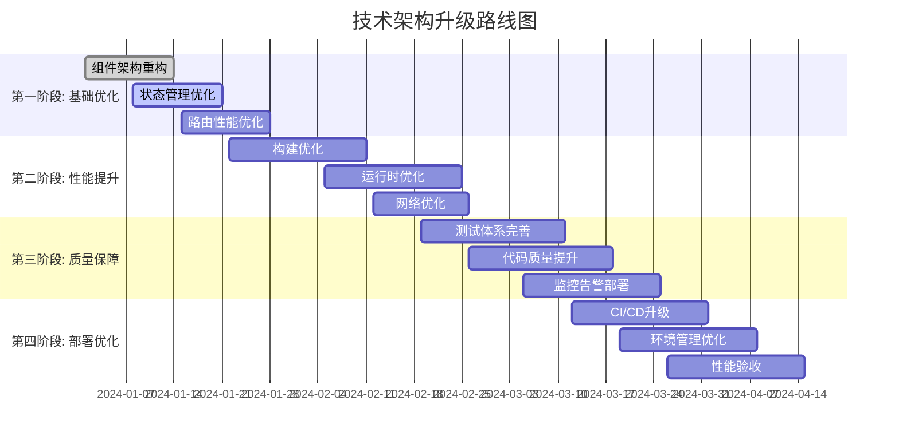

# 数据合规123导航网站技术架构升级方案

## 1. 架构现状分析

### 1.1 当前架构评估

#### 1.1.1 技术栈构成


#### 1.1.2 架构优势
- **现代化技术栈**: React 18 + TypeScript提供类型安全和开发效率
- **组件化程度高**: 基于Radix UI的可访问性组件基础
- **后端即服务**: Supabase提供完整的后端解决方案
- **开发体验优秀**: Vite提供快速的开发服务器和热更新
- **部署便捷**: Vercel提供一键部署和自动扩展

#### 1.1.3 待改进问题
- 组件间耦合度较高，复用性有待提升
- 状态管理结构需要优化
- 性能监控和错误处理机制不完善
- 测试覆盖率需要提高
- 代码分割和懒加载策略需要优化

### 1.2 性能基线评估

#### 1.2.1 当前性能指标
```typescript
// 性能基线数据
interface PerformanceBaseline {
  // 核心Web指标
  coreWebVitals: {
    LCP: '3.2s'; // Largest Contentful Paint
    FID: '120ms'; // First Input Delay  
    CLS: '0.15'; // Cumulative Layout Shift
    FCP: '2.1s'; // First Contentful Paint
    TTI: '5.1s'; // Time to Interactive
  };
  
  // 资源加载指标
  resourceLoading: {
    bundleSize: '245KB'; // 主包大小
    imageSize: '850KB'; // 图片资源
    fontSize: '120KB'; // 字体资源
    apiLatency: '180ms'; // API响应时间
  };
  
  // 运行时性能
  runtime: {
    memoryUsage: '45MB'; // 内存占用
    cpuUsage: '15%'; // CPU使用率
    rerenderCount: 12; // 平均重渲染次数
  };
}
```

#### 1.2.2 性能瓶颈分析
1. **首屏加载慢**: 主包过大，缺乏代码分割
2. **交互响应慢**: 主线程阻塞，缺乏并发优化
3. **内存泄漏**: 事件监听未正确清理
4. **重渲染频繁**: 组件优化不足

## 2. 架构升级目标

### 2.1 技术目标

#### 2.1.1 性能目标
```typescript
// 性能目标定义
interface PerformanceTargets {
  // 核心Web指标优化目标
  coreWebVitals: {
    LCP: '< 2s'; // 提升37%
    FID: '< 80ms'; // 提升33%
    CLS: '< 0.05'; // 提升66%
    FCP: '< 1.5s'; // 提升28%
    TTI: '< 3s'; // 提升41%
  };
  
  // 资源优化目标
  resourceOptimization: {
    bundleSize: '< 180KB'; // 减少26%
    imageSize: '< 500KB'; // 减少41%
    fontSize: '< 80KB'; // 减少33%
    apiLatency: '< 120ms'; // 减少33%
  };
  
  // 运行时优化目标
  runtime: {
    memoryUsage: '< 35MB'; // 减少22%
    cpuUsage: '< 10%'; // 减少33%
    rerenderCount: 6; // 减少50%
  };
}
```

#### 2.1.2 质量目标
```typescript
// 代码质量目标
interface QualityTargets {
  // 测试覆盖率
  testCoverage: {
    unit: 90; // 单元测试覆盖率
    integration: 80; // 集成测试覆盖率
    e2e: 100; // 关键路径E2E覆盖
  };
  
  // 代码质量
  codeQuality: {
    complexity: '< 10'; // 圈复杂度
    duplication: '< 3%'; // 代码重复率
    technicalDebt: 'low'; // 技术债务等级
  };
  
  // 可维护性
  maintainability: {
    modularity: 'high'; // 模块化程度
    reusability: 'high'; // 可复用性
    documentation: 95; // 文档覆盖率
  };
}
```

### 2.2 业务目标

#### 2.2.1 用户体验目标
```typescript
// 用户体验指标
interface UXTargets {
  // 参与度指标
  engagement: {
    bounceRate: '< 30%'; // 跳出率降低
    sessionDuration: '> 3.5m'; // 会话时长增加
    pagesPerSession: '> 4'; // 页面访问深度
  };
  
  // 满意度指标
  satisfaction: {
    userSatisfaction: '> 4.5/5'; // 用户满意度
    netPromoterScore: '> 50'; // NPS推荐值
    taskSuccessRate: '> 95%'; // 任务成功率
  };
  
  // 可用性指标
  usability: {
    errorRate: '< 2%'; // 操作错误率
    learnability: '< 5m'; // 学习时间
    accessibility: '> 95%'; // 无障碍合规性
  };
}
```

## 3. 前端架构重构

### 3.1 组件架构优化

#### 3.1.1 原子化设计体系
```typescript
// 组件分层架构
interface AtomicDesignSystem {
  // 原子组件 (Atoms)
  atoms: {
    // 基础UI元素
    Button: {
      variants: ['primary', 'secondary', 'outline', 'ghost'];
      sizes: ['sm', 'md', 'lg'];
      states: ['default', 'hover', 'active', 'disabled', 'loading'];
    };
    Input: {
      types: ['text', 'email', 'password', 'search'];
      variants: ['default', 'error', 'success'];
      sizes: ['sm', 'md', 'lg'];
    };
    Icon: {
      library: 'lucide-react';
      sizes: [16, 20, 24, 32, 48];
      variants: ['filled', 'outlined'];
    };
    Typography: {
      elements: ['h1', 'h2', 'h3', 'p', 'span', 'label'];
      variants: ['default', 'muted', 'emphasis'];
      weights: [400, 500, 600, 700];
    };
  };
  
  // 分子组件 (Molecules)
  molecules: {
    SearchBar: {
      composition: ['Input', 'Button', 'Icon'];
      features: ['autocomplete', 'history', 'suggestions'];
    };
    WebsiteCard: {
      composition: ['Card', 'Image', 'Typography', 'Button'];
      states: ['default', 'hover', 'selected', 'loading'];
    };
    CategoryItem: {
      composition: ['Button', 'Icon', 'Badge'];
      variants: ['primary', 'secondary'];
    };
    UserProfile: {
      composition: ['Avatar', 'Typography', 'Button'];
      states: ['authenticated', 'anonymous'];
    };
  };
  
  // 有机体组件 (Organisms)
  organisms: {
    Header: {
      composition: ['Logo', 'SearchBar', 'Navigation', 'UserProfile'];
      states: ['default', 'scrolled', 'mobile'];
    };
    WebsiteGrid: {
      composition: ['WebsiteCard', 'Pagination', 'FilterBar'];
      layouts: ['grid', 'list', 'masonry'];
    };
    CategoryNav: {
      composition: ['CategoryItem', 'Accordion', 'Badge'];
      behaviors: ['expandable', 'collapsible', 'searchable'];
    };
    Footer: {
      composition: ['Typography', 'Link', 'Icon'];
      sections: ['links', 'social', 'legal', 'contact'];
    };
  };
  
  // 模板组件 (Templates)
  templates: {
    HomeTemplate: {
      composition: ['Header', 'Hero', 'CategoryNav', 'WebsiteGrid', 'Footer'];
      sections: 5;
      responsive: true;
    };
    SearchTemplate: {
      composition: ['Header', 'SearchBar', 'FilterSidebar', 'WebsiteGrid', 'Footer'];
      features: ['faceted-search', 'sorting', 'pagination'];
    };
    AdminTemplate: {
      composition: ['Sidebar', 'Header', 'ContentArea', 'Footer'];
      layout: 'dashboard';
      permissions: 'admin-only';
    };
  };
}
```

#### 3.1.2 组件开发规范
```typescript
// 组件接口规范
interface ComponentSpecification {
  // 基础属性
  props: {
    // 必需属性
    required: {
      id: 'string'; // 唯一标识
      className?: 'string'; // 样式类名
      style?: 'React.CSSProperties'; // 内联样式
    };
    // 可选属性
    optional: {
      variant?: 'primary' | 'secondary' | 'outline' | 'ghost';
      size?: 'sm' | 'md' | 'lg';
      disabled?: 'boolean';
      loading?: 'boolean';
    };
    // 事件处理
    events: {
      onClick?: '(event: React.MouseEvent) => void';
      onChange?: '(value: any) => void';
      onFocus?: '(event: React.FocusEvent) => void';
      onBlur?: '(event: React.FocusEvent) => void';
    };
  };
  
  // 状态管理
  state: {
    internal: ['loading', 'error', 'focused'];
    external: ['value', 'disabled', 'validation'];
  };
  
  // 生命周期
  lifecycle: {
    mount: 'componentDidMount';
    update: 'componentDidUpdate';
    unmount: 'componentWillUnmount';
  };
  
  // 可访问性
  accessibility: {
    ariaLabel: 'string';
    role: 'string';
    tabIndex: 'number';
    keyboardSupport: 'boolean';
  };
}
```

#### 3.1.3 组件测试策略
```typescript
// 组件测试规范
interface ComponentTestingStrategy {
  // 单元测试
  unit: {
    // 渲染测试
    rendering: {
      snapshots: true;
      propsValidation: true;
      errorBoundaries: true;
    };
    // 交互测试
    interaction: {
      clickEvents: true;
      keyboardEvents: true;
      focusManagement: true;
    };
    // 状态测试
    state: {
      initialState: true;
      stateTransitions: true;
      edgeCases: true;
    };
  };
  
  // 集成测试
  integration: {
    // 组件组合
    composition: {
      propDrilling: true;
      contextUsage: true;
      eventBubbling: true;
    };
    // 数据流
    dataFlow: {
      stateManagement: true;
      apiIntegration: true;
      errorHandling: true;
    };
  };
  
  // 可访问性测试
  accessibility: {
    // WCAG合规
    wcag: {
      colorContrast: true;
      keyboardNavigation: true;
      screenReader: true;
    };
    // ARIA测试
    aria: {
      labels: true;
      roles: true;
      states: true;
    };
  };
}
```

### 3.2 状态管理重构

#### 3.2.1 状态分层架构
```typescript
// 状态管理架构
interface StateManagementArchitecture {
  // 全局状态 (Global State)
  global: {
    // 用户状态
    auth: {
      user: User | null;
      isAuthenticated: boolean;
      permissions: string[];
      session: Session | null;
    };
    // 应用状态
    app: {
      loading: boolean;
      error: AppError | null;
      theme: 'light' | 'dark';
      language: string;
      version: string;
    };
    // UI状态
    ui: {
      sidebar: boolean;
      modal: ModalState | null;
      toast: ToastState[];
      breadcrumbs: Breadcrumb[];
    };
  };
  
  // 领域状态 (Domain State)
  domain: {
    // 网站数据
    websites: {
      items: Website[];
      categories: Category[];
      favorites: string[];
      searchResults: Website[];
      pagination: PaginationState;
    };
    // 用户数据
    user: {
      preferences: UserPreferences;
      history: VisitHistory[];
      settings: UserSettings;
    };
    // 管理数据
    admin: {
      users: User[];
      analytics: AnalyticsData;
      settings: AdminSettings;
    };
  };
  
  // 组件状态 (Component State)
  component: {
    // 局部UI状态
    local: {
      form: FormState;
      validation: ValidationState;
      selection: SelectionState;
      dragDrop: DragDropState;
    };
    // 临时数据
    ephemeral: {
      hover: boolean;
      focus: boolean;
      active: boolean;
      touched: boolean;
    };
  };
  
  // 服务器状态 (Server State)
  server: {
    // 缓存策略
    cache: {
      websites: CacheState<Website[]>;
      categories: CacheState<Category[]>;
      user: CacheState<User>;
    };
    // 同步状态
    sync: {
      pending: SyncOperation[];
      conflicts: SyncConflict[];
      lastSync: Date | null;
    };
  };
}
```

#### 3.2.2 Zustand Store重构
```typescript
// 重构后的Store结构
interface StoreArchitecture {
  // 认证Store
  authStore: {
    // 状态
    user: User | null;
    isAuthenticated: boolean;
    isLoading: boolean;
    error: AuthError | null;
    
    // 动作
    actions: {
      login: (credentials: Credentials) => Promise<void>;
      logout: () => void;
      refreshSession: () => Promise<void>;
      updateProfile: (profile: UserProfile) => Promise<void>;
    };
    
    // 选择器
    selectors: {
      useAuth: () => { user: User; isAuthenticated: boolean };
      usePermissions: () => string[];
      useUserRole: () => UserRole;
    };
  };
  
  // 网站Store
  websiteStore: {
    // 状态
    websites: Website[];
    categories: Category[];
    favorites: Set<string>;
    searchQuery: string;
    selectedCategory: string;
    loading: boolean;
    error: WebsiteError | null;
    
    // 动作
    actions: {
      fetchWebsites: () => Promise<void>;
      searchWebsites: (query: string) => Promise<void>;
      toggleFavorite: (websiteId: string) => void;
      incrementClick: (websiteId: string) => Promise<void>;
    };
    
    // 派生状态
    derived: {
      filteredWebsites: Website[];
      favoriteWebsites: Website[];
      popularWebsites: Website[];
      categoriesWithCount: CategoryCount[];
    };
  };
  
  // UI Store
  uiStore: {
    // 状态
    theme: 'light' | 'dark';
    sidebarOpen: boolean;
    modals: ModalState[];
    toasts: Toast[];
    loadingStates: Map<string, boolean>;
    
    // 动作
    actions: {
      setTheme: (theme: 'light' | 'dark') => void;
      toggleSidebar: () => void;
      openModal: (modal: ModalState) => void;
      closeModal: (id: string) => void;
      showToast: (toast: ToastInput) => void;
      hideToast: (id: string) => void;
      setLoading: (key: string, loading: boolean) => void;
    };
  };
}
```

#### 3.2.3 状态持久化策略
```typescript
// 状态持久化配置
interface StatePersistence {
  // 本地存储
  localStorage: {
    // 用户偏好
    preferences: {
      theme: 'light' | 'dark';
      language: string;
      fontSize: 'small' | 'medium' | 'large';
      animations: boolean;
    };
    // UI状态
    uiState: {
      sidebarOpen: boolean;
      columnWidths: Record<string, number>;
      expandedCategories: string[];
    };
    // 缓存数据
    cache: {
      websites: Website[];
      categories: Category[];
      lastFetch: number;
    };
  };
  
  // 会话存储
  sessionStorage: {
    // 临时状态
    tempState: {
      formData: Record<string, any>;
      scrollPosition: number;
      activeTab: string;
    };
  };
  
  // 数据同步策略
  syncStrategy: {
    // 实时同步
    realtime: {
      enabled: true;
      channels: ['auth', 'user-profile', 'notifications'];
      conflictResolution: 'last-write-wins';
    };
    // 定期同步
    periodic: {
      interval: 30000; // 30秒
      entities: ['websites', 'categories', 'analytics'];
      strategy: 'incremental';
    };
    // 手动同步
    manual: {
      triggers: ['user-action', 'app-focus', 'network-reconnect'];
      confirmation: true;
    };
  };
}
```

### 3.3 路由架构优化

#### 3.3.1 路由结构重构
```typescript
// 优化后的路由结构
interface RouteArchitecture {
  // 路由配置
  routes: {
    // 公共路由
    public: {
      home: {
        path: '/';
        component: 'HomePage';
        layout: 'default';
        seo: {
          title: '数据合规123导航';
          description: '专业的数据合规网站导航平台';
        };
      };
      login: {
        path: '/login';
        component: 'LoginPage';
        layout: 'auth';
        redirect: {
          authenticated: '/';
        };
      };
      search: {
        path: '/search';
        component: 'SearchPage';
        layout: 'default';
        queryParams: ['q', 'category', 'sort'];
      };
      category: {
        path: '/category/:slug';
        component: 'CategoryPage';
        layout: 'default';
        loader: 'categoryLoader';
      };
      website: {
        path: '/website/:id';
        component: 'WebsiteDetailPage';
        layout: 'default';
        loader: 'websiteLoader';
      };
    };
    
    // 私有路由
    private: {
      favorites: {
        path: '/favorites';
        component: 'FavoritesPage';
        layout: 'default';
        auth: true;
      };
      profile: {
        path: '/profile';
        component: 'ProfilePage';
        layout: 'default';
        auth: true;
      };
      settings: {
        path: '/settings';
        component: 'SettingsPage';
        layout: 'default';
        auth: true;
      };
    };
    
    // 管理路由
    admin: {
      dashboard: {
        path: '/admin';
        component: 'AdminDashboard';
        layout: 'admin';
        auth: true;
        role: 'admin';
      };
      users: {
        path: '/admin/users';
        component: 'UserManagement';
        layout: 'admin';
        auth: true;
        role: 'admin';
      };
      websites: {
        path: '/admin/websites';
        component: 'WebsiteManagement';
        layout: 'admin';
        auth: true;
        role: 'admin';
      };
      categories: {
        path: '/admin/categories';
        component: 'CategoryManagement';
        layout: 'admin';
        auth: true;
        role: 'admin';
      };
      analytics: {
        path: '/admin/analytics';
        component: 'AnalyticsDashboard';
        layout: 'admin';
        auth: true;
        role: 'admin';
      };
    };
    
    // 错误页面
    error: {
      notFound: {
        path: '/404';
        component: 'NotFoundPage';
        layout: 'minimal';
      };
      serverError: {
        path: '/500';
        component: 'ServerErrorPage';
        layout: 'minimal';
      };
      maintenance: {
        path: '/maintenance';
        component: 'MaintenancePage';
        layout: 'minimal';
      };
    };
  };
  
  // 路由优化策略
  optimization: {
    // 代码分割
    codeSplitting: {
      strategy: 'route-based';
      preload: 'viewport';
      prefetch: 'idle';
    };
    // 懒加载
    lazyLoading: {
      components: true;
      data: true;
      images: true;
    };
    // 预加载
    preloading: {
      critical: ['home', 'search'];
      important: ['favorites', 'profile'];
      strategy: 'intersection-observer';
    };
  };
}
```

#### 3.3.2 数据加载策略
```typescript
// 路由数据加载
interface RouteDataLoading {
  // 加载器配置
  loaders: {
    // 首页数据加载
    homeLoader: {
      queries: [
        'getCategories',
        'getFeaturedWebsites',
        'getPopularWebsites'
      ];
      cache: '5m';
      parallel: true;
    };
    // 分类页数据加载
    categoryLoader: {
      queries: [
        'getCategoryBySlug',
        'getWebsitesByCategory',
        'getRelatedCategories'
      ];
      cache: '10m';
      dependencies: ['categorySlug'];
    };
    // 搜索页数据加载
    searchLoader: {
      queries: [
        'searchWebsites',
        'getSearchSuggestions',
        'getSearchHistory'
      ];
      cache: '2m';
      debounce: 300;
    };
  };
  
  // 错误处理
  errorHandling: {
    // 错误边界
    boundaries: {
      level: 'route';
      fallback: 'ErrorBoundary';
      retry: 3;
      backoff: 'exponential';
    };
    // 降级策略
    fallback: {
      offline: 'cached-data';
      error: 'skeleton-ui';
      loading: 'progressive';
    };
  };
  
  // 性能优化
  performance: {
    // 数据预取
    prefetching: {
      strategy: 'intelligent';
      threshold: 100; // ms
      probability: 0.8;
    };
    // 缓存策略
    caching: {
      browser: 'aggressive';
      cdn: '24h';
      api: 'stale-while-revalidate';
    };
  };
}
```

## 4. 性能优化策略

### 4.1 构建优化

#### 4.1.1 Vite配置优化
```typescript
// Vite优化配置
interface ViteOptimization {
  // 构建配置
  build: {
    // 代码分割
    rollupOptions: {
      output: {
        manualChunks: {
          vendor: ['react', 'react-dom', 'react-router'];
          ui: ['@radix-ui/react-*', 'lucide-react'];
          utils: ['date-fns', 'clsx', 'tailwind-merge'];
        };
      };
    };
    // 压缩优化
    minify: 'terser';
    terserOptions: {
      compress: {
        drop_console: true;
        drop_debugger: true;
      };
    };
    // 资源优化
    assetsInlineLimit: 4096;
    cssCodeSplit: true;
    sourcemap: false; // 生产环境禁用
  };
  
  // 开发优化
  server: {
    hmr: {
      overlay: false;
    };
    watch: {
      usePolling: false;
    };
  };
  
  // 插件配置
  plugins: [
    'vite-plugin-compression', // Gzip压缩
    'vite-plugin-imagemin', // 图片压缩
    'rollup-plugin-visualizer', // 打包分析
    'vite-plugin-pwa', // PWA支持
  ];
}
```

#### 4.1.2 依赖优化
```typescript
// 依赖优化策略
interface DependencyOptimization {
  // 包大小优化
  bundleAnalysis: {
    // 分析工具
    tools: ['webpack-bundle-analyzer', 'bundlephobia'];
    // 大小限制
    limits: {
      total: '500KB';
      vendor: '200KB';
      app: '300KB';
    };
  };
  
  // 按需加载
  treeShaking: {
    // 库优化
    libraries: [
      {
        name: 'lodash';
        replacement: 'lodash-es';
        import: 'import { debounce } from "lodash-es"';
      },
      {
        name: 'date-fns';
        import: 'import { format } from "date-fns/esm"';
      },
      {
        name: '@radix-ui/react-*';
        import: 'import { Button } from "@radix-ui/react-button"';
      },
    ];
  };
  
  // 外部化大型依赖
  externalDependencies: {
    // CDN引入
    cdn: [
      {
        package: 'react';
        cdn: 'https://cdn.jsdelivr.net/npm/react@18/umd/react.production.min.js';
        global: 'React';
      },
      {
        package: 'react-dom';
        cdn: 'https://cdn.jsdelivr.net/npm/react-dom@18/umd/react-dom.production.min.js';
        global: 'ReactDOM';
      },
    ];
  };
}
```

### 4.2 运行时优化

#### 4.2.1 React性能优化
```typescript
// React性能优化策略
interface ReactPerformanceOptimization {
  // 渲染优化
  rendering: {
    // 记忆化
    memoization: {
      components: 'React.memo';
      functions: 'useMemo';
      values: 'useMemo';
      callbacks: 'useCallback';
    };
    // 虚拟化
    virtualization: {
      lists: 'react-window';
      grids: 'react-virtualized';
      tables: '@tanstack/react-virtual';
    };
    // 并发特性
    concurrent: {
      transitions: 'useTransition';
      deferred: 'useDeferredValue';
      suspense: true;
    };
  };
  
  // 状态优化
  state: {
    // 状态拆分
    splitting: {
      strategy: 'atomic';
      granularity: 'fine';
      colocation: true;
    };
    // 选择器优化
    selectors: {
      library: 'reselect';
      memoization: true;
      deepComparison: false;
    };
  };
  
  // 副作用优化
  effects: {
    // 依赖优化
    dependencies: {
      linting: 'eslint-plugin-react-hooks';
      optimization: 'auto';
      cleanup: true;
    };
    // 事件处理
    events: {
      debouncing: 'lodash.debounce';
      throttling: 'lodash.throttle';
      delegation: true;
    };
  };
}
```

#### 4.2.2 图片和资源优化
```typescript
// 资源优化配置
interface AssetOptimization {
  // 图片优化
  images: {
    // 格式优化
    formats: {
      modern: ['webp', 'avif'];
      fallback: ['jpg', 'png'];
      priority: 'webp';
    };
    // 响应式图片
    responsive: {
      sizes: [320, 640, 768, 1024, 1280, 1920];
      densities: ['1x', '2x', '3x'];
      strategy: 'srcset';
    };
    // 懒加载
    lazyLoading: {
      threshold: 0.1;
      rootMargin: '50px';
      placeholder: 'blur';
    };
  };
  
  // 字体优化
  fonts: {
    // 字体加载策略
    loading: {
      strategy: 'swap';
      preload: true;
      display: 'optional';
    };
    // 子集化
    subsetting: {
      enabled: true;
      ranges: ['latin', 'latin-ext'];
      unicode: true;
    };
    // 压缩
    compression: {
      woff2: true;
      gzip: true;
      quality: 90;
    };
  };
  
  // CSS优化
  styles: {
    // 关键CSS
    critical: {
      extraction: true;
      inline: true;
      aboveFold: true;
    };
    // 未使用CSS移除
    purging: {
      enabled: true;
      safelist: ['html', 'body', 'modal-*'];
      keyframes: true;
    };
  };
}
```

### 4.3 网络优化

#### 4.3.1 API优化
```typescript
// API优化策略
interface APIOptimization {
  // 请求优化
  requests: {
    // 批量请求
    batching: {
      enabled: true;
      maxSize: 20;
      delay: 50;
      endpoint: '/api/batch';
    };
    // 请求去重
    deduplication: {
      enabled: true;
      keyBy: ['url', 'params'];
      ttl: 5000;
    };
    // 缓存策略
    caching: {
      browser: '5m';
      cdn: '1h';
      staleWhileRevalidate: '24h';
    };
  };
  
  // 响应优化
  responses: {
    // 数据压缩
    compression: {
      gzip: true;
      brotli: true;
      threshold: 1024;
    };
    // 分页优化
    pagination: {
      defaultSize: 20;
      maxSize: 100;
      cursorBased: true;
    };
    // 字段过滤
    fieldFiltering: {
      enabled: true;
      param: 'fields';
      default: 'id,name,description';
    };
  };
  
  // 连接优化
  connection: {
    // HTTP/2
    http2: {
      enabled: true;
      multiplexing: true;
      serverPush: false;
    };
    // 连接池
    pooling: {
      maxConnections: 6;
      keepAlive: true;
      timeout: 30000;
    };
  };
}
```

#### 4.3.2 CDN和缓存策略
```typescript
// CDN配置
interface CDNConfiguration {
  // 缓存策略
  caching: {
    // 静态资源
    static: {
      images: '1y';
      fonts: '1y';
      css: '1y';
      js: '1y';
    };
    // API响应
    api: {
      websites: '5m';
      categories: '1h';
      user: '0s'; // 不缓存
      analytics: '1h';
    };
    // HTML页面
    html: {
      home: '1h';
      category: '1h';
      search: '0s';
      admin: '0s';
    };
  };
  
  // 地理分布
  geographic: {
    // 区域设置
    regions: ['global', 'china', 'us', 'eu'];
    // 边缘节点
    edgeLocations: 200;
    // 智能路由
    smartRouting: true;
  };
  
  // 优化功能
  optimization: {
    // 图像优化
    imageOptimization: {
      enabled: true;
      formats: ['webp', 'avif'];
      quality: 85;
      resizing: true;
    };
    // 压缩
    compression: {
      gzip: true;
      brotli: true;
      minification: true;
    };
    // HTTP/3
    http3: {
      enabled: true;
      quic: true;
      zeroRTT: true;
    };
  };
}
```

## 5. 质量保障体系

### 5.1 测试架构

#### 5.1.1 测试金字塔
```typescript
// 测试策略架构
interface TestingArchitecture {
  // 单元测试 (70%)
  unit: {
    // 组件测试
    components: {
      coverage: 90;
      tools: ['vitest', '@testing-library/react', '@testing-library/user-event'];
      approach: 'isolation';
    };
    // 工具函数测试
    utilities: {
      coverage: 95;
      tools: ['vitest'];
      approach: 'pure-functions';
    };
    // 自定义Hook测试
    hooks: {
      coverage: 85;
      tools: ['vitest', '@testing-library/react-hooks'];
      approach: 'behavior-driven';
    };
  };
  
  // 集成测试 (20%)
  integration: {
    // API集成测试
    api: {
      coverage: 80;
      tools: ['vitest', 'msw'];
      approach: 'contract-testing';
    };
    // 状态管理测试
    state: {
      coverage: 85;
      tools: ['vitest', 'zustand'];
      approach: 'store-testing';
    };
    // 路由测试
    routing: {
      coverage: 80;
      tools: ['vitest', 'react-router'];
      approach: 'navigation-testing';
    };
  };
  
  // E2E测试 (10%)
  e2e: {
    // 关键用户路径
    criticalPaths: {
      coverage: 100;
      tools: ['playwright'];
      approach: 'user-journey';
      scenarios: [
        'user-authentication',
        'website-navigation',
        'search-functionality',
        'favorite-management',
        'admin-operations'
      ];
    };
    // 跨浏览器测试
    crossBrowser: {
      browsers: ['chrome', 'firefox', 'safari', 'edge'];
      devices: ['desktop', 'tablet', 'mobile'];
      coverage: 85;
    };
  };
}
```

#### 5.1.2 测试自动化
```typescript
// 测试自动化配置
interface TestAutomation {
  // CI/CD集成
  ci: {
    // 触发条件
    triggers: ['push', 'pull-request', 'schedule'];
    // 测试阶段
    stages: [
      'lint',
      'type-check',
      'unit-tests',
      'integration-tests',
      'build',
      'e2e-tests',
      'performance-tests'
    ];
    // 并行执行
    parallel: {
      unit: 4;
      integration: 2;
      e2e: 1;
    };
  };
  
  // 测试报告
  reporting: {
    // 覆盖率报告
    coverage: {
      tool: 'codecov';
      thresholds: {
        unit: 90;
        integration: 80;
        e2e: 85;
      };
    };
    // 测试报告
    testResults: {
      format: 'junit';
      storage: 'artifacts';
      retention: '30d';
    };
    // 性能报告
    performance: {
      tool: 'lighthouse-ci';
      budgets: {
        performance: 90;
        accessibility: 95;
        bestPractices: 95;
        seo: 90;
      };
    };
  };
  
  // 质量门禁
  qualityGates: {
    // 代码覆盖率
    coverage: {
      minimum: 85;
      diff: 90;
      patch: 95;
    };
    // 代码质量
    quality: {
      complexity: 10;
      duplication: 3;
      lintErrors: 0;
      typeErrors: 0;
    };
    // 性能预算
    performance: {
      bundleSize: '200KB';
      loadTime: '2s';
      tti: '3s';
    };
  };
}
```

### 5.2 代码质量保障

#### 5.2.1 代码规范
```typescript
// 代码规范配置
interface CodeStandards {
  // 代码风格
  style: {
    // 格式化
    formatting: {
      tool: 'prettier';
      config: {
        printWidth: 80;
        tabWidth: 2;
        semi: true;
        singleQuote: true;
        trailingComma: 'es5';
      };
    };
    // 代码检查
    linting: {
      tool: 'biome';
      rules: {
        complexity: 'error';
        noConsole: 'warn';
        noDebugger: 'error';
        noUnusedVars: 'error';
        noUnusedImports: 'error';
      };
    };
  };
  
  // TypeScript规范
  typescript: {
    // 严格模式
    strictness: {
      strict: true;
      noImplicitAny: true;
      strictNullChecks: true;
      strictFunctionTypes: true;
    };
    // 类型定义
    types: {
      explicitReturn: true;
      noImplicitReturns: true;
      noImplicitThis: true;
      noUnusedLocals: true;
    };
  };
  
  // 文件组织
  structure: {
    // 命名规范
    naming: {
      components: 'PascalCase';
      utilities: 'camelCase';
      constants: 'UPPER_SNAKE_CASE';
      types: 'PascalCase';
    };
    // 文件结构
    organization: {
      components: 'feature-based';
      utilities: 'function-based';
      types: 'domain-based';
      tests: 'co-located';
    };
  };
}
```

#### 5.2.2 代码审查流程
```typescript
// 代码审查配置
interface CodeReviewProcess {
  // 审查要求
  requirements: {
    // 最小审查人数
    reviewers: 2;
    // 必需审查角色
    required: ['frontend-lead', 'qa-engineer'];
    // 审查时限
    timeout: '24h';
    // 自动合并条件
    autoMerge: {
      coverage: 90;
      approvals: 2;
      noConflicts: true;
      ciPassing: true;
    };
  };
  
  // 审查清单
  checklist: {
    // 功能审查
    functionality: [
      'meets-requirements',
      'handles-edge-cases',
      'proper-error-handling',
      'performance-considerations'
    ];
    // 代码质量
    quality: [
      'follows-coding-standards',
      'adequate-test-coverage',
      'proper-documentation',
      'no-code-smells'
    ];
    // 安全性
    security: [
      'no-sensitive-data-exposure',
      'proper-input-validation',
      'no-xss-vulnerabilities',
      'secure-api-usage'
    ];
  };
  
  // 审查工具
  tools: {
    // 代码审查平台
    platform: 'github';
    // 静态分析
    staticAnalysis: ['sonarqube', 'codeclimate'];
    // 安全扫描
    securityScanning: ['snyk', 'dependabot'];
    // 性能分析
    performanceAnalysis: ['lighthouse-ci', 'bundlesize'];
  };
}
```

### 5.3 监控和可观测性

#### 5.3.1 应用监控
```typescript
// 监控架构
interface MonitoringArchitecture {
  // 性能监控
  performance: {
    // 核心指标
    metrics: [
      'page-load-time',
      'time-to-interactive',
      'first-contentful-paint',
      'largest-contentful-paint',
      'cumulative-layout-shift'
    ];
    // 用户指标
    userMetrics: [
      'session-duration',
      'bounce-rate',
      'conversion-rate',
      'error-rate'
    ];
    // 资源指标
    resourceMetrics: [
      'bundle-size',
      'api-latency',
      'cache-hit-rate',
      'cdn-performance'
    ];
  };
  
  // 错误监控
  errorTracking: {
    // 前端错误
    frontend: {
      tools: ['sentry'];
      capture: [
        'javascript-errors',
        'promise-rejections',
        'resource-loading-errors',
        'unhandled-exceptions'
      ];
      context: ['user-id', 'session-id', 'browser-info', 'url'];
    };
    // API错误
    api: {
      tools: ['sentry'];
      capture: [
        'http-errors',
        'timeout-errors',
        'network-errors',
        'validation-errors'
      ];
      context: ['endpoint', 'method', 'status-code', 'response-time'];
    };
  };
  
  // 用户行为监控
  userBehavior: {
    // 行为跟踪
    tracking: {
      tools: ['google-analytics-4', 'mixpanel'];
      events: [
        'page-views',
        'button-clicks',
        'form-submissions',
        'search-queries',
        'navigation-patterns'
      ];
      properties: ['user-id', 'session-id', 'device-type', 'referrer'];
    };
    // 性能跟踪
    performance: {
      tools: ['web-vitals'];
      metrics: [
        'core-web-vitals',
        'custom-user-timings',
        'navigation-timing',
        'resource-timing'
      ];
    };
  };
}
```

#### 5.3.2 日志管理
```typescript
// 日志策略
interface LoggingStrategy {
  // 日志级别
  levels: {
    error: {
      usage: 'system-errors,user-errors';
      retention: '90d';
      alerting: 'immediate';
    };
    warn: {
      usage: 'deprecations,performance-issues';
      retention: '30d';
      alerting: 'daily';
    };
    info: {
      usage: 'user-actions,api-calls';
      retention: '7d';
      alerting: 'none';
    };
    debug: {
      usage: 'development,troubleshooting';
      retention: '1d';
      alerting: 'none';
    };
  };
  
  // 日志格式
  format: {
    // 结构化日志
    structured: {
      timestamp: 'ISO-8601';
      level: 'string';
      message: 'string';
      context: 'object';
      userId: 'string';
      sessionId: 'string';
      requestId: 'string';
    };
    // 上下文信息
    context: {
      browser: ['name', 'version', 'os'];
      device: ['type', 'screen-resolution'];
      location: ['url', 'referrer', 'ip'];
      performance: ['load-time', 'memory-usage'];
    };
  };
  
  // 日志收集
  collection: {
    // 客户端日志
    client: {
      transport: 'batch';
      batchSize: 50;
      flushInterval: 5000;
      retryPolicy: 'exponential-backoff';
    };
    // 服务端日志
    server: {
      transport: 'real-time';
      format: 'json';
      aggregation: true;
      sampling: 0.1; // 10%采样率
    };
  };
}
```

## 6. 部署和运维

### 6.1 部署策略

#### 6.1.1 CI/CD流水线
```typescript
// CI/CD配置
interface CICDConfiguration {
  // 构建阶段
  build: {
    // 环境准备
    environment: {
      nodeVersion: '18.x';
      pnpmVersion: '8.x';
      cache: ['pnpm', 'build'];
    };
    // 构建步骤
    steps: [
      'install-dependencies',
      'type-check',
      'lint-code',
      'run-tests',
      'build-application',
      'analyze-bundle'
    ];
    // 构建优化
    optimization: {
      parallelization: true;
      caching: true;
      incremental: true;
    };
  };
  
  // 测试阶段
  test: {
    // 测试矩阵
    matrix: {
      node: ['16.x', '18.x', '20.x'];
      os: ['ubuntu-latest', 'windows-latest'];
      browser: ['chrome', 'firefox'];
    };
    // 测试策略
    strategy: {
      unit: { parallel: 4, coverage: 90 };
      integration: { parallel: 2, coverage: 80 };
      e2e: { parallel: 1, coverage: 100 };
    };
  };
  
  // 部署阶段
  deploy: {
    // 部署策略
    strategy: 'blue-green';
    // 环境配置
    environments: {
      staging: {
        autoDeploy: true;
        healthCheck: true;
        rollback: true;
      };
      production: {
        manualApproval: true;
        healthCheck: true;
        canary: true;
        rollback: true;
      };
    };
    // 部署检查
    checks: {
      health: '/health';
      performance: '/metrics';
      security: '/security';
    };
  };
}
```

#### 6.1.2 环境管理
```typescript
// 环境配置管理
interface EnvironmentManagement {
  // 环境变量
  variables: {
    // 通用变量
    common: {
      NODE_ENV: 'development' | 'staging' | 'production';
      API_URL: string;
      CDN_URL: string;
      APP_VERSION: string;
    };
    // 开发环境
    development: {
      API_URL: 'http://localhost:3000';
      DEBUG: true;
      MOCK_DATA: true;
      HOT_RELOAD: true;
    };
    // 预发布环境
    staging: {
      API_URL: 'https://api-staging.example.com';
      DEBUG: false;
      ANALYTICS: true;
      ERROR_REPORTING: true;
    };
    // 生产环境
    production: {
      API_URL: 'https://api.example.com';
      DEBUG: false;
      ANALYTICS: true;
      ERROR_REPORTING: true;
      PERFORMANCE_MONITORING: true;
    };
  };
  
  // 配置管理
  config: {
    // 配置文件
    files: {
      base: '.env';
      local: '.env.local';
      staging: '.env.staging';
      production: '.env.production';
    };
    // 配置验证
    validation: {
      required: ['API_URL', 'SUPABASE_URL', 'SUPABASE_KEY'];
      format: {
        URL: '^https?://.+',
        KEY: '^[a-zA-Z0-9_-]+$',
      };
    };
    // 配置加密
    encryption: {
      secrets: ['SUPABASE_KEY', 'JWT_SECRET'];
      algorithm: 'aes-256-gcm';
      rotation: '30d';
    };
  };
}
```

### 6.2 监控和告警

#### 6.2.1 系统监控
```typescript
// 系统监控配置
interface SystemMonitoring {
  // 基础设施监控
  infrastructure: {
    // 服务器指标
    server: {
      cpu: { threshold: 80, duration: '5m' };
      memory: { threshold: 85, duration: '5m' };
      disk: { threshold: 90, duration: '5m' };
      network: { threshold: 1000, duration: '5m' }; // MB/s
    };
    // 应用指标
    application: {
      responseTime: { threshold: 2000, duration: '2m' };
      errorRate: { threshold: 5, duration: '2m' }; // %
      throughput: { threshold: 100, duration: '2m' }; // req/s
      availability: { threshold: 99.9, duration: '2m' }; // %
    };
    // 数据库指标
    database: {
      connections: { threshold: 80, duration: '5m' };
      queryTime: { threshold: 1000, duration: '5m' }; // ms
      lockTime: { threshold: 100, duration: '5m' }; // ms
      replicationLag: { threshold: 1000, duration: '5m' }; // ms
    };
  };
  
  // 业务监控
  business: {
    // 用户指标
    userMetrics: {
      activeUsers: { threshold: 100, duration: '1h' };
      newUsers: { threshold: 50, duration: '1h' };
      retention: { threshold: 30, duration: '1d' }; // %
      satisfaction: { threshold: 4.0, duration: '1d' }; // /5
    };
    // 功能指标
    featureMetrics: {
      searchUsage: { threshold: 1000, duration: '1h' };
      favoriteUsage: { threshold: 500, duration: '1h' };
      clickThroughRate: { threshold: 10, duration: '1h' }; // %
      conversionRate: { threshold: 2, duration: '1d' }; // %
    };
  };
}
```

#### 6.2.2 告警策略
```typescript
// 告警配置
interface AlertingStrategy {
  // 告警级别
  severity: {
    critical: {
      description: 'System down or critical functionality affected';
      responseTime: '5m';
      escalation: 'immediate';
      notification: ['pagerduty', 'slack', 'email'];
    };
    warning: {
      description: 'Performance degradation or high error rate';
      responseTime: '15m';
      escalation: 'after-1h';
      notification: ['slack', 'email'];
    };
    info: {
      description: 'Non-critical issues or anomalies';
      responseTime: '1h';
      escalation: 'none';
      notification: ['slack'];
    };
  };
  
  // 告警规则
  rules: {
    // 系统告警
    system: [
      {
        name: 'high-cpu-usage';
        condition: 'cpu > 80%';
        duration: '5m';
        severity: 'warning';
      },
      {
        name: 'service-down';
        condition: 'availability < 95%';
        duration: '2m';
        severity: 'critical';
      },
      {
        name: 'high-error-rate';
        condition: 'error_rate > 5%';
        duration: '5m';
        severity: 'warning';
      },
    ];
    // 业务告警
    business: [
      {
        name: 'low-user-activity';
        condition: 'active_users < 100';
        duration: '1h';
        severity: 'info';
      },
      {
        name: 'drop-in-conversion';
        condition: 'conversion_rate < 1%';
        duration: '1d';
        severity: 'warning';
      },
    ];
  };
  
  // 告警通知
  notification: {
    // 通知渠道
    channels: {
      slack: {
        webhook: 'https://hooks.slack.com/...';
        channel: '#alerts';
        username: 'Monitoring Bot';
      };
      email: {
        smtp: 'smtp.gmail.com';
        recipients: ['oncall@example.com'];
        template: 'alert-template';
      };
      pagerduty: {
        integrationKey: 'pd-integration-key';
        escalationPolicy: 'on-call-policy';
      };
    };
    // 通知规则
    rules: {
      deduplication: '5m';
      throttling: '15m';
      escalation: '30m';
      acknowledgment: '1h';
    };
  };
}
```

## 7. 实施计划和里程碑

### 7.1 实施路线图

#### 7.1.1 阶段划分


#### 7.1.2 关键里程碑
```typescript
// 里程碑定义
interface ProjectMilestones {
  // 里程碑1: 架构重构完成
  milestone1: {
    date: '2024-01-28';
    deliverables: [
      '组件架构重构完成',
      '状态管理优化完成',
      '路由性能优化完成',
      '代码质量提升30%'
    ];
    successCriteria: {
      testCoverage: 85;
      buildTime: '< 30s';
      bundleSize: '< 200KB';
      lighthouseScore: 80;
    };
  };
  
  // 里程碑2: 性能优化完成
  milestone2: {
    date: '2024-02-26';
    deliverables: [
      '构建性能优化完成',
      '运行时性能优化完成',
      '网络性能优化完成',
      '性能监控部署完成'
    ];
    successCriteria: {
      lcp: '< 2s';
      fid: '< 80ms';
      cls: '< 0.05';
      tti: '< 3s';
      apiLatency: '< 120ms';
    };
  };
  
  // 里程碑3: 质量保障完成
  milestone3: {
    date: '2024-03-25';
    deliverables: [
      '测试覆盖率达标',
      '代码质量检查自动化',
      '监控告警系统部署',
      '文档更新完成'
    ];
    successCriteria: {
      unitTestCoverage: 90;
      integrationTestCoverage: 80;
      e2eCoverage: 100;
      codeQuality: 'A';
      monitoringCoverage: 95;
    };
  };
  
  // 里程碑4: 项目交付
  milestone4: {
    date: '2024-04-15';
    deliverables: [
      'CI/CD流水线优化完成',
      '环境管理标准化',
      '性能验收通过',
      '团队培训完成'
    ];
    successCriteria: {
      deploymentTime: '< 5m';
      rollbackTime: '< 2m';
      availability: 99.9;
      errorRate: '< 1%';
      userSatisfaction: '> 4.5/5';
    };
  };
}
```

### 7.2 资源需求

#### 7.2.1 人力资源
```typescript
// 团队配置
interface TeamResources {
  // 核心团队
  core: {
    frontendLead: {
      role: '技术负责人';
      allocation: 1.0;
      duration: '16周';
      responsibilities: ['架构设计', '技术决策', '代码审查'];
    };
    seniorDeveloper: {
      role: '高级前端工程师';
      allocation: 2.0;
      duration: '16周';
      responsibilities: ['组件开发', '性能优化', '测试编写'];
    };
    qaEngineer: {
      role: '测试工程师';
      allocation: 1.0;
      duration: '12周';
      responsibilities: ['测试设计', '自动化测试', '质量保障'];
    };
  };
  
  // 支持团队
  support: {
    devOpsEngineer: {
      role: 'DevOps工程师';
      allocation: 0.5;
      duration: '8周';
      responsibilities: ['CI/CD', '部署优化', '监控配置'];
    };
    uxDesigner: {
      role: 'UX设计师';
      allocation: 0.3;
      duration: '4周';
      responsibilities: ['交互优化', '可用性测试', '设计走查'];
    };
    productManager: {
      role: '产品经理';
      allocation: 0.2;
      duration: '16周';
      responsibilities: ['需求管理', '进度跟踪', '验收确认'];
    };
  };
}
```

#### 7.2.2 技术资源
```typescript
// 技术资源需求
interface TechnicalResources {
  // 开发工具
  development: {
    // IDE和编辑器
    ides: ['VS Code Pro', 'WebStorm'];
    // 调试工具
    debugging: ['React DevTools', 'Redux DevTools', 'Chrome DevTools'];
    // 性能分析
    profiling: ['Lighthouse', 'WebPageTest', 'Bundle Analyzer'];
  };
  
  // 测试工具
  testing: {
    // 测试框架
    frameworks: ['Vitest', 'Playwright', 'Testing Library'];
    // 测试环境
    environments: ['Docker', 'Kubernetes', 'BrowserStack'];
    // 测试数据
    data: ['Mock Service Worker', 'Faker.js', 'Test Data Factory'];
  };
  
  // 部署和运维
  deployment: {
    // 云平台
    platforms: ['Vercel Pro', 'Supabase Pro', 'Cloudflare Pro'];
    // 监控工具
    monitoring: ['Sentry', 'Google Analytics', 'Lighthouse CI'];
    // 安全工具
    security: ['Snyk', 'OWASP ZAP', 'Dependabot'];
  };
}
```

### 7.3 风险评估与缓解

#### 7.3.1 技术风险
```typescript
// 技术风险评估
interface TechnicalRisks {
  // 兼容性风险
  compatibility: {
    description: '浏览器兼容性问题导致功能异常';
    probability: 'medium';
    impact: 'high';
    mitigation: [
      '渐进增强策略',
      'polyfill自动注入',
      '跨浏览器测试覆盖',
      '用户代理检测'
    ];
    contingency: '提供降级方案，确保核心功能可用';
  };
  
  // 性能风险
  performance: {
    description: '性能优化效果不达预期';
    probability: 'low';
    impact: 'medium';
    mitigation: [
      '分阶段性能优化',
      '持续性能监控',
      'A/B测试验证',
      '性能预算控制'
    ];
    contingency: '回滚到优化前版本，重新评估优化策略';
  };
  
  // 技术债务风险
  technicalDebt: {
    description: '重构过程中引入新的技术债务';
    probability: 'medium';
    impact: 'medium';
    mitigation: [
      '严格的代码审查',
      '自动化质量检查',
      '技术债务跟踪',
      '定期重构计划'
    ];
    contingency: '制定技术债务偿还计划，分阶段解决';
  };
}
```

#### 7.3.2 项目风险
```typescript
// 项目风险评估
interface ProjectRisks {
  // 进度风险
  schedule: {
    description: '项目进度延期，无法按时交付';
    probability: 'medium';
    impact: 'high';
    mitigation: [
      '详细的项目计划',
      '关键路径管理',
      '缓冲时间设置',
      '定期进度评估'
    ];
    contingency: '调整项目范围，优先交付核心功能';
  };
  
  // 资源风险
  resources: {
    description: '关键人员流失或资源不足';
    probability: 'low';
    impact: 'high';
    mitigation: [
      '团队知识共享',
      '文档化要求',
      '备份人员培养',
      '外部资源储备'
    ];
    contingency: '启用外部资源，调整团队配置';
  };
  
  // 需求变更风险
  requirements: {
    description: '需求频繁变更导致开发返工';
    probability: 'medium';
    impact: 'medium';
    mitigation: [
      '需求冻结机制',
      '变更影响评估',
      '敏捷开发方法',
      '定期需求评审'
    ];
    contingency: '重新评估项目计划和资源分配';
  };
}
```

## 8. 预期成果和ROI

### 8.1 技术成果

#### 8.1.1 性能提升
```typescript
// 性能