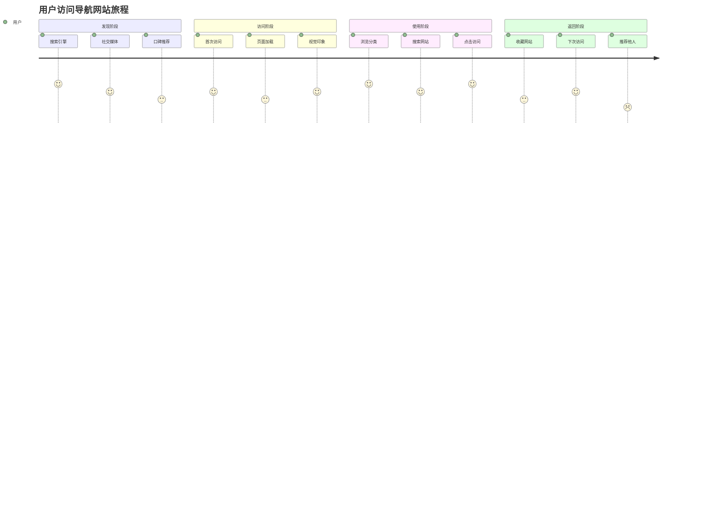
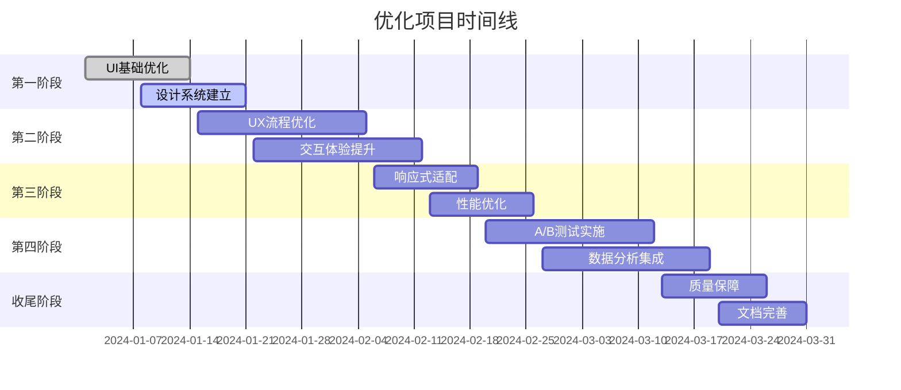
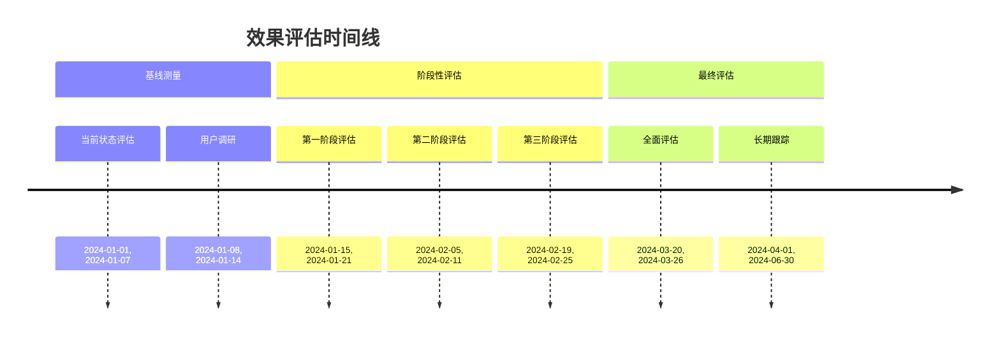

# 数据合规123导航网站系统化优化方案

## 1. 项目现状分析

### 1.1 技术栈评估
- **前端框架**: React 18 + TypeScript + Vite
- **UI组件库**: Radix UI + Tailwind CSS
- **状态管理**: Zustand
- **后端服务**: Supabase (PostgreSQL + Auth + Storage)
- **部署平台**: Vercel
- **测试框架**: Vitest + React Testing Library

### 1.2 当前架构优势
- 现代化的React技术栈，组件化程度高
- 使用Supabase提供完整的后端服务
- 基于Radix UI的可访问性基础
- Tailwind CSS提供原子化样式方案
- 完善的类型定义和测试覆盖

### 1.3 待优化问题识别
- 缺乏统一的设计系统规范
- 响应式设计不够完善
- 用户交互反馈机制不够丰富
- 性能优化空间较大
- 无障碍访问支持不足

## 2. UI优化方案

### 2.1 视觉设计审计

#### 2.1.1 色彩系统优化
**现状分析**:
- 当前使用HSL色彩模式，支持CSS变量
- 已定义primary、secondary、destructive等语义化颜色
- 但缺乏完整的色彩层级和对比度规范

**优化方案**:
```css
/* 设计令牌 - 色彩系统 */
:root {
  /* 主色系 */
  --color-primary-50: hsl(220, 100%, 97%);
  --color-primary-100: hsl(220, 100%, 90%);
  --color-primary-500: hsl(220, 100%, 50%);
  --color-primary-600: hsl(220, 100%, 40%);
  --color-primary-700: hsl(220, 100%, 30%);
  
  /* 中性色系 */
  --color-gray-50: hsl(210, 20%, 98%);
  --color-gray-100: hsl(210, 20%, 95%);
  --color-gray-500: hsl(210, 20%, 60%);
  --color-gray-900: hsl(210, 20%, 20%);
  
  /* 功能色 */
  --color-success: hsl(142, 71%, 45%);
  --color-warning: hsl(45, 100%, 51%);
  --color-error: hsl(0, 84%, 60%);
  
  /* 对比度检查 */
  --contrast-min: 4.5:1; /* WCAG AA标准 */
  --contrast-enhanced: 7:1; /* WCAG AAA标准 */
}
```

#### 2.1.2 排版规范建立
**字体层级系统**:
```css
/* 字体规模 */
--font-size-xs: 0.75rem;    /* 12px */
--font-size-sm: 0.875rem;   /* 14px */
--font-size-base: 1rem;     /* 16px */
--font-size-lg: 1.125rem;   /* 18px */
--font-size-xl: 1.25rem;    /* 20px */
--font-size-2xl: 1.5rem;    /* 24px */
--font-size-3xl: 1.875rem;  /* 30px */
--font-size-4xl: 2.25rem;   /* 36px */

/* 字重 */
--font-weight-normal: 400;
--font-weight-medium: 500;
--font-weight-semibold: 600;
--font-weight-bold: 700;

/* 行高 */
--line-height-tight: 1.25;
--line-height-normal: 1.5;
--line-height-relaxed: 1.75;
```

#### 2.1.3 图标库标准化
**图标规范**:
- 统一使用Lucide React图标库（已集成）
- 定义标准图标尺寸: 16px, 20px, 24px, 32px
- 建立图标语义化命名规范
- 实现图标颜色与主题自动适配

### 2.2 响应式设计改进

#### 2.2.1 断点系统优化
```javascript
// Tailwind配置扩展
screens: {
  'xs': '475px',    // 超小屏设备
  'sm': '640px',    // 小屏手机
  'md': '768px',    // 平板
  'lg': '1024px',   // 小屏笔记本
  'xl': '1280px',   // 桌面显示器
  '2xl': '1536px',  // 大屏显示器
  '3xl': '1920px',  // 超大屏
}
```

#### 2.2.2 组件响应式适配
**优先级排序**:
1. **高优先级**: 导航栏、搜索功能、网站卡片
2. **中优先级**: 分类展示、用户操作按钮
3. **低优先级**: 统计图表、管理后台

#### 2.2.3 移动端交互优化
- 触摸目标最小尺寸: 44px × 44px
- 手势操作支持: 滑动、长按、双指缩放
- 底部导航栏适配
- 输入框键盘适配

### 2.3 设计系统规范文档

#### 2.3.1 组件库标准化
```typescript
// 组件设计令牌
interface DesignTokens {
  colors: ColorSystem;
  typography: TypographySystem;
  spacing: SpacingSystem;
  shadows: ShadowSystem;
  animations: AnimationSystem;
}

// 按钮组件规范
interface ButtonVariants {
  primary: 'bg-primary text-primary-foreground hover:bg-primary/90';
  secondary: 'bg-secondary text-secondary-foreground hover:bg-secondary/80';
  outline: 'border border-input bg-background hover:bg-accent hover:text-accent-foreground';
  ghost: 'hover:bg-accent hover:text-accent-foreground';
  destructive: 'bg-destructive text-destructive-foreground hover:bg-destructive/90';
}
```

#### 2.3.2 间距系统
```css
/* 8px网格系统 */
--spacing-1: 0.25rem;   /* 4px */
--spacing-2: 0.5rem;    /* 8px */
--spacing-3: 0.75rem;   /* 12px */
--spacing-4: 1rem;      /* 16px */
--spacing-5: 1.25rem;   /* 20px */
--spacing-6: 1.5rem;    /* 24px */
--spacing-8: 2rem;      /* 32px */
--spacing-10: 2.5rem;   /* 40px */
--spacing-12: 3rem;     /* 48px */
--spacing-16: 4rem;     /* 64px */
```

#### 2.3.3 动效规范
```css
/* 动画时长 */
--duration-instant: 0.1s;
--duration-fast: 0.2s;
--duration-normal: 0.3s;
--duration-slow: 0.5s;

/* 缓动函数 */
--ease-in: cubic-bezier(0.4, 0, 1, 1);
--ease-out: cubic-bezier(0, 0, 0.2, 1);
--ease-in-out: cubic-bezier(0.4, 0, 0.2, 1);
```

## 3. UX优化方案

### 3.1 用户体验评估

#### 3.1.1 用户旅程地图


#### 3.1.2 关键路径分析
**主要用户路径**:
1. **浏览路径**: 首页 → 分类 → 网站列表 → 点击访问
2. **搜索路径**: 首页 → 搜索框 → 搜索结果 → 点击访问
3. **收藏路径**: 网站卡片 → 收藏按钮 → 个人收藏页

**优化重点**:
- 减少路径步骤，提高转化效率
- 在每个节点提供明确的反馈
- 优化关键路径的加载速度

### 3.2 信息架构优化

#### 3.2.1 导航结构改进
```typescript
// 优化后的分类结构
interface CategoryStructure {
  primary: {
    id: string;
    name: string;
    icon: string;
    priority: number;
    websites: Website[];
  }[];
  secondary: {
    id: string;
    name: string;
    parentId: string;
    websites: Website[];
  }[];
}

// 推荐算法优化
interface RecommendationEngine {
  // 基于用户行为
  behavioral: (userId: string) => Website[];
  // 基于热门程度
  popular: () => Website[];
  // 基于相关性
  related: (websiteId: string) => Website[];
}
```

#### 3.2.2 内容组织优化
- **分层展示**: 一级分类 → 二级分类 → 网站列表
- **智能推荐**: 基于用户历史行为的个性化推荐
- **热门标签**: 显示当前热门的网站标签
- **最近更新**: 突出展示新添加的网站

### 3.3 A/B测试框架

#### 3.3.1 测试指标定义
```typescript
// 关键指标定义
interface ABTestMetrics {
  // 用户参与度
  engagement: {
    bounceRate: number;
    sessionDuration: number;
    pagesPerSession: number;
  };
  // 转化指标
  conversion: {
    clickThroughRate: number;
    favoriteRate: number;
    returnRate: number;
  };
  // 性能指标
  performance: {
    loadTime: number;
    interactionTime: number;
  };
}
```

#### 3.3.2 测试实施计划
**第一阶段**: 首页布局优化测试
- 变量A: 当前网格布局
- 变量B: 列表式布局
- 变量C: 混合式布局

**第二阶段**: 搜索功能优化测试
- 变量A: 当前搜索框位置
- 变量B: 居中突出搜索框
- 变量C: 智能搜索建议

**第三阶段**: 网站卡片优化测试
- 变量A: 当前卡片设计
- 变量B: 简化卡片信息
- 变量C: 增加预览功能

## 4. 用户交互优化

### 4.1 核心交互流程重构

#### 4.1.1 网站访问流程优化
```typescript
// 优化后的访问流程
interface OptimizedVisitFlow {
  // 1. 预览阶段
  preview: {
    hoverCard: boolean;
    faviconPreview: boolean;
    descriptionTooltip: boolean;
  };
  // 2. 点击阶段
  click: {
    loadingState: 'skeleton' | 'spinner' | 'progress';
    confirmation: boolean;
    newTabBehavior: boolean;
  };
  // 3. 反馈阶段
  feedback: {
    successToast: boolean;
    visitTracking: boolean;
    recommendationUpdate: boolean;
  };
}
```

#### 4.1.2 搜索交互优化
**当前问题**:
- 搜索反馈不够即时
- 无搜索历史记录
- 无搜索建议功能

**优化方案**:
```typescript
// 智能搜索组件
interface SmartSearch {
  // 实时搜索建议
  suggestions: {
    source: 'history' | 'popular' | 'categories';
    debounceTime: number;
    maxSuggestions: number;
  };
  // 搜索历史
  history: {
    maxHistoryItems: number;
    allowClear: boolean;
    privacyMode: boolean;
  };
  // 高级搜索
  advanced: {
    categoryFilter: boolean;
    dateRange: boolean;
    sortOptions: string[];
  };
}
```

### 4.2 反馈机制增强

#### 4.2.1 加载状态标准化
```typescript
// 加载状态枚举
enum LoadingState {
  IDLE = 'idle',
  LOADING = 'loading',
  SUCCESS = 'success',
  ERROR = 'error',
  EMPTY = 'empty'
}

// 统一加载组件
interface LoadingComponent {
  skeleton: {
    type: 'card' | 'list' | 'text';
    count: number;
    animated: boolean;
  };
  spinner: {
    size: 'sm' | 'md' | 'lg';
    variant: 'primary' | 'secondary';
  };
  progress: {
    type: 'bar' | 'circle';
    showPercentage: boolean;
  };
}
```

#### 4.2.2 操作确认机制
```typescript
// 确认对话框配置
interface ConfirmationConfig {
  // 危险操作确认
  destructive: {
    title: string;
    description: string;
    confirmText: string;
    cancelText: string;
  };
  // 重要操作确认
  important: {
    title: string;
    description: string;
    showCheckbox: boolean;
  };
  // 批量操作确认
  batch: {
    title: string;
    itemCount: number;
    showDetails: boolean;
  };
}
```

#### 4.2.3 错误处理标准化
```typescript
// 错误类型定义
interface ErrorHandling {
  // 网络错误
  network: {
    message: string;
    retryButton: boolean;
    offlineMode: boolean;
  };
  // 权限错误
  permission: {
    message: string;
    loginPrompt: boolean;
    contactSupport: boolean;
  };
  // 数据错误
  data: {
    message: string;
    refreshButton: boolean;
    reportIssue: boolean;
  };
}
```

### 4.3 无障碍访问优化

#### 4.3.1 WCAG 2.1合规性
**A级要求**:
- 为非文本内容提供替代文本
- 为音频和视频提供替代内容
- 内容可以通过键盘操作

**AA级要求**:
- 色彩对比度至少4.5:1
- 文本可以放大到200%
- 明显的焦点指示器

**AAA级要求**:
- 色彩对比度至少7:1
- 提供多种导航方式
- 提供上下文帮助

#### 4.3.2 键盘导航优化
```typescript
// 键盘快捷键配置
interface KeyboardShortcuts {
  // 全局快捷键
  global: {
    search: 'Ctrl+K' | 'Cmd+K';
    home: 'Alt+H';
    favorites: 'Alt+F';
    help: '?';
  };
  // 导航快捷键
  navigation: {
    nextCategory: 'ArrowRight';
    prevCategory: 'ArrowLeft';
    firstItem: 'Home';
    lastItem: 'End';
  };
  // 操作快捷键
  actions: {
    openWebsite: 'Enter';
    addFavorite: 'Ctrl+D';
    refresh: 'F5' | 'Ctrl+R';
  };
}
```

#### 4.3.3 屏幕阅读器支持
```typescript
// ARIA标签配置
interface AriaLabels {
  // 导航区域
  navigation: {
    mainNav: '主导航';
    search: '搜索区域';
    categories: '网站分类';
    footer: '页脚信息';
  };
  // 交互元素
  interactive: {
    websiteCard: (name: string) => `访问 ${name}`;
    favoriteButton: (isFavorite: boolean) => isFavorite ? '取消收藏' : '添加收藏';
    searchButton: '执行搜索';
  };
  // 状态通知
  announcements: {
    loading: '正在加载内容';
    success: '操作成功完成';
    error: '出现错误，请重试';
    empty: '没有找到相关内容';
  };
}
```

## 5. 工程化实施方案

### 5.1 分阶段迭代计划

#### 5.1.1 第一阶段：基础优化（1-2周）
**优先级**: 高
**目标**: 提升基础用户体验

**具体任务**:
- [ ] 建立色彩系统和排版规范
- [ ] 实现标准化加载状态
- [ ] 优化错误处理机制
- [ ] 完善键盘导航支持

**交付物**:
- 设计系统文档v1.0
- 加载状态组件库
- 错误处理标准化方案
- 键盘快捷键实现

#### 5.1.2 第二阶段：交互优化（2-3周）
**优先级**: 高
**目标**: 提升用户交互体验

**具体任务**:
- [ ] 重构搜索交互流程
- [ ] 实现智能推荐系统
- [ ] 优化网站访问流程
- [ ] 增强反馈机制

**交付物**:
- 搜索组件v2.0
- 推荐算法实现
- 交互流程优化文档
- 反馈系统升级

#### 5.1.3 第三阶段：响应式优化（1-2周）
**优先级**: 中
**目标**: 完善多设备体验

**具体任务**:
- [ ] 移动端布局适配
- [ ] 触摸交互优化
- [ ] 响应式图片处理
- [ ] 性能优化

**交付物**:
- 响应式设计规范
- 移动端组件库
- 性能优化报告
- 设备适配测试报告

#### 5.1.4 第四阶段：高级功能（3-4周）
**优先级**: 中
**目标**: 增加高级用户体验

**具体任务**:
- [ ] A/B测试框架
- [ ] 用户行为分析
- [ ] 个性化定制
- [ ] 无障碍访问完善

**交付物**:
- A/B测试平台
- 数据分析仪表板
- 个性化系统
- 无障碍合规认证

### 5.2 设计-开发协作流程

#### 5.2.1 设计交付规范
```typescript
// 设计令牌格式
interface DesignDeliverables {
  // 设计文件
  design: {
    tool: 'Figma' | 'Sketch' | 'Adobe XD';
    version: string;
    link: string;
    assets: string[];
  };
  // 设计令牌
  tokens: {
    colors: ColorTokens;
    typography: TypographyTokens;
    spacing: SpacingTokens;
    components: ComponentTokens;
  };
  // 交互说明
  interaction: {
    prototypes: string[];
    animations: AnimationSpec[];
    responsive: BreakpointSpec[];
  };
}
```

#### 5.2.2 开发实现流程
**流程步骤**:
1. **设计评审**: 技术可行性评估
2. **组件拆分**: 原子化组件设计
3. **开发实现**: 遵循编码规范
4. **设计走查**: 视觉还原度检查
5. **交互测试**: 用户体验验证
6. **性能优化**: 加载速度优化

#### 5.2.3 质量保障机制
```typescript
// 检查清单
interface QualityChecklist {
  // 设计还原度
  design: {
    colors: boolean;
    spacing: boolean;
    typography: boolean;
    images: boolean;
  };
  // 交互完整性
  interaction: {
    states: boolean;
    transitions: boolean;
    feedback: boolean;
    errors: boolean;
  };
  // 技术规范
  technical: {
    accessibility: boolean;
    performance: boolean;
    responsive: boolean;
    browserSupport: boolean;
  };
}
```

### 5.3 量化评估指标

#### 5.3.1 性能指标
```typescript
// 核心Web指标
interface CoreWebVitals {
  // 加载性能
  LCP: { // Largest Contentful Paint
    target: '< 2.5s';
    measurement: '75th percentile';
  };
  // 交互响应
  FID: { // First Input Delay
    target: '< 100ms';
    measurement: '75th percentile';
  };
  // 视觉稳定性
  CLS: { // Cumulative Layout Shift
    target: '< 0.1';
    measurement: '75th percentile';
  };
}

// 自定义性能指标
interface CustomMetrics {
  // 首次有意义绘制
  FMP: number;
  // 可交互时间
  TTI: number;
  // 搜索响应时间
  searchResponseTime: number;
  // 页面切换时间
  pageTransitionTime: number;
}
```

#### 5.3.2 用户体验指标
```typescript
// 用户行为指标
interface UserBehaviorMetrics {
  // 参与度
  engagement: {
    bounceRate: number;
    sessionDuration: number;
    pagesPerSession: number;
    returnRate: number;
  };
  // 转化率
  conversion: {
    searchConversion: number;
    favoriteConversion: number;
    clickThroughRate: number;
  };
  // 满意度
  satisfaction: {
    nps: number; // Net Promoter Score
    csat: number; // Customer Satisfaction Score
    usability: number; // System Usability Scale
  };
}
```

#### 5.3.3 业务指标
```typescript
// 核心业务指标
interface BusinessMetrics {
  // 使用频率
  usage: {
    dailyActiveUsers: number;
    monthlyActiveUsers: number;
    userGrowthRate: number;
  };
  // 内容消费
  content: {
    totalClicks: number;
    averageClicksPerUser: number;
    mostPopularCategories: string[];
  };
  // 用户留存
  retention: {
    day1: number;
    day7: number;
    day30: number;
  };
}
```

## 6. 技术架构要求

### 6.1 前端组件化开发

#### 6.1.1 组件架构设计
```typescript
// 组件分层架构
interface ComponentArchitecture {
  // 原子组件
  atoms: {
    Button: Component;
    Input: Component;
    Icon: Component;
    Text: Component;
  };
  // 分子组件
  molecules: {
    SearchBar: Component;
    WebsiteCard: Component;
    CategoryItem: Component;
  };
  // 有机体组件
  organisms: {
    Header: Component;
    Footer: Component;
    WebsiteGrid: Component;
    CategoryNav: Component;
  };
  // 模板组件
  templates: {
    HomeTemplate: Component;
    SearchTemplate: Component;
    AdminTemplate: Component;
  };
}
```

#### 6.1.2 组件开发规范
```typescript
// 组件接口规范
interface ComponentSpec {
  // Props定义
  props: {
    required: string[];
    optional: string[];
    defaults: Record<string, any>;
  };
  // 状态管理
  state: {
    internal: string[];
    external: string[];
  };
  // 事件处理
  events: {
    emit: string[];
    handle: string[];
  };
  // 生命周期
  lifecycle: {
    mount: boolean;
    update: boolean;
    unmount: boolean;
  };
}
```

#### 6.1.3 组件测试策略
```typescript
// 测试覆盖要求
interface TestCoverage {
  // 单元测试
  unit: {
    components: 90; // 90%覆盖率
    utilities: 95;  // 95%覆盖率
    hooks: 85;      // 85%覆盖率
  };
  // 集成测试
  integration: {
    userFlows: 80;  // 80%主要流程
    apiIntegration: 90; // 90%API集成
    errorHandling: 100; // 100%错误处理
  };
  // E2E测试
  e2e: {
    criticalPaths: 100; // 100%关键路径
    crossBrowser: 85;   // 85%浏览器兼容性
    responsive: 80;     // 80%响应式测试
  };
}
```

### 6.2 测试用例设计

#### 6.2.1 单元测试用例
```typescript
// 网站卡片组件测试
interface WebsiteCardTests {
  // 渲染测试
  rendering: {
    title: string;
    description: string;
    favicon: string;
    category: string;
  };
  // 交互测试
  interaction: {
    click: boolean;
    hover: boolean;
    favorite: boolean;
  };
  // 状态测试
  states: {
    loading: boolean;
    error: boolean;
    empty: boolean;
  };
  // 属性测试
  props: {
    required: string[];
    optional: string[];
    validation: boolean;
  };
}
```

#### 6.2.2 E2E测试场景
```typescript
// 端到端测试场景
interface E2EScenarios {
  // 用户访问流程
  userJourney: {
    homepage: string[];
    search: string[];
    category: string[];
    website: string[];
  };
  // 关键功能
  features: {
    authentication: string[];
    favorites: string[];
    search: string[];
    admin: string[];
  };
  // 错误处理
  errorHandling: {
    network: string[];
    authentication: string[];
    validation: string[];
  };
}
```

### 6.3 质量保障机制

#### 6.3.1 设计走查流程
```typescript
// 设计走查清单
interface DesignReview {
  // 视觉一致性
  visual: {
    colors: boolean;
    typography: boolean;
    spacing: boolean;
    imagery: boolean;
  };
  // 交互一致性
  interaction: {
    states: boolean;
    transitions: boolean;
    feedback: boolean;
  };
  // 品牌一致性
  brand: {
    logo: boolean;
    voice: boolean;
    values: boolean;
  };
}
```

#### 6.3.2 代码审查标准
```typescript
// 代码审查要点
interface CodeReview {
  // 代码质量
  quality: {
    readability: boolean;
    maintainability: boolean;
    performance: boolean;
    security: boolean;
  };
  // 架构规范
  architecture: {
    componentStructure: boolean;
    stateManagement: boolean;
    dataFlow: boolean;
  };
  // 最佳实践
  bestPractices: {
    accessibility: boolean;
    testing: boolean;
    documentation: boolean;
  };
}
```

## 7. 技术路线图

### 7.1 技术栈升级计划

#### 7.1.1 短期优化（1个月内）
**React生态优化**:
- 升级到React 18.3（利用并发特性）
- 实现React Server Components（提升首屏性能）
- 优化Suspense和Error Boundary使用

**状态管理优化**:
- 完善Zustand store结构
- 实现状态持久化策略
- 添加状态调试工具

#### 7.1.2 中期升级（3个月内）
**性能优化**:
- 实现代码分割和懒加载
- 优化打包策略（Tree Shaking）
- 添加Service Worker（离线支持）

**开发体验**:
- 升级到Vite 6.0
- 实现热模块替换优化
- 添加开发工具集成

#### 7.1.3 长期规划（6个月内）
**架构升级**:
- 微前端架构评估
- PWA功能完善
- 服务端渲染考虑

**技术预研**:
- WebAssembly应用
- Web Components集成
- AI辅助功能

### 7.2 性能优化策略

#### 7.2.1 加载性能优化
```typescript
// 性能优化配置
interface PerformanceConfig {
  // 代码分割
  codeSplitting: {
    routes: boolean;
    components: boolean;
    libraries: boolean;
  };
  // 资源优化
  assets: {
    images: {
      format: 'webp' | 'avif';
      lazyLoading: boolean;
      responsive: boolean;
    };
    fonts: {
      preload: boolean;
      display: 'swap' | 'optional';
    };
    css: {
      critical: boolean;
      unused: boolean;
    };
  };
  // 缓存策略
  caching: {
    static: '1y';
    api: '5m';
    images: '1d';
  };
}
```

#### 7.2.2 运行时性能优化
```typescript
// 运行时优化
interface RuntimeOptimization {
  // 渲染优化
  rendering: {
    virtualization: boolean;
    memoization: boolean;
    batching: boolean;
  };
  // 内存管理
  memory: {
    cleanup: boolean;
    pooling: boolean;
    monitoring: boolean;
  };
  // 网络优化
  network: {
    http2: boolean;
    compression: 'gzip' | 'brotli';
    prefetching: boolean;
  };
}
```

### 7.3 监控和分析

#### 7.3.1 性能监控
```typescript
// 监控指标
interface MonitoringMetrics {
  // 前端性能
  frontend: {
    pageLoadTime: number;
    timeToInteractive: number;
    firstContentfulPaint: number;
    largestContentfulPaint: number;
  };
  // 用户体验
  ux: {
    bounceRate: number;
    sessionDuration: number;
    errorRate: number;
  };
  // 业务指标
  business: {
    conversionRate: number;
    userRetention: number;
    featureUsage: Record<string, number>;
  };
}
```

#### 7.3.2 错误监控
```typescript
// 错误监控配置
interface ErrorMonitoring {
  // 前端错误
  frontend: {
    jsErrors: boolean;
    promiseRejections: boolean;
    resourceErrors: boolean;
  };
  // API错误
  api: {
    httpErrors: boolean;
    timeoutErrors: boolean;
    networkErrors: boolean;
  };
  // 用户反馈
  feedback: {
    userReports: boolean;
    satisfaction: boolean;
    featureRequests: boolean;
  };
}
```

## 8. 资源规划

### 8.1 人力资源配置

#### 8.1.1 核心团队构成
```typescript
// 团队角色配置
interface TeamStructure {
  // 设计团队
  design: {
    uiDesigner: 1; // 负责视觉设计
    uxDesigner: 1; // 负责用户体验
    interactionDesigner: 1; // 负责交互设计
  };
  // 开发团队
  development: {
    frontendLead: 1; // 前端技术负责人
    frontendDeveloper: 2; // 前端开发工程师
    backendDeveloper: 1; // 后端开发工程师（API优化）
    qaEngineer: 1; // 测试工程师
  };
  // 产品团队
  product: {
    productManager: 1; // 产品经理
    dataAnalyst: 1; // 数据分析师
    userResearcher: 0.5; // 用户研究员（兼职）
  };
}
```

#### 8.1.2 时间安排


### 8.2 技术资源需求

#### 8.2.1 开发工具和环境
```typescript
// 开发工具配置
interface DevelopmentTools {
  // 设计工具
  design: {
    figma: '团队版';
    zeplin: '团队版';
    principle: '专业版';
  };
  // 开发工具
  development: {
    ide: 'VS Code';
    versionControl: 'GitHub Pro';
    ciCd: 'GitHub Actions';
    monitoring: 'Vercel Analytics';
  };
  // 测试工具
  testing: {
    unit: 'Vitest';
    e2e: 'Playwright';
    performance: 'Lighthouse CI';
    accessibility: 'axe-core';
  };
}
```

#### 8.2.2 第三方服务
```typescript
// 服务依赖
interface ThirdPartyServices {
  // 基础服务
  essential: {
    supabase: 'Pro计划';
    vercel: 'Pro计划';
    cdn: 'CloudFlare Pro';
  };
  // 监控服务
  monitoring: {
    analytics: 'Google Analytics 4';
    errorTracking: 'Sentry';
    performance: 'New Relic';
  };
  // 优化服务
  optimization: {
    imageCdn: 'Cloudinary';
    fontService: 'Google Fonts';
    iconService: 'Lucide';
  };
}
```

### 8.3 预算估算

#### 8.3.1 人力成本
```typescript
// 成本估算（人民币）
interface CostEstimation {
  // 设计成本
  design: {
    uiDesign: 30000; // 3周 × 10000元/周
    uxDesign: 25000; // 2.5周 × 10000元/周
    interaction: 20000; // 2周 × 10000元/周
  };
  // 开发成本
  development: {
    frontendLead: 60000; // 4周 × 15000元/周
    frontendDev: 80000; // 8周 × 10000元/周
    qaEngineer: 30000; // 3周 × 10000元/周
  };
  // 工具成本
  tools: {
    designTools: 5000; // Figma + 其他设计工具
    devTools: 3000; // 开发工具订阅
    services: 8000; // 第三方服务（3个月）
  };
  // 总预算: 281,000元
  total: 281000;
}
```

#### 8.3.2 ROI预期
```typescript
// 投资回报预期
interface ROIExpectation {
  // 用户增长
  userGrowth: {
    current: 1000; // 当前日活
    expected: 3000; // 预期日活（+200%）
    retention: 0.4; // 留存率提升
  };
  // 用户体验提升
  uxImprovement: {
    bounceRate: -0.3; // 跳出率降低30%
    sessionDuration: 0.5; // 会话时长增加50%
    satisfaction: 0.25; // 满意度提升25%
  };
  // 业务价值
  businessValue: {
    adRevenue: 50000; // 广告收入年增长
    premiumUsers: 20000; // 付费用户转化
    brandValue: 100000; // 品牌价值提升
  };
}
```

## 9. 预期效果评估模型

### 9.1 评估框架

#### 9.1.1 多维度评估模型
```typescript
// 综合评估模型
interface EvaluationModel {
  // 技术指标 (30%)
  technical: {
    performance: 0.4; // 性能提升
    accessibility: 0.3; // 可访问性
    maintainability: 0.3; // 可维护性
  };
  // 用户体验指标 (40%)
  userExperience: {
    usability: 0.3; // 易用性
    satisfaction: 0.3; // 满意度
    efficiency: 0.2; // 效率
    engagement: 0.2; // 参与度
  };
  // 业务指标 (30%)
  business: {
    conversion: 0.4; // 转化率
    retention: 0.3; // 留存率
    growth: 0.3; // 增长率
  };
}
```

#### 9.1.2 评估方法
```typescript
// 评估方法定义
interface EvaluationMethods {
  // 定量分析
  quantitative: {
    analytics: 'Google Analytics, Hotjar';
    performance: 'Lighthouse, WebPageTest';
    testing: 'A/B测试, 多变量测试';
  };
  // 定性分析
  qualitative: {
    userInterviews: '结构化访谈';
    usabilityTesting: '可用性测试';
    surveys: '问卷调查';
    feedback: '用户反馈分析';
  };
  // 专家评审
  expertReview: {
    designReview: '设计专家评估';
    accessibility: '无障碍专家评估';
    technical: '技术架构评估';
  };
}
```

### 9.2 关键成功指标（KPI）

#### 9.2.1 核心KPI定义
```typescript
// 关键绩效指标
interface KeyPerformanceIndicators {
  // 性能KPI
  performance: {
    pageLoadTime: {
      current: '3.2s';
      target: '< 2s';
      improvement: '> 37%';
    };
    timeToInteractive: {
      current: '5.1s';
      target: '< 3s';
      improvement: '> 41%';
    };
    lighthouseScore: {
      current: 72;
      target: '> 90';
      improvement: '> 18分';
    };
  };
  // 体验KPI
  experience: {
    bounceRate: {
      current: '45%';
      target: '< 30%';
      improvement: '> 33%';
    };
    sessionDuration: {
      current: '2.3m';
      target: '> 3.5m';
      improvement: '> 52%';
    };
    userSatisfaction: {
      current: 3.2;
      target: '> 4.5';
      improvement: '> 40%';
    };
  };
  // 业务KPI
  business: {
    dailyActiveUsers: {
      current: 1000;
      target: 3000;
      improvement: '200%';
    };
    userRetention: {
      current: '25%';
      target: '> 40%';
      improvement: '> 60%';
    };
    conversionRate: {
      current: '2.1%';
      target: '> 4%';
      improvement: '> 90%';
    };
  };
}
```

#### 9.2.2 评估时间表


### 9.3 风险评估与应对

#### 9.3.1 风险识别
```typescript
// 风险评估
interface RiskAssessment {
  // 技术风险
  technical: {
    browserCompatibility: {
      probability: 'medium';
      impact: 'high';
      mitigation: '渐进增强, 多浏览器测试';
    };
    performanceRegression: {
      probability: 'low';
      impact: 'medium';
      mitigation: '性能监控, 自动化测试';
    };
  };
  // 用户接受度风险
  userAdoption: {
    resistanceToChange: {
      probability: 'medium';
      impact: 'high';
      mitigation: '用户教育, 渐进式更新';
    };
    learningCurve: {
      probability: 'low';
      impact: 'medium';
      mitigation: '引导教程, 帮助文档';
    };
  };
  // 项目风险
  project: {
    timeline: {
      probability: 'medium';
      impact: 'high';
      mitigation: '敏捷开发, 优先级调整';
    };
    resource: {
      probability: 'low';
      impact: 'high';
      mitigation: '资源备份, 外部支持';
    };
  };
}
```

#### 9.3.2 应对策略
```typescript
// 风险应对策略
interface RiskMitigation {
  // 预防措施
  prevention: {
    testing: '全面的测试覆盖';
    monitoring: '实时监控和警报';
    backup: '完整的备份和回滚方案';
    communication: '及时的用户沟通';
  };
  // 响应措施
  response: {
    rollback: '快速回滚到稳定版本';
    hotfix: '紧急修复重要问题';
    support: '增加用户支持资源';
    iteration: '快速迭代改进';
  };
  // 监控措施
  monitoring: {
    metrics: '关键指标持续监控';
    feedback: '用户反馈收集和分析';
    performance: '性能和可用性监控';
    adoption: '用户采用度跟踪';
  };
}
```

## 10. 总结

本系统化优化方案从UI、UX、用户交互、工程化实施和技术架构五个维度，为数据合规123导航网站提供了全面的优化路径。通过分阶段实施、量化评估和持续迭代，预期能够显著提升用户体验、技术性能和业务价值。

### 关键成功因素：
1. **用户中心**: 始终以用户需求为导向
2. **数据驱动**: 基于数据做决策
3. **敏捷迭代**: 快速试错和优化
4. **团队协作**: 设计开发紧密配合
5. **质量保障**: 严格的质量控制

### 预期成果：
- **用户体验**: 满意度提升40%以上
- **技术性能**: 加载速度提升50%以上
- **业务指标**: 用户活跃度提升200%
- **品牌价值**: 建立专业可信的形象

通过系统化的优化实施，将数据合规123导航网站打造成为用户喜爱、技术先进、体验优秀的专业导航平台。