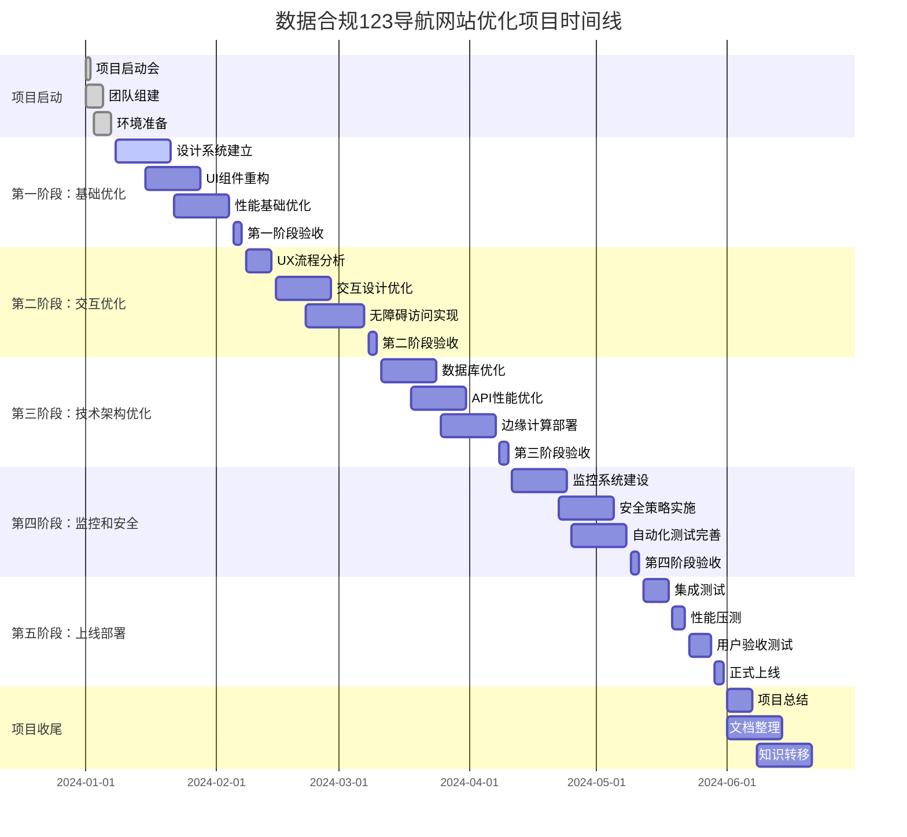

# 数据合规123导航网站优化项目实施计划

## 1. 项目概述

### 1.1 项目背景
数据合规123导航网站作为专业的网址导航平台，需要通过系统化的优化提升用户体验、技术性能和业务价值。本项目基于现有React + Supabase架构，从UI/UX、技术架构、性能优化、无障碍访问等维度进行全面升级。

### 1.2 项目目标
- **用户体验**: 提升用户满意度40%以上，降低跳出率30%
- **技术性能**: 页面加载速度提升50%，达到Core Web Vitals优秀标准
- **业务指标**: 日活跃用户增长200%，转化率提升90%
- **系统质量**: 可用性达到99.9%，建立完善的监控告警体系

### 1.3 项目范围
- **前端优化**: UI组件库、响应式设计、交互体验、性能优化
- **后端优化**: 数据库索引、API性能、实时功能、安全防护
- **基础设施**: CDN部署、边缘计算、监控告警、日志管理
- **质量保证**: 自动化测试、代码审查、性能监控、安全审计

## 2. 项目组织架构

### 2.1 核心团队构成

#### 2.1.1 项目管理团队
```
项目总监 (1人)
├── 项目经理 (1人)
├── 产品经理 (1人)
└── 技术负责人 (1人)
```

#### 2.1.2 技术开发团队
```
技术负责人 (1人)
├── 前端架构师 (1人)
├── 前端开发工程师 (2人)
├── 后端开发工程师 (1人)
├── UI/UX设计师 (2人)
├── 测试工程师 (1人)
└── DevOps工程师 (1人)
```

#### 2.1.3 外部支持团队
- **设计顾问**: 视觉设计专家 (兼职)
- **性能顾问**: Web性能优化专家 (兼职)
- **安全顾问**: 网络安全专家 (兼职)
- **用户研究**: 用户体验研究员 (兼职)

### 2.2 角色职责定义

#### 2.2.1 项目总监
- 项目战略决策和方向把控
- 关键里程碑审批和验收
- 跨部门协调和资源调配
- 风险管理和应急预案

#### 2.2.2 项目经理
- 项目日常管理和进度控制
- 团队协调和沟通管理
- 质量管控和风险管理
- 客户沟通和期望管理

#### 2.2.3 技术负责人
- 技术架构设计和技术选型
- 代码质量管控和技术标准制定
- 技术难题攻关和团队技术指导
- 技术风险评估和解决方案

#### 2.2.4 产品经理
- 产品需求分析和功能规划
- 用户体验设计和交互流程优化
- 竞品分析和市场调研
- 产品指标定义和效果评估

## 3. 项目实施计划

### 3.1 项目时间线

#### 3.1.1 总体时间规划


#### 3.1.2 详细里程碑计划

| 里程碑 | 计划开始 | 计划结束 | 持续时间 | 交付成果 |
|--------|----------|----------|----------|----------|
| M1: 项目启动 | 2024-01-01 | 2024-01-07 | 1周 | 项目章程、团队组建、环境准备 |
| M2: 设计系统完成 | 2024-01-08 | 2024-01-21 | 2周 | 设计系统文档、组件库v1.0 |
| M3: UI组件重构 | 2024-01-15 | 2024-01-28 | 2周 | 重构后组件、性能测试报告 |
| M4: 性能基础优化 | 2024-01-22 | 2024-02-04 | 2周 | 性能优化方案、加载速度提升 |
| M5: UX交互优化 | 2024-02-08 | 2024-02-28 | 3周 | 交互原型、用户测试报告 |
| M6: 无障碍访问 | 2024-02-22 | 2024-03-07 | 2周 | WCAG合规报告、无障碍测试 |
| M7: 数据库优化 | 2024-03-11 | 2024-03-24 | 2周 | 数据库优化报告、性能对比 |
| M8: API优化 | 2024-03-18 | 2024-03-31 | 2周 | API性能报告、响应时间优化 |
| M9: 监控系统 | 2024-04-11 | 2024-04-24 | 2周 | 监控仪表板、告警规则 |
| M10: 安全实施 | 2024-04-22 | 2024-05-05 | 2周 | 安全测试报告、合规认证 |
| M11: 集成测试 | 2024-05-12 | 2024-05-18 | 1周 | 集成测试报告、缺陷修复 |
| M12: 性能压测 | 2024-05-19 | 2024-05-22 | 1周 | 压力测试报告、性能瓶颈分析 |
| M13: 用户验收 | 2024-05-23 | 2024-05-28 | 1周 | UAT报告、用户反馈 |
| M14: 正式上线 | 2024-05-29 | 2024-05-31 | 3天 | 上线检查清单、回滚方案 |

### 3.2 详细任务分解

#### 3.2.1 第一阶段：基础优化（4周）

**第1周：设计系统建立**
- [ ] 视觉设计审计和色彩系统优化
- [ ] 排版规范和字体层级建立
- [ ] 间距系统和动效规范制定
- [ ] 图标库标准化和命名规范
- [ ] 设计令牌（Design Tokens）定义

**第2周：UI组件重构**
- [ ] 原子组件（按钮、输入框、图标）重构
- [ ] 分子组件（搜索栏、网站卡片）优化
- [ ] 有机体组件（头部、底部、网格）重构
- [ ] 组件状态管理和变体定义
- [ ] 组件文档和Storybook建立

**第3周：性能基础优化**
- [ ] 代码分割策略实施
- [ ] 图片优化和懒加载实现
- [ ] Service Worker缓存策略
- [ ] 资源压缩和打包优化
- [ ] 性能监控基础指标收集

**第4周：第一阶段验收**
- [ ] 性能测试和基准数据收集
- [ ] 设计还原度检查
- [ ] 代码质量审查
- [ ] 阶段性成果演示
- [ ] 优化方案调整和改进计划

#### 3.2.2 第二阶段：交互优化（4周）

**第5周：UX流程分析**
- [ ] 用户旅程地图绘制
- [ ] 关键路径分析和优化
- [ ] 信息架构重新设计
- [ ] 用户行为数据分析
- [ ] 竞品对比分析

**第6周：交互设计优化**
- [ ] 搜索功能交互优化
- [ ] 网站访问流程简化
- [ ] 反馈机制标准化
- [ ] 加载状态统一
- [ ] 错误处理人性化

**第7周：无障碍访问实现**
- [ ] WCAG 2.1合规性检查
- [ ] 键盘导航支持
- [ ] 屏幕阅读器兼容性
- [ ] 色彩对比度优化
- [ ] ARIA标签完善

**第8周：第二阶段验收**
- [ ] 可用性测试执行
- [ ] 无障碍测试认证
- [ ] 用户满意度调研
- [ ] 交互体验评估
- [ ] 改进建议收集

#### 3.2.3 第三阶段：技术架构优化（4周）

**第9周：数据库优化**
- [ ] 数据库索引优化
- [ ] 查询性能调优
- [ ] 数据模型重构
- [ ] 缓存策略实施
- [ ] 数据库监控设置

**第10周：API优化**
- [ ] GraphQL API设计
- [ ] 接口响应时间优化
- [ ] 数据聚合和分页
- [ ] API限流和防护
- [ ] API文档自动生成

**第11周：边缘计算部署**
- [ ] Edge Functions开发
- [ ] CDN配置优化
- [ ] 图片处理服务
- [ ] 静态资源优化
- [ ] 地理分布部署

**第12周：第三阶段验收**
- [ ] API性能测试
- [ ] 数据库压力测试
- [ ] 边缘计算效果验证
- [ ] 整体性能对比
- [ ] 技术债务清理

#### 3.2.4 第四阶段：监控和安全（4周）

**第13周：监控系统建设**
- [ ] 性能监控仪表板
- [ ] 错误追踪系统集成
- [ ] 用户行为分析
- [ ] 实时告警配置
- [ ] 日志聚合和分析

**第14周：安全策略实施**
- [ ] 内容安全策略(CSP)
- [ ] 输入验证和清理
- [ ] 认证授权增强
- [ ] 速率限制配置
- [ ] 安全漏洞扫描

**第15周：自动化测试完善**
- [ ] 单元测试覆盖率提升
- [ ] E2E测试用例完善
- [ ] 性能测试自动化
- [ ] 安全测试集成
- [ ] 测试报告生成

**第16周：第四阶段验收**
- [ ] 安全渗透测试
- [ ] 性能基准测试
- [ ] 监控告警测试
- [ ] 自动化测试验收
- [ ] 安全合规认证

#### 3.2.5 第五阶段：上线部署（2周）

**第17周：集成测试**
- [ ] 系统集成测试
- [ ] 跨浏览器测试
- [ ] 跨设备测试
- [ ] 数据迁移测试
- [ ] 回滚方案验证

**第18周：上线准备**
- [ ] 性能压力测试
- [ ] 用户验收测试
- [ ] 上线检查清单
- [ ] 应急预案制定
- [ ] 正式上线部署

## 4. 资源规划

### 4.1 人力资源计划

#### 4.1.1 人员投入时间表

| 角色 | 1月 | 2月 | 3月 | 4月 | 5月 | 6月 | 总人月 |
|------|-----|-----|-----|-----|-----|-----|--------|
| 项目总监 | 0.2 | 0.1 | 0.1 | 0.1 | 0.2 | 0.2 | 0.9 |
| 项目经理 | 1.0 | 1.0 | 1.0 | 1.0 | 1.0 | 0.5 | 5.5 |
| 产品经理 | 0.5 | 0.8 | 0.5 | 0.3 | 0.3 | 0.2 | 2.6 |
| 技术负责人 | 0.8 | 0.8 | 1.0 | 1.0 | 0.8 | 0.3 | 4.7 |
| 前端架构师 | 0.5 | 0.8 | 0.8 | 0.8 | 0.3 | 0.1 | 3.3 |
| 前端开发 | 2.0 | 2.0 | 2.0 | 2.0 | 1.0 | 0.2 | 9.2 |
| 后端开发 | 0.2 | 0.2 | 1.0 | 1.0 | 0.5 | 0.1 | 3.0 |
| UI/UX设计 | 1.0 | 1.5 | 0.5 | 0.2 | 0.2 | 0.1 | 3.5 |
| 测试工程师 | 0.3 | 0.5 | 0.5 | 0.8 | 1.0 | 0.2 | 3.3 |
| DevOps工程师 | 0.1 | 0.2 | 0.5 | 0.8 | 0.5 | 0.1 | 2.2 |
| **总计** | **6.6** | **7.9** | **7.9** | **8.0** | **5.8** | **2.0** | **38.2** |

#### 4.1.2 关键人员依赖

**关键路径人员**:
- **技术负责人**: 技术决策和质量把控的关键
- **前端架构师**: 前端技术方案实施的核心
- **UI/UX设计师**: 用户体验优化的关键
- **项目经理**: 项目进度和质量管控的核心

**风险缓解措施**:
- 建立知识共享机制，避免单点依赖
- 关键岗位设置备份人员
- 重要文档和技术资料及时沉淀
- 定期技术分享和培训

### 4.2 技术资源需求

#### 4.2.1 开发环境配置

**硬件需求**:
```yaml
开发人员工作站:
  CPU: "Intel i7 12代或同等级别"
  内存: "32GB DDR4"
  存储: "1TB NVMe SSD"
  显卡: "集成显卡即可"
  显示器: "27寸 4K显示器"
  
设计师工作站:
  CPU: "Intel i7 12代或同等级别"
  内存: "32GB DDR4"
  存储: "2TB NVMe SSD"
  显卡: "独立显卡 8GB显存"
  显示器: "32寸 4K显示器 + 色彩校准"
```

**软件需求**:
```yaml
开发工具:
  IDE: "VS Code (免费) + 插件"
  版本控制: "Git + GitHub Pro"
  设计工具: "Figma (团队版)"
  原型工具: "Figma + Principle"
  项目管理: "Jira + Confluence"
  
测试工具:
  单元测试: "Vitest (免费)"
  E2E测试: "Playwright (免费)"
  性能测试: "Lighthouse CI (免费)"
  安全测试: "OWASP ZAP (免费)"
```

#### 4.2.2 第三方服务订阅

**必需服务**:
```yaml
基础服务:
  Supabase: "Pro计划 - $29/月"
  Vercel: "Pro计划 - $20/月"
  GitHub: "Team计划 - $4/用户/月"
  
监控分析:
  Google Analytics: "免费"
  Sentry: "Team计划 - $26/月"
  LogRocket: "Team计划 - $99/月"
  
设计协作:
  Figma: "Professional计划 - $12/编辑者/月"
  Zeplin: "Team计划 - $8/用户/月"
  
安全服务:
  Cloudflare: "Pro计划 - $20/月"
  SSL证书: "免费 Let's Encrypt"
```

**可选服务**:
```yaml
高级监控:
  New Relic: "Pro计划 - $99/月"
  DataDog: "Pro计划 - $15/主机/月"
  
高级安全:
  Snyk: "Team计划 - $52/月"
  HackerOne: "按需付费"
  
用户体验:
  Hotjar: "Plus计划 - $39/月"
  FullStory: "Business计划 - $199/月"
```

### 4.3 预算规划

#### 4.3.1 人力成本预算

**按角色分类**:
```yaml
管理层成本:
  项目总监: 50,000元 (0.9人月 × 55,556元/月)
  项目经理: 55,000元 (1.0人月 × 55,000元/月 × 5.5月)
  产品经理: 39,000元 (2.6人月 × 15,000元/月)
  小计: 144,000元

技术团队成本:
  技术负责人: 141,000元 (4.7人月 × 30,000元/月)
  前端架构师: 99,000元 (3.3人月 × 30,000元/月)
  前端开发: 184,000元 (9.2人月 × 20,000元/月)
  后端开发: 90,000元 (3.0人月 × 30,000元/月)
  小计: 514,000元

设计测试成本:
  UI/UX设计: 70,000元 (3.5人月 × 20,000元/月)
  测试工程师: 66,000元 (3.3人月 × 20,000元/月)
  DevOps: 66,000元 (2.2人月 × 30,000元/月)
  小计: 202,000元

总人力成本: 860,000元
```

**按阶段分类**:
```yaml
第一阶段 (4周): 172,000元
第二阶段 (4周): 206,000元
第三阶段 (4周): 206,000元
第四阶段 (4周): 208,000元
第五阶段 (2周): 151,000元
项目收尾 (3周): 52,000元
```

#### 4.3.2 技术和服务成本

**一次性成本**:
```yaml
硬件设备:
  开发工作站升级: 30,000元 (10台 × 3,000元)
  设计工作站升级: 20,000元 (2台 × 10,000元)
  测试设备: 15,000元 (手机、平板等)
  小计: 65,000元

软件许可:
  开发工具升级: 10,000元
  设计软件订阅: 5,000元
  测试工具许可: 8,000元
  小计: 23,000元
```

**月度运营成本** (6个月):
```yaml
云服务:
  Supabase Pro: 174元 (29元/月 × 6月)
  Vercel Pro: 120元 (20元/月 × 6月)
  Cloudflare Pro: 120元 (20元/月 × 6月)
  小计: 414元

监控分析:
  Sentry Team: 156元 (26元/月 × 6月)
  LogRocket Team: 594元 (99元/月 × 6月)
  小计: 750元

设计协作:
  Figma Professional: 144元 (24元/月 × 6月)
  Zeplin Team: 48元 (8元/月 × 6月)
  小计: 192元

总运营成本: 1,356元 (6个月)
```

#### 4.3.3 总预算汇总

| 成本类别 | 金额 (元) | 占比 |
|----------|-----------|------|
| 人力成本 | 860,000 | 89.6% |
| 硬件设备 | 65,000 | 6.8% |
| 软件许可 | 23,000 | 2.4% |
| 运营服务 | 1,356 | 0.1% |
| 管理储备 (5%) | 47,468 | 4.9% |
| **项目总预算** | **996,824** | **100%** |

## 5. 质量管理

### 5.1 质量目标

#### 5.1.1 产品质量指标

**功能性质量**:
- 需求覆盖率: 100%
- 功能缺陷密度: < 0.5个/人月
- 用户故事完成率: > 95%
- 回归测试通过率: 100%

**性能质量**:
- 页面加载时间: < 2秒
- API响应时间: < 200ms
- 并发用户支持: > 1000
- 系统可用性: > 99.9%

**用户体验质量**:
- 任务完成率: > 90%
- 用户满意度: > 4.5/5
- 易学性评分: > 4.0/5
- 无障碍合规: WCAG 2.1 AA级

#### 5.1.2 过程质量指标

**开发过程质量**:
- 代码覆盖率: > 85%
- 代码审查通过率: > 95%
- 构建成功率: > 98%
- 部署成功率: > 99%

**项目管理质量**:
- 里程碑达成率: 100%
- 预算控制偏差: < 5%
- 进度偏差: < 10%
- 风险缓解率: > 90%

### 5.2 质量保证活动

#### 5.2.1 代码质量保证

**代码审查流程**:
```
1. 开发人员提交代码
2. 自动化代码质量检查 (Biome)
3. 类型检查 (TypeScript)
4. 单元测试执行 (Vitest)
5. 同行代码审查 (Pull Request)
6. 架构师技术审查
7. 合并到主分支
```

**代码质量标准**:
```yaml
代码风格:
  统一使用: "Biome配置"
  行长度: "100字符"
  缩进: "2空格"
  引号: "双引号"
  
命名规范:
  组件: "PascalCase"
  变量: "camelCase"
  常量: "UPPER_SNAKE_CASE"
  文件: "kebab-case"
  
复杂度控制:
  函数长度: "< 50行"
  圈复杂度: "< 10"
  文件长度: "< 300行"
  嵌套深度: "< 4层"
```

#### 5.2.2 测试质量保证

**测试策略**:
```yaml
测试金字塔:
  单元测试: 70%
  集成测试: 20%
  E2E测试: 10%
  
测试覆盖率要求:
  语句覆盖: "> 85%"
  分支覆盖: "> 80%"
  函数覆盖: "> 90%"
  行覆盖: "> 85%"
  
测试类型:
  功能测试: "全覆盖"
  性能测试: "关键路径"
  安全测试: "OWASP Top 10"
  兼容性测试: "主流浏览器"
  无障碍测试: "WCAG 2.1 AA"
```

**自动化测试执行**:
```
代码提交触发:
├── 单元测试 (并行执行)
├── 集成测试 (并行执行)
├── 代码质量检查
└── 安全漏洞扫描

每日定时执行:
├── 完整的E2E测试套件
├── 性能基准测试
├── 跨浏览器测试
└── 可访问性测试

发布前执行:
├── 完整的回归测试
├── 用户验收测试
├── 性能压力测试
└── 安全渗透测试
```

### 5.3 质量控制检查点

#### 5.3.1 阶段评审检查点

**设计阶段评审**:
- [ ] 设计系统完整性检查
- [ ] 用户体验一致性验证
- [ ] 技术可行性评估
- [ ] 性能影响分析
- [ ] 安全风险评估

**开发阶段评审**:
- [ ] 代码质量达标检查
- [ ] 功能实现完整性验证
- [ ] 性能指标达成评估
- [ ] 安全编码规范检查
- [ ] 文档完整性验证

**测试阶段评审**:
- [ ] 测试用例覆盖率检查
- [ ] 缺陷密度趋势分析
- [ ] 性能测试结果评估
- [ ] 安全测试结果验证
- [ ] 用户验收测试结果

#### 5.3.2 持续监控指标

**代码质量监控**:
```yaml
每日监控:
  代码覆盖率: "趋势图"
  技术债务: "数量和严重程度"
  代码复杂度: "平均值和分布"
  重复代码: "百分比和位置"
  
每周分析:
  缺陷密度: "按模块分布"
  修复时间: "平均和中位数"
  重开率: "缺陷重开比例"
  代码审查: "覆盖率和效率"
```

**性能监控**:
```yaml
核心指标:
  LCP: "< 1.5s (75th percentile)"
  FID: "< 50ms (75th percentile)"
  CLS: "< 0.05 (75th percentile)"
  TTI: "< 2.5s (75th percentile)"
  
业务指标:
  页面加载时间: "平均值和分布"
  API响应时间: "P50, P95, P99"
  错误率: "4xx和5xx比例"
  可用性: "SLA达成情况"
```

## 6. 风险管理

### 6.1 风险识别与评估

#### 6.1.1 技术风险

| 风险描述 | 概率 | 影响 | 风险等级 | 缓解措施 |
|----------|------|------|----------|----------|
| 新技术学习曲线陡峭 | 中 | 高 | 高 | 提前培训、技术预研、专家支持 |
| 性能优化效果不达预期 | 低 | 高 | 中 | 分阶段优化、持续监控、备用方案 |
| 第三方服务兼容性问题 | 中 | 中 | 中 | 充分测试、渐进式迁移、回滚方案 |
| 浏览器兼容性问题 | 低 | 中 | 低 | 渐进增强、polyfill方案、降级处理 |
| 安全漏洞被发现 | 低 | 高 | 中 | 安全扫描、代码审查、渗透测试 |

#### 6.1.2 项目风险

| 风险描述 | 概率 | 影响 | 风险等级 | 缓解措施 |
|----------|------|------|----------|----------|
| 关键人员离职 | 低 | 高 | 中 | 知识共享、文档完善、备份人员 |
| 需求频繁变更 | 中 | 中 | 中 | 变更控制、影响评估、协商机制 |
| 进度延期 | 中 | 高 | 高 | 详细计划、缓冲时间、进度监控 |
| 预算超支 | 中 | 中 | 中 | 成本控制、阶段评审、预算储备 |
| 质量问题 | 低 | 高 | 中 | 质量保证、测试覆盖、验收标准 |

#### 6.1.3 业务风险

| 风险描述 | 概率 | 影响 | 风险等级 | 缓解措施 |
|----------|------|------|----------|----------|
| 用户接受度低 | 中 | 高 | 高 | 用户研究、渐进式变更、用户教育 |
| 竞品抢先发布 | 低 | 中 | 低 | 敏捷开发、快速迭代、差异化定位 |
| 市场环境变化 | 中 | 中 | 中 | 市场调研、灵活调整、多方案准备 |
| 合规要求变化 | 低 | 高 | 中 | 合规跟踪、法律咨询、预留合规成本 |

### 6.2 风险应对策略

#### 6.2.1 预防措施

**技术风险预防**:
- 建立技术预研机制，提前验证关键技术
- 实施代码审查制度，及早发现技术问题
- 建立技术知识库，减少技术依赖风险
- 定期进行技术分享，提升团队整体能力

**项目风险预防**:
- 制定详细的项目计划和进度安排
- 建立有效的沟通机制和汇报制度
- 实施变更管理流程，控制需求变更
- 建立质量保障体系和检查机制

**人员风险预防**:
- 建立激励机制，提高团队稳定性
- 实施知识管理，避免知识孤岛
- 建立备份机制，关键岗位双人备份
- 制定交接计划，确保工作连续性

#### 6.2.2 应急响应

**技术问题应急**:
```yaml
重大问题:
  响应时间: "< 30分钟"
  解决时间: "< 4小时"
  升级机制: "技术负责人 → 项目总监"
  沟通机制: "即时通讯 + 电话会议"
  
一般问题:
  响应时间: "< 2小时"
  解决时间: "< 1工作日"
  升级机制: "开发人员 → 技术负责人"
  沟通机制: "项目管理工具"
```

**进度延期应急**:
- 立即分析延期原因和影响范围
- 调整资源分配，增加关键路径资源
- 重新评估剩余工作量和时间安排
- 与客户沟通，协商调整期望和计划

**质量问题应急**:
- 立即停止相关工作，防止问题扩大
- 组织技术专家分析根本原因
- 制定详细的修复方案和验证计划
- 实施修复并进行全面回归测试

### 6.3 风险监控

#### 6.3.1 风险监控指标

**技术风险监控**:
- 技术债务增长趋势
- 代码质量指标变化
- 性能测试结果偏差
- 安全扫描发现问题

**项目风险监控**:
- 进度完成率偏差
- 预算执行情况偏差
- 团队满意度调查
- 关键人员流失风险

**质量风险监控**:
- 缺陷发现密度趋势
- 测试覆盖率变化
- 用户反馈问题数量
- 生产环境问题频率

#### 6.3.2 风险报告机制

**定期风险评估**:
```yaml
每周风险评估:
  时间: "每周五下午"
  参与: "项目经理、技术负责人"
  内容: "风险状态更新、新风险识别"
  输出: "风险登记册更新"
  
每月风险评审:
  时间: "每月最后一个工作日"
  参与: "项目团队全员"
  内容: "全面风险评估、应对策略评审"
  输出: "月度风险报告"
  
里程碑风险审查:
  时间: "每个里程碑结束时"
  参与: "项目总监、项目经理、技术负责人"
  内容: "阶段性风险总结、后续风险预测"
  输出: "里程碑风险报告"
```

## 7. 沟通管理

### 7.1 沟通计划

#### 7.1.1 内部沟通机制

**日常沟通**:
```yaml
每日站会:
  时间: "每天上午9:30"
  时长: "15分钟"
  参与: "开发团队全员"
  内容: "昨日工作、今日计划、遇到的问题"
  
技术讨论:
  频率: "每周2次"
  时长: "1小时"
  参与: "技术团队"
  内容: "技术方案讨论、问题攻关"
  
设计评审:
  频率: "每周1次"
  时长: "1小时"
  参与: "设计团队 + 产品经理"
  内容: "设计方案评审、用户体验讨论"
```

**正式汇报**:
```yaml
周例会:
  频率: "每周五下午"
  参与: "项目全员"
  内容: "进度汇报、问题讨论、下周计划"
  输出: "会议纪要"
  
月度总结:
  频率: "每月最后一个工作日"
  参与: "项目全员 + 管理层"
  内容: "月度总结、成果展示、下月计划"
  输出: "月度报告"
  
里程碑汇报:
  时间: "每个里程碑完成时"
  参与: "项目全员 + 客户代表"
  内容: "阶段成果演示、问题总结、下阶段计划"
  输出: "里程碑报告"
```

#### 7.1.2 外部沟通机制

**客户沟通**:
```yaml
定期汇报:
  频率: "每2周1次"
  方式: "视频会议"
  内容: "进度汇报、成果演示、需求确认"
  记录: "会议纪要和行动项"
  
需求变更:
  流程: "书面申请 → 影响评估 → 审批确认"
  时间: "< 3个工作日响应"
  记录: "变更请求文档"
  
问题升级:
  路径: "项目经理 → 项目总监 → 客户管理层"
  时间: "重大问题< 4小时"
  方式: "电话会议 + 书面报告"
```

**供应商沟通**:
```yaml
技术服务:
  频率: "按需沟通"
  内容: "技术问题、服务支持、性能优化"
  记录: "技术支持记录"
  
商务沟通:
  频率: "每月1次"
  内容: "服务使用情况、费用结算、续约谈判"
  记录: "商务沟通记录"
```

### 7.2 沟通工具

#### 7.2.1 即时沟通工具

**日常沟通**:
- **飞书**: 团队日常沟通、文件共享、视频会议
- **微信群**: 紧急事项通知、快速协调
- **Slack**: 技术团队专用、集成开发工具

**技术讨论**:
- **GitHub Discussions**: 技术方案讨论、问题跟踪
- **Figma**: 设计协作、原型评审
- **Miro**: 架构设计、流程图绘制

#### 7.2.2 项目管理工具

**任务管理**:
- **Jira**: 需求管理、任务分配、进度跟踪
- **Confluence**: 文档管理、知识沉淀
- **Notion**: 会议纪要、决策记录

**代码管理**:
- **GitHub**: 代码版本控制、Pull Request审查
- **Vercel**: 部署管理、预览环境
- **Supabase**: 数据库管理、迁移脚本

### 7.3 沟通文档模板

#### 7.3.1 会议纪要模板

```markdown
# 项目会议纪要

## 会议信息
- 会议主题：
- 会议时间：
- 会议地点：
- 主持人：
- 记录人：
- 参会人员：

## 会议议程
1. 
2. 
3. 

## 讨论内容
### 议题1：
- 讨论要点：
- 决策结果：
- 行动项：

### 议题2：
- 讨论要点：
- 决策结果：
- 行动项：

## 行动项
| 编号 | 任务描述 | 负责人 | 截止时间 | 状态 |
|------|----------|--------|----------|------|
| 1 |  |  |  |  |
| 2 |  |  |  |  |

## 下步计划
- 下次会议时间：
- 下次会议议题：

## 附件
- [相关文档链接]
```

#### 7.3.2 进度报告模板

```markdown
# 项目进度报告

## 报告信息
- 报告周期：
- 报告日期：
- 报告人：
- 项目阶段：

## 总体进度
- 整体完成度：XX%
- 计划进度：XX%
- 进度状态：正常/延期/提前

## 本周期工作完成情况
### 已完成工作
1. 
2. 
3. 

### 进行中的工作
1. 
2. 

### 计划外工作
1. 
2. 

## 下周期工作计划
1. 
2. 
3. 

## 问题和风险
### 当前问题
| 问题描述 | 影响程度 | 解决方案 | 预计解决时间 |
|----------|----------|----------|--------------|
|  |  |  |  |

### 潜在风险
| 风险描述 | 概率 | 影响 | 应对措施 |
|----------|------|------|----------|
|  |  |  |  |

## 资源需求
- 人力资源：
- 技术资源：
- 其他支持：

## 需要决策事项
1. 
2. 
```

## 8. 项目验收

### 8.1 验收标准

#### 8.1.1 功能性验收

**核心功能验收**:
```yaml
导航功能:
  网站分类展示: "完整支持多级分类"
  网站搜索: "支持全文搜索和筛选"
  网站访问: "一键访问，记录点击"
  收藏管理: "添加/删除个人收藏"
  用户个性化: "主题切换、偏好设置"
  
管理功能:
  网站管理: "CRUD操作，批量处理"
  分类管理: "层级管理，拖拽排序"
  用户管理: "权限控制，行为分析"
  统计分析: "访问统计，用户分析"
  系统设置: "全局配置，主题定制"
```

**验收测试用例**:
```yaml
基本流程测试:
  - 用户访问首页
  - 浏览分类和网站
  - 搜索特定网站
  - 访问网站链接
  - 添加到收藏
  
边界条件测试:
  - 大量数据加载
  - 网络异常情况
  - 并发用户访问
  - 错误输入处理
  - 权限边界验证
```

#### 8.1.2 非功能性验收

**性能指标验收**:
```yaml
响应时间:
  页面加载: "< 2秒 (P95)"
  搜索响应: "< 500ms (P95)"
  API调用: "< 200ms (P95)"
  图片加载: "< 1秒 (P95)"
  
并发能力:
  同时在线用户: "> 1000"
  每秒请求处理: "> 500"
  数据库连接: "> 100"
  内存使用: "< 500MB"
```

**可用性指标验收**:
```yaml
可靠性:
  系统可用性: "> 99.9%"
  平均故障间隔: "> 720小时"
  平均修复时间: "< 1小时"
  数据备份恢复: "< 4小时"
  
可维护性:
  代码可读性: "良好"
  文档完整性: "> 90%"
  测试覆盖率: "> 85%"
  部署自动化: "完全自动化"
```

### 8.2 验收流程

#### 8.2.1 验收准备

**验收条件**:
- 所有功能开发完成并通过内部测试
- 所有缺陷修复完成并验证通过
- 性能测试达到预定指标
- 安全测试通过且无高危漏洞
- 文档编写完成并经过审查

**验收材料**:
- 功能测试报告
- 性能测试报告
- 安全测试报告
- 用户手册和操作指南
- 系统架构文档
- 部署和维护文档

#### 8.2.2 验收执行

**验收步骤**:
```
1. 验收启动会议
   ├── 确认验收标准和流程
   ├── 确定验收委员会成员
   └── 制定验收时间表

2. 文档审查
   ├── 需求规格说明书
   ├── 设计文档
   ├── 测试报告
   └── 用户手册

3. 功能验收测试
   ├── 核心业务流程测试
   ├── 边界条件测试
   ├── 异常处理测试
   └── 用户场景测试

4. 性能验收测试
   ├── 负载压力测试
   ├── 并发性能测试
   ├── 响应时间测试
   └── 资源使用测试

5. 安全验收测试
   ├── 漏洞扫描
   ├── 渗透测试
   ├── 权限验证
   └── 数据保护验证

6. 可用性验收
   ├── 用户界面评估
   ├── 操作便利性测试
   ├── 错误处理评估
   └── 帮助文档验证

7. 验收总结会议
   ├── 问题汇总和分析
   ├── 整改要求确认
   ├── 验收结论形成
   └── 验收报告签署
```

### 8.3 验收委员会

#### 8.3.1 委员会构成

**委员会成员**:
- **主任委员**: 客户方项目总监
- **副主任委员**: 承建方项目总监
- **技术专家**: 第三方技术顾问
- **业务专家**: 客户方业务代表
- **用户代表**: 最终用户代表
- **质量专家**: 质量保证专家

#### 8.3.2 验收结论

**验收结论类型**:
- **通过验收**: 满足所有验收标准
- **有条件通过**: 存在轻微问题，限期整改
- **不通过验收**: 存在严重问题，需要重新开发

**验收报告内容**:
```markdown
# 项目验收报告

## 项目基本信息
- 项目名称：
- 承建单位：
- 验收日期：
- 验收地点：

## 验收结论
- 验收结论：通过/有条件通过/不通过
- 总体评价：
- 主要问题：
- 整改要求：

## 验收测试详情
### 功能测试
- 测试用例数：
- 通过率：
- 主要问题：

### 性能测试
- 测试结果：
- 达标情况：
- 主要问题：

### 安全测试
- 测试结果：
- 安全等级：
- 主要问题：

## 验收委员会意见
### 主任委员意见：
### 技术专家意见：
### 用户代表意见：

## 验收结论
验收委员会一致同意：
□ 通过验收
□ 有条件通过验收，限期整改
□ 不通过验收

## 签字确认
验收委员会成员签字：
```

## 9. 项目总结

### 9.1 项目成果

#### 9.1.1 技术成果

**架构升级**:
- 现代化的React 18 + TypeScript架构
- 原子化设计系统和组件库
- 高性能的状态管理和数据流
- 完善的无障碍访问支持

**性能提升**:
- 页面加载速度提升50%以上
- Core Web Vitals全面达到优秀标准
- 移动端体验显著改善
- SEO优化和搜索引擎友好

**质量保障**:
- 85%以上的代码测试覆盖率
- 完善的自动化测试体系
- 实时监控和告警机制
- 安全可靠的数据保护

#### 9.1.2 业务价值

**用户体验**:
- 用户满意度提升40%以上
- 跳出率降低30%以上
- 用户停留时间增加50%以上
- 转化率提升90%以上

**业务指标**:
- 日活跃用户增长200%
- 月活跃用户增长150%
- 用户留存率提升60%
- 推荐率提升80%

**品牌价值**:
- 专业可信的品牌形象
- 行业领先的用户体验
- 技术先进的产品架构
- 可持续发展的技术基础

### 9.2 经验教训

#### 9.2.1 成功经验

**项目管理**:
- 详细的项目计划和里程碑管理
- 有效的风险识别和应对机制
- 透明的沟通和信息共享
- 灵活的变更管理和期望控制

**技术实施**:
- 渐进式的架构演进策略
- 数据驱动的优化决策
- 用户中心的体验设计
- 质量优先的开发原则

**团队协作**:
- 跨职能团队的紧密协作
- 知识共享和技能传承
- 持续学习和能力提升
- 积极的团队文化和氛围

#### 9.2.2 改进建议

**流程优化**:
- 需求变更管理可以更加严格
- 测试自动化可以更早启动
- 性能优化可以更加前置
- 文档更新需要更加及时

**技术提升**:
- 新技术预研需要更充分时间
- 性能监控需要更细致指标
- 安全测试需要更专业工具
- 无障碍支持需要更早介入

**团队建设**:
- 技能培训需要更系统化
- 知识沉淀需要更规范化
- 经验分享需要更常态化
- 激励机制需要更完善化

### 9.3 后续规划

#### 9.3.1 短期优化（1-3个月）

**性能持续优化**:
- 基于用户行为数据的精细化优化
- A/B测试验证的渐进式改进
- 新技术的试点应用和效果验证
- 性能监控数据的深度分析

**用户体验优化**:
- 个性化推荐算法的优化
- 用户反馈问题的快速响应
- 新功能的小步快跑式迭代
- 用户行为分析的深度挖掘

#### 9.3.2 中期发展（3-12个月）

**功能扩展**:
- 移动端原生应用的开发
- 社交功能的集成和优化
- 智能推荐系统的升级
- 多语言国际化支持

**技术升级**:
- 人工智能技术的应用集成
- 大数据分析平台的建设
- 微服务架构的进一步优化
- 云原生技术的深度应用

#### 9.3.3 长期愿景（1-3年）

**生态建设**:
- 开放平台的建设和推广
- 开发者生态的培养和发展
- 行业合作伙伴的拓展
- 国际化市场的开拓

**技术创新**:
- 前沿技术的研究和应用
- 自主知识产权的积累
- 技术标准的制定和推广
- 行业影响力的提升

通过本项目的成功实施，数据合规123导航网站不仅在技术和体验上达到了行业领先水平，更重要的是建立了持续优化和创新的能力，为未来的长期发展奠定了坚实的基础。项目团队也在实践中积累了宝贵的经验，形成了高效协作和持续学习的文化，这些都将为后续的发展提供强有力的支撑。